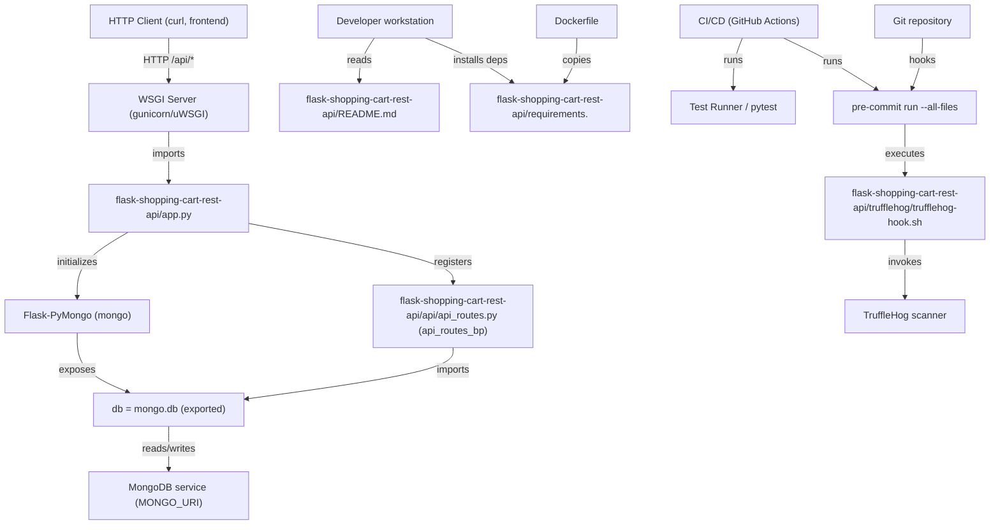
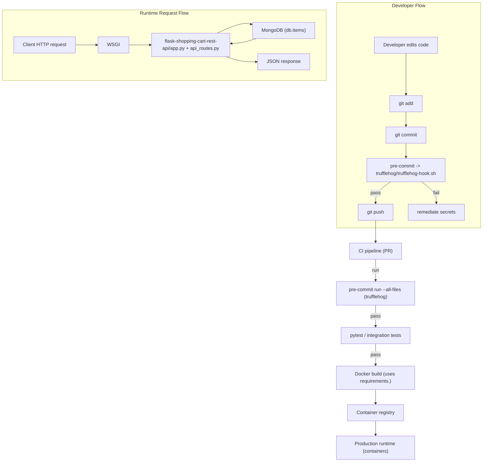
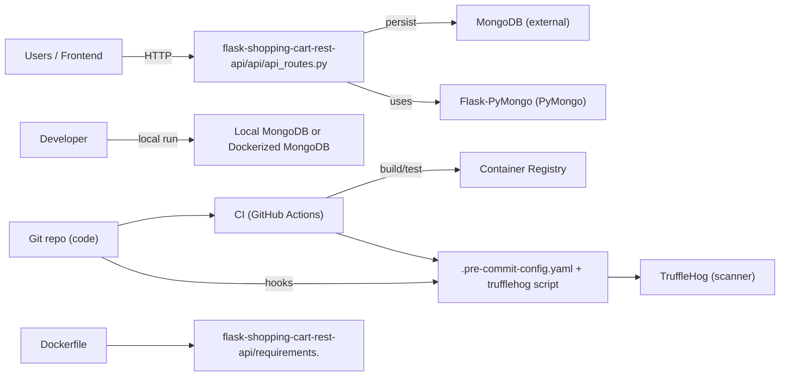
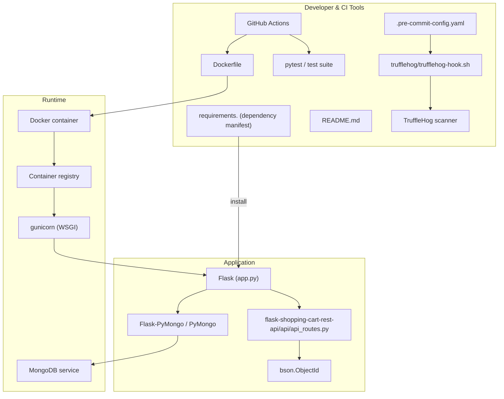

# flask-shopping-cart-rest-api - System Overview

## Purpose and scope
Documented system components: application bootstrap (flask-shopping-cart-rest-api/app.py), HTTP controllers (flask-shopping-cart-rest-api/api/api_routes.py), persistence (Flask-PyMongo → MongoDB), developer tooling and dependency management (flask-shopping-cart-rest-api/requirements., README.md, Dockerfile, CI), and repository-level secret scanning (flask-shopping-cart-rest-api/.pre-commit-config.yaml, flask-shopping-cart-rest-api/trufflehog/trufflehog-hook.sh). The repository implements a minimal shopping-cart REST API backed by MongoDB and includes developer and CI automation.

## Key Application Flows
1. Application startup and DB provisioning
   - app.py reads environment configuration (MONGO_URI / MONGODB_URI, FLASK_ENV), initializes Flask, instantiates Flask-PyMongo (mongo = PyMongo(app)), exposes db = mongo.db, registers api_routes_bp under /api, and either runs a dev server (app.run) or is imported by a WSGI server (gunicorn -w 4 'app:app').
   - Outcome: a Flask process with a pooled MongoDB client available to route handlers.

2. Client request → List items
   - Client issues GET /api/getItems (recommended GET /api/items).
   - api_routes.py uses the exported db handle (from app import db) to run db.items.find(), serializes BSON (_id → str), and returns JSON with count and items (200).
   - Operational considerations: pagination (limit/skip), consistent JSON schema, DB error mapping to 5xx.

3. Client request → Create item (secure)
   - Client posts JSON to POST /api/items (recommended; current code exposes unsafe GET /addItem using eval).
   - Handler parses request.get_json(), validates schema, inserts via db.items.insert_one(data), serializes created document (_id → str), and returns 201 with created resource.
   - Security consideration: eliminate eval usage, add schema validation, and validate fields/types before DB insert.

4. Client request → Delete item
   - Client issues DELETE /api/items/<id> (current code uses GET /removeItem?id=).
   - Handler validates id with bson.ObjectId.is_valid(id), converts to ObjectId, calls db.items.find_one_and_delete({_id: ObjectId(id)}). If found, returns 200; if missing, returns 404; invalid id returns 400.

5. Developer commit-to-deploy with secret scanning and CI gates
   - Developer runs git commit/push. pre-commit framework (flask-shopping-cart-rest-api/.pre-commit-config.yaml) invokes trufflehog wrapper (trufflehog/trufflehog-hook.sh) at pre-commit/pre-push stages; wrapper scans staged diffs or outgoing commit ranges for secrets (entropy + regex).
   - CI runs pre-commit run --all-files (or the same trufflehog script) to enforce scans on PRs. Successful CI triggers Docker image build using flask-shopping-cart-rest-api/requirements. and Dockerfile, pushes image to registry, and deploys to production runtime (containers served by gunicorn).

## Architectural Principles
1. Centralized configuration via environment variables
   - app.py reads runtime configuration (MONGO_URI / MONGODB_URI, FLASK_ENV, PORT) from the environment; configuration drives DB connectivity and runtime mode.

2. Lightweight controller-first service with a shared persistence handle
   - A single Flask application exposes Blueprints (api_routes_bp). Persistence is provided by a shared Flask-PyMongo instance (db = mongo.db) imported by controllers.

3. Explicit separation of runtime and developer tooling
   - Runtime artifacts (Flask, PyMongo, Docker image) are decoupled from developer tooling (requirements., README.md, pre-commit, trufflehog). CI enforces parity by using the same dependency manifest and running the same pre-commit checks.

4. Security-in-depth via Git lifecycle scanning and CI enforcement
   - Secret scanning is integrated at multiple stages: pre-commit/pre-push hooks and CI-level scans. Tooling is invoked via a tracked wrapper script to centralize options and ignore rules.

5. Incremental improvement and testability focus
   - Current design uses a global app and db export pattern (simple onboarding), while recommended evolution is an application factory (create_app) and a thin service/repository layer for better test isolation and parallel CI test runs.

## Local Development Setup
Prerequisites: Python 3.x, virtualenv, local MongoDB (or dockerized MongoDB), git.

1. Clone and change into repo
   - git clone https://github.com/dvjakhar31/shopping-cart-rest-api.git
   - cd shopping-cart-rest-api

2. Create virtual environment and activate
   - python3 -m venv env
   - source env/bin/activate

3. Install dependencies (verify filename)
   - Confirm actual dependency filename in repository: flask-shopping-cart-rest-api/requirements. (note: nonstandard trailing dot). If the file exists:
     - pip install -r flask-shopping-cart-rest-api/requirements.
   - If the repository contains requirements.txt instead, use:
     - pip install -r flask-shopping-cart-rest-api/requirements.txt

4. Enable repository hooks (local secret scanning)
   - pip install pre-commit
   - cd flask-shopping-cart-rest-api
   - pre-commit install
   - Optional verification:
     - pre-commit run --all-files
     - pre-commit run trufflehog --hook-stage pre-commit

5. Configure environment variables
   - export MONGODB_URI="mongodb://localhost:27017/shoppingcart"
   - export FLASK_ENV=development
   - export PORT=5000

6. Run the application
   - Development server:
     - python flask-shopping-cart-rest-api/app.py
   - Or WSGI server:
     - gunicorn -w 4 'flask-shopping-cart-rest-api.app:app'

7. Run tests (uses exported app and db)
   - From repo root or test location: ensure tests import app and db from flask-shopping-cart-rest-api/app.py
   - pytest (or python -m pytest)

8. Build Docker image (if present)
   - Dockerfile copies flask-shopping-cart-rest-api/requirements. into /app/requirements. and runs pip install -r /app/requirements.
   - docker build -t shopping-cart-rest-api .

9. Notes and troubleshooting
   - Verify dependency filename mismatch between README.md and repo (requirements. vs requirements.txt) and reconcile before CI/Docker builds.
   - Ensure trufflehog/trufflehog-hook.sh is executable (chmod +x).
   - Replace unsafe endpoints that use eval before using in any shared/dev environment.

## Frontend-Backend Topic Coordination Architecture
Mermaid diagram: System architecture (how all topics work together)

## System value flows
Mermaid diagram: System value flows (key processes and value creation)

## Integration ecosystem
Mermaid diagram: Integration ecosystem (external connections and data flows)

## Technology stack and deployment
Mermaid diagram: Technology stack (technical architecture and deployment)

## Recommended immediate attention items (operational)
- Standardize dependency manifest filename: resolve mismatch between requirements. and README references to requirements.txt before CI or Docker builds.
- Remove eval-based create endpoints and migrate to POST /api/items with JSON parsing and schema validation.
- Implement consistent BSON -> JSON serialization helper (convert _id to str) and normalize HTTP status codes.
- Ensure trufflehog wrapper and pre-commit config are executable and CI runs the same scan to avoid bypasses.