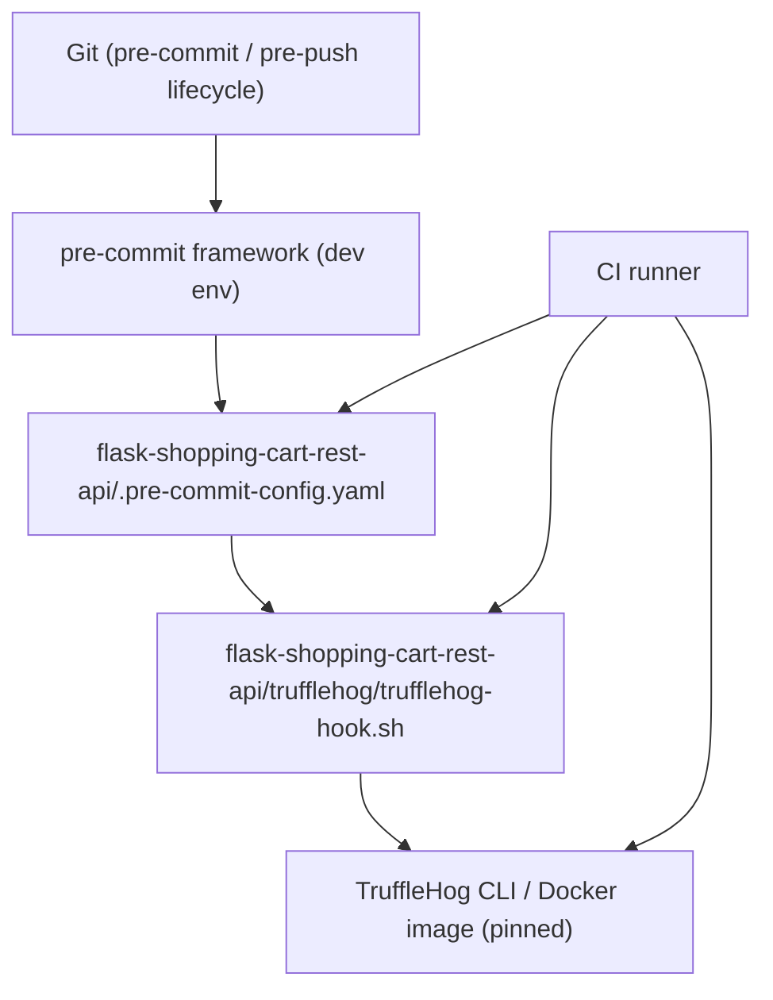
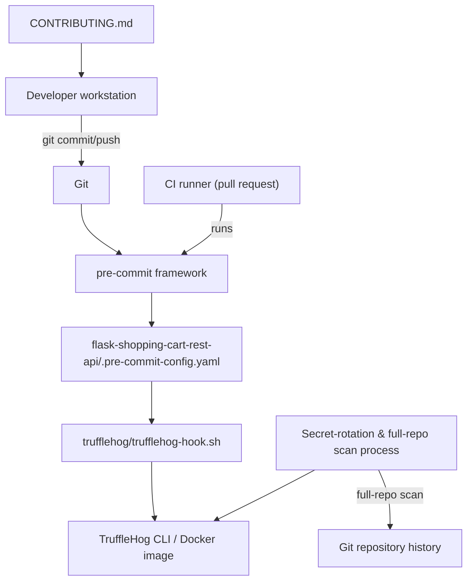
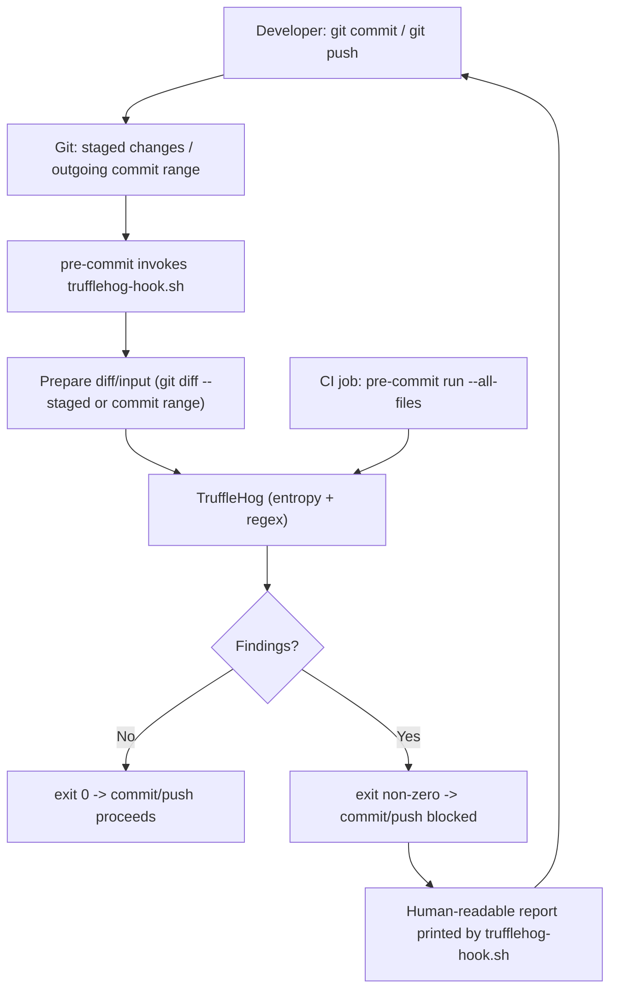
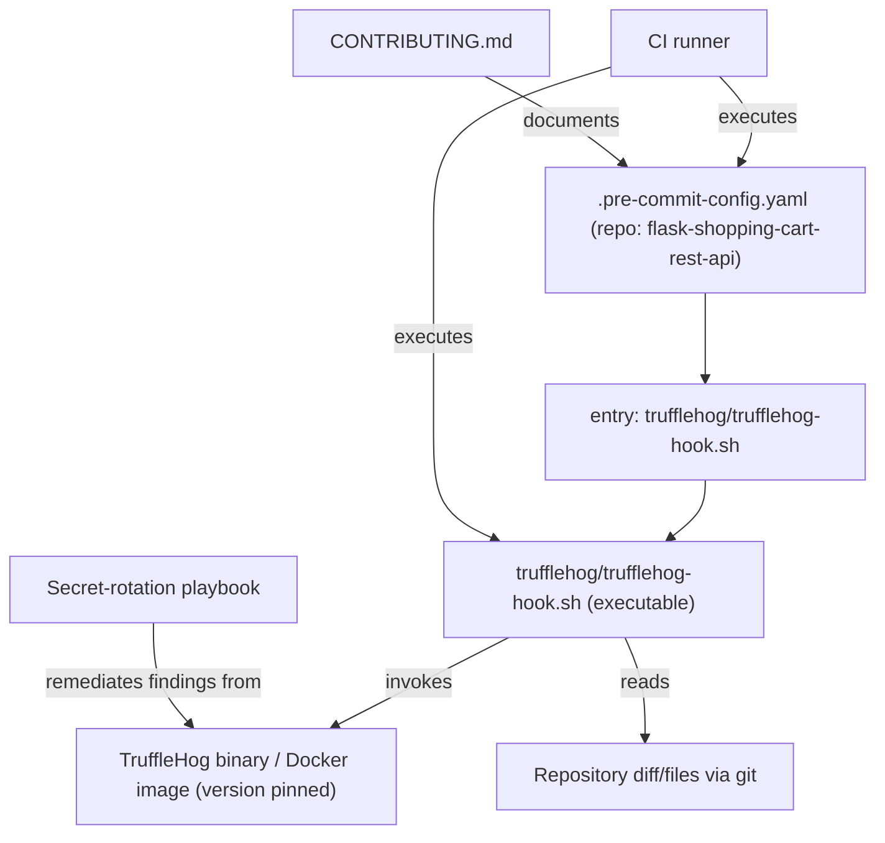

# Security and Secrets Management

## Secrets detection and prevention Across Git Lifecycle and CI

This section documents how the subtopic "Secrets detection and prevention" (files: flask-shopping-cart-rest-api/.pre-commit-config.yaml and flask-shopping-cart-rest-api/trufflehog/trufflehog-hook.sh) integrates repository-level secret scanning into developer and CI workflows to prevent sensitive data from entering VCS or CI artifacts.

### Purpose
- Prevent accidental commits/pushes of secrets by scanning staged diffs (pre-commit), outgoing pushes (pre-push), and by enforcing scans in CI.
- Centralize scanner options, ignore rules, and exit-code semantics via the trufflehog wrapper script to provide consistent behavior across developer machines and CI.

## Cross-Topic Interactions

- Interaction with Git lifecycle and developer tooling
  - Files involved: flask-shopping-cart-rest-api/.pre-commit-config.yaml binds the trufflehog wrapper into Git lifecycle stages (`pre-commit`, `pre-push`).
  - Example: `git commit` triggers pre-commit hooks via the pre-commit framework; `git push` triggers pre-push hooks.

- Interaction with CI/CD (CI runner)
  - CI job must run `pre-commit run --all-files` (or the trufflehog hook) to enforce policy even when developers bypass local hooks.
  - Example: CI job step installs pre-commit and runs `pre-commit run --all-files` using pinned tool versions to ensure deterministic output.

- Interaction with Repository Contribution Policy and Onboarding docs
  - CONTRIBUTING.md should require `pip install pre-commit` and `pre-commit install` after cloning.
  - Example: onboarding steps direct contributors to run `pre-commit install` in flask-shopping-cart-rest-api to enable the trufflehog hook locally.

- Interaction with Incident Response / Secret Rotation processes
  - Pre-commit/pre-push hooks do not retroactively remove secrets from repository history; detection of historical leaks requires full-repo scanning and secret rotation workflows.
  - Example: on discovering a secret via the wrapper or CI, follow secret-rotation procedures and run a full-repo TruffleHog scan to identify affected commits.

- Interaction with Build & Release determinism
  - Tool version pinning (TruffleHog CLI or Docker image tags) is required in CI to prevent variance in detection thresholds between runs.

## Key Application Flows

1. Pre-commit Checks (local)
   - Trigger: Developer runs `git commit`.
   - Action: pre-commit framework reads flask-shopping-cart-rest-api/.pre-commit-config.yaml and executes the hook entry `trufflehog/trufflehog-hook.sh` at the `pre-commit` stage. The wrapper prepares a staged-diff input (e.g., `git diff --staged`) and pipes it into TruffleHog (entropy/regex).
   - Outcome: Hook exits 0 if no findings; exit non-zero if findings (commit blocked). Wrapper prints human-readable report on findings.
   - Practical detail: Wrapper uses diff-based scan for speed in local dev.

2. Pre-push Checks (local)
   - Trigger: Developer runs `git push`.
   - Action: pre-commit runs hooks declared for `pre-push`. The wrapper can compute the outgoing commit range and run TruffleHog against that set (broader than staged diff).
   - Outcome: Push prevented if findings are detected. Acts as last-line-of-defense before remote exposure.

3. CI enforcement (remote)
   - Trigger: Pull request creation or scheduled CI job.
   - Action: CI runner executes a job step that installs pre-commit and runs `pre-commit run --all-files` (or directly runs `trufflehog/trufflehog-hook.sh`) against the repository snapshot.
   - Outcome: Enforces repository policy; prevents merges when CI fails secret scans even if local hooks were bypassed using `--no-verify`.

4. Historical/Repository-wide Scanning for Incident Remediation
   - Trigger: Detection of a leaked secret or periodic security audit.
   - Action: Run full-repo TruffleHog scans (outside pre-commit wrapper) and follow secret-rotation, access audit, and git history rewrite or remediation processes.
   - Outcome: Identify and remediate pre-existing leaks that pre-commit hooks cannot prevent.

## Developer Onboarding Guide

Learning path and tasks for new developers working with "Secrets detection and prevention":

1. Read the hook configuration
   - Inspect flask-shopping-cart-rest-api/.pre-commit-config.yaml to understand the local `trufflehog` hook entry and declared `stages: [pre-commit, pre-push]`.

2. Understand the wrapper script
   - Open flask-shopping-cart-rest-api/trufflehog/trufflehog-hook.sh to see how diffs/inputs are prepared, which TruffleHog options are used (`--entropy`, `--regex`, `--no-update`), and how exit codes are propagated.

3. Install and enable hooks locally
   - Commands:
     - pip install pre-commit
     - cd flask-shopping-cart-rest-api
     - pre-commit install
   - Verify: run `pre-commit run --all-files` and `pre-commit run trufflehog --hook-stage pre-commit` to see scanner behavior.

4. Common change workflow with the hook
   - Modify files.
   - git add <files>
   - git commit
     - If commit is blocked due to findings, inspect wrapper output, remove or rotate secrets, update ignore rules only when justified, then recommit.
   - git push
     - If push is blocked at pre-push, inspect outgoing commits and remediate before attempting push again.

5. CI integration awareness
   - Understand CI job snippet in repository (example step: install pre-commit and run `pre-commit run --all-files`) and ensure local runs mirror CI (pin tool versions).

6. Troubleshooting and maintenance checklist
   - Ensure flask-shopping-cart-rest-api/trufflehog/trufflehog-hook.sh is executable: chmod +x trufflehog/trufflehog-hook.sh.
   - If hooks do not register, validate YAML syntax and indentation in flask-shopping-cart-rest-api/.pre-commit-config.yaml.
   - If wrapper fails to run, check shebang and file permissions.
   - For false positives, open a PR to tune ignore rules in the wrapper or a tracked config file; do not disable scanner globally.

Required technical skillset:
- Familiarity with Git, pre-commit framework, shell scripting, and basic CI configuration.
- Understanding of secret-rotation practices and access control for incident remediation.

## Visual Diagrams

### 1) Primary architecture: Secrets detection and prevention components

### 2) Cross-domain integration: Hooks, CI, CONTRIBUTING, and Incident Response

### 3) Internal process/workflow: Commit -> Scan -> Outcome

### 4) Component relationships: files, frameworks, and runtime dependencies

## Operational and Maintenance Notes (concise)

- Keep trufflehog/trufflehog-hook.sh executable and store ignore rules and scanner options in tracked files to ensure consistent behavior.
- Pin TruffleHog versions or Docker tags in CI to prevent detection variability.
- Prefer diff-based scans for pre-commit speed; run broader scans in pre-push and CI.
- Do not rely solely on local hooks—configure CI to run the same checks to catch `--no-verify` bypasses.
- For discovered historical leaks, run full-repo scans and follow secret-rotation and repository-remediation procedures (out-of-band to the pre-commit hooks).