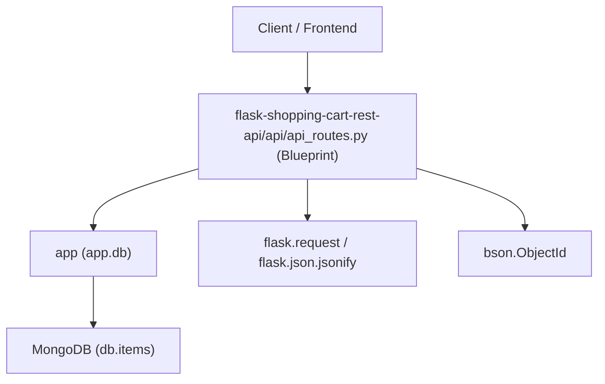
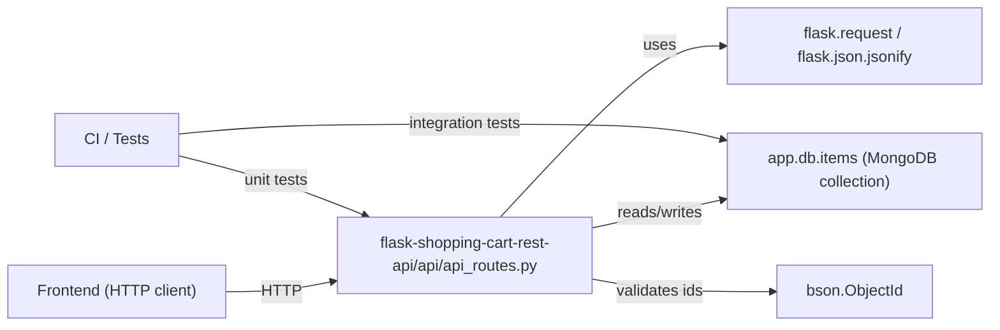
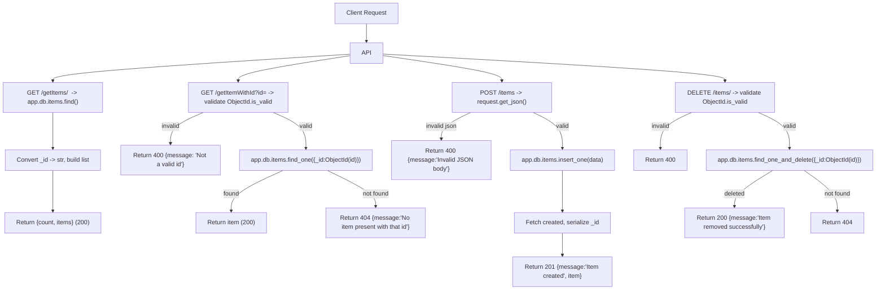
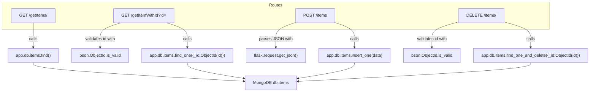

# Shopping Cart API

## Cross-Topic Interactions

- flask-shopping-cart-rest-api/api/api_routes.py <-> app (app.db)
  - The Flask Blueprint in flask-shopping-cart-rest-api/api/api_routes.py reads and writes the MongoDB collection exposed on app.db.items (PyMongo handle). Example: app.db.items.find(), app.db.items.insert_one(data), app.db.items.find_one_and_delete({_id: ObjectId(id)}).

- flask-shopping-cart-rest-api/api/api_routes.py <-> Flask request/response primitives
  - Endpoints use flask.request to parse query parameters and flask.json.jsonify to serialize responses. Example: request.args.get("id") and return jsonify({"count": len(items), "items": items}).

- flask-shopping-cart-rest-api/api/api_routes.py <-> bson.ObjectId
  - Identifier validation and conversion rely on bson.ObjectId.is_valid and ObjectId(id) when reading/deleting single items. Example: if not ObjectId.is_valid(id): return jsonify({"message": "Not a valid id"}).

- DB document serialization dependency
  - API handlers convert MongoDB BSON types before returning JSON (convert _id to str). Current code is inconsistent (some handlers use str(item) incorrectly). Canonical serialization is required for interoperability with clients.

- Error handling / HTTP semantics interaction
  - Current blueprint exposes mutating operations over GET and lacks consistent status codes; interplay with HTTP clients and load balancers depends on correct verbs and status responses (e.g., 201 for create, 404 for not found, 400 for invalid input, 500 for DB errors).

- Test and CI integration (implicit)
  - Unit/integration tests will need a PyMongo test fixture or MongoDB mocking, and must exercise ObjectId validation and DB error paths used by the blueprint.

## Key Application Flows

1) Cart Item Retrieval Flow — List all items
- Endpoint (current): GET /getItems/
- Recommended endpoint: GET /items
- Steps:
  1. Client issues HTTP GET to /items.
  2. api_routes calls app.db.items.find().
  3. Each document: convert "_id" to string and ensure JSON-serializable fields.
  4. Return JSON: { "count": <n>, "items": [<item>, ...] } with status 200.
- Operational notes: implement pagination parameters (limit/skip) and DB error handling (return 500 with sanitized message on DB failure).

2) Cart Item Lookup Flow — Get a single item by id
- Endpoint (current): GET /getItemWithId?id=<id>
- Recommended endpoint: GET /items/<id>
- Steps:
  1. Client requests /items/<id>.
  2. Validate id with bson.ObjectId.is_valid(id) — if invalid, return 400.
  3. Query app.db.items.find_one({"_id": ObjectId(id)}).
  4. If found: convert "_id" to string and return { "message": "Successfully found an item with that id", "item": <item> } with status 200.
  5. If not found: return { "message": "No item present with that id" } with status 404.
- Operational notes: avoid stringifying the full document (no str(item)); always return structured JSON.

3) Cart Item Add Flow — Create item
- Endpoint (current, unsafe): GET /addItem?item=<item> (uses eval)
- Recommended endpoint: POST /items
- Steps:
  1. Client POSTs JSON body to /items.
  2. Server parses JSON via request.get_json(silent=True). If body missing/invalid, return 400.
  3. Validate required fields and types (schema checking).
  4. Insert into app.db.items.insert_one(data).
  5. Retrieve created document, convert "_id" to string, and return { "message":"Item created", "item": <created> } with status 201.
- Security notes: remove all uses of eval and any dynamic code execution. Use JSON parsing and schema validation.

4) Cart Item Remove Flow — Delete item
- Endpoint (current): GET /removeItem?id=<id>
- Recommended endpoint: DELETE /items/<id>
- Steps:
  1. Client issues DELETE /items/<id>.
  2. Validate id with bson.ObjectId.is_valid(id) — if invalid, return 400.
  3. Call app.db.items.find_one_and_delete({"_id": ObjectId(id)}).
  4. If deleted: return { "message": "Item removed successfully" } with status 200.
  5. If not found: return { "message": "No item present with that id" } with status 404.
- Operational notes: ensure id validation is present on all delete code paths.

## Developer Onboarding Guide

Sequence for a new developer to become productive on the Cart and item CRUD operations:

1. Read the API controller source
   - File: flask-shopping-cart-rest-api/api/api_routes.py — inspect Blueprint routes, current query parameter usage, ObjectId checks, and DB calls.

2. Local environment and DB setup
   - Ensure Flask app wiring includes app.db (PyMongo). Example registration:
     from flask import Flask
     app = Flask(__name__)
     app.register_blueprint(api_routes, url_prefix="/api")
   - Start a local MongoDB instance or use a test fixture (mongomock or a dockerized MongoDB).

3. Run and explore endpoints
   - Start the Flask app and invoke current endpoints:
     - GET /getItems/
     - GET /getItemWithId?id=<id>
     - GET /addItem?item=<item> (note: unsafe, for exploration only)
     - GET /removeItem?id=<id>
   - Inspect logs and returned payload shapes.

4. Fix priority issues (recommended first changes)
   - Replace eval-based create with POST /items using request.get_json().
   - Replace GET mutating endpoints with proper HTTP verbs (POST, DELETE).
   - Normalize responses: serialize _id to string, return consistent JSON bodies and HTTP status codes.
   - Add ObjectId.is_valid checks wherever ObjectId() conversion happens.

5. Validation, error handling, and tests
   - Add request body schema validation (simple dict checks or use a library like marshmallow).
   - Wrap DB operations in try/except and map exceptions to 5xx responses.
   - Create unit tests for:
     - valid/invalid ObjectId inputs
     - missing/invalid JSON body for create
     - DB error handling (simulate DB exceptions)
   - Integration tests for end-to-end behavior against a test MongoDB instance.

6. Optional architecture improvements
   - Introduce a thin service/repository layer between api_routes and app.db to decouple persistence from controllers and make unit testing easier.
   - Implement a serialization helper serialize_item(doc) that converts BSON types consistently.

Required technical familiarity:
- Flask Blueprint and request/response model
- PyMongo and MongoDB CRUD operations
- bson.ObjectId validation and conversion
- JSON request parsing and HTTP status code semantics
- Basic security practices (avoid eval, sanitize inputs)

Typical change workflow:
- Edit api_routes.py (or add service layer)
- Run unit tests and integration tests
- Verify endpoints with curl/Postman against a dev DB
- Ensure consistent serialization and status codes before merging

## Visual Diagrams

### 1) Primary architecture (how subtopics work together)

### 2) Cross-domain integration (connections to other system parts)

### 3) Internal processes/workflows (create, read, delete flows)

### 4) Component relationships (routes -> DB operations -> validations)
