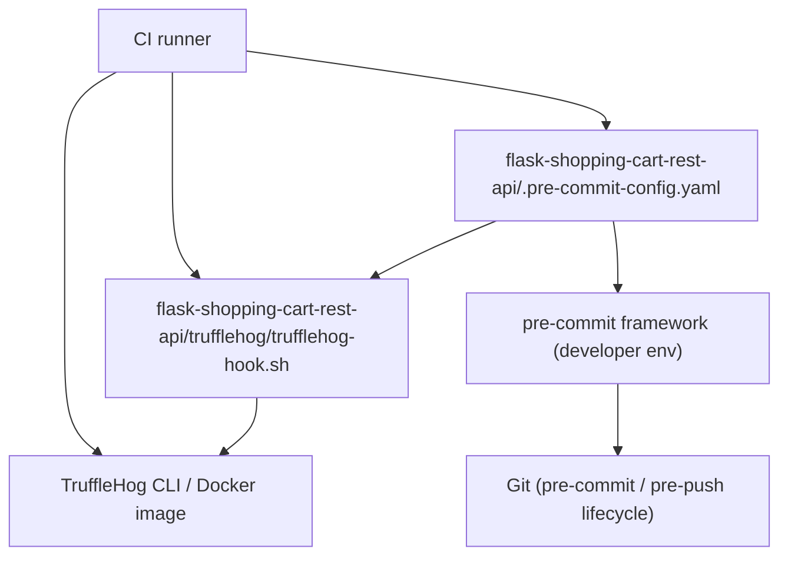
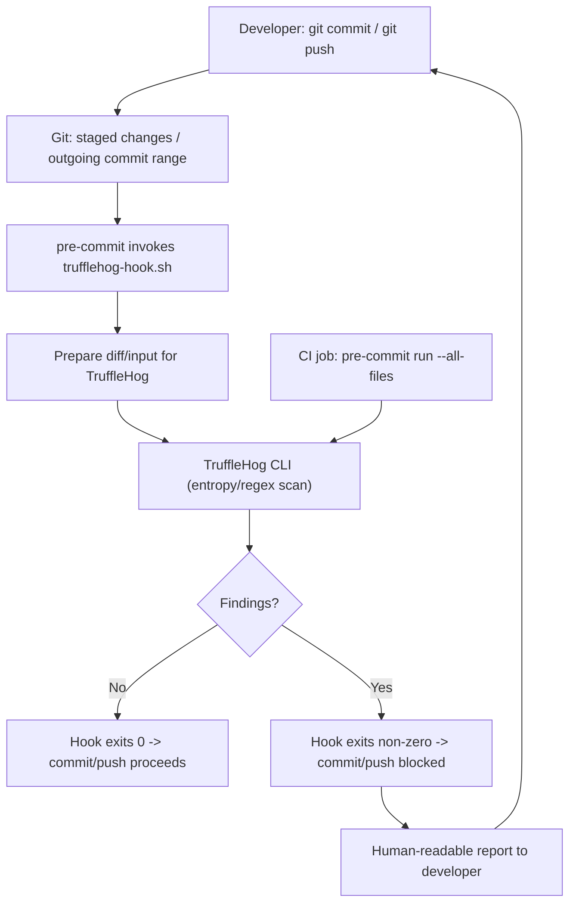

# Secrets detection and prevention

## Overview (Developer Tooling & Security, tags: security, hooks, pre-commit)

This subtopic documents repository-level secrets detection and prevention implemented via the pre-commit framework. It centers on a local TruffleHog-based hook configured in:
- flask-shopping-cart-rest-api/.pre-commit-config.yaml
and implemented by:
- flask-shopping-cart-rest-api/trufflehog/trufflehog-hook.sh

Purpose: prevent accidental commits/pushes of sensitive data by scanning staged changes (pre-commit) and outgoing pushes (pre-push), and by enabling consistent CI enforcement.

---

## Key Abstractions

- **Local pre-commit hook configuration**  
  Represented by `flask-shopping-cart-rest-api/.pre-commit-config.yaml`. Declares a `local` repo and one or more hooks. Core fields: `id`, `entry`, `language`, `stages`. Pattern: configuration-as-code to bind repository scripts into Git lifecycle events.

- **Script-based scanner wrapper**  
  Represented by `trufflehog/trufflehog-hook.sh`. Acts as a thin wrapper that invokes a secret-scanning tool (TruffleHog CLI, dockerized binary, or other scanner) with repository/diff inputs and returns appropriate exit codes for pre-commit to act upon. Pattern: adapter/wrapper that normalizes scanner invocation, output, and exit codes.

- **Stage-driven enforcement**  
  The `stages` field ties the hook to Git lifecycle stages (e.g., `pre-commit`, `pre-push`). Pattern: event-driven gating where scans run automatically before developer actions complete.

---

## Collaborative Use Case

This section shows how the YAML hook, the script, and the developer/CI workflows collaborate.

Example of the pre-commit config (real file path used in repo):

```yaml
# flask-shopping-cart-rest-api/.pre-commit-config.yaml
repos:
  - repo: local
    hooks:
      - id: trufflehog
        name: TruffleHog
        description: Detect secrets in staged changes and outgoing pushes
        entry: trufflehog/trufflehog-hook.sh
        language: script
        stages: [pre-commit, pre-push]
```

Minimal skeleton for the wrapper script (real file path used in repo):

```bash
# flask-shopping-cart-rest-api/trufflehog/trufflehog-hook.sh
#!/usr/bin/env bash
set -euo pipefail

# Example invocation: scan staged diff
# This script should exit non-zero on findings to block the commit/push.
git diff --staged --no-color --name-only | grep -q . || exit 0

# Build input (diff or files) for the scanner
diff_content="$(git diff --staged)"

# Call trufflehog (replace with actual binary or docker command)
echo "$diff_content" | trufflehog --entropy --regex --no-update

# Capture exit code from trufflehog and propagate
exit_code=$?
if [ $exit_code -ne 0 ]; then
  echo "TruffleHog: potential secrets found. Aborting."
fi
exit $exit_code
```

Developer commands to work with the pre-commit setup:

```bash
# Install pre-commit hooks locally (one-time per clone)
pip install pre-commit
cd flask-shopping-cart-rest-api
pre-commit install

# Run the configured hooks against staged files
pre-commit run --all-files                # run all hooks against all files
pre-commit run trufflehog --hook-stage pre-commit   # run specific hook
```

CI enforcement example (CI job step):

```yaml
# CI job snippet
- name: Run pre-commit checks
  run: |
    pip install pre-commit
    pre-commit run --all-files
```

Notes on behavior:
- The hook runs in the developer's environment when pre-commit is installed, and in CI when explicitly executed.
- The wrapper script centralizes scanner options, ignores, and output formatting so maintainers tune detection thresholds without changing YAML.

---

## Application Flow Integration

This section maps the key flows enabled by this configuration and where they participate in developer lifecycle.

Key flows enabled:
1. Pre-commit Checks (local)
   - Trigger: developer runs `git commit`
   - Action: `pre-commit` executes hooks declared for `pre-commit` stage. The TruffleHog wrapper scans staged diffs/files. If findings are detected, the hook exits non-zero and the commit is blocked.
   - Benefit: immediate feedback and prevention of secrets entering commit history.

2. Pre-push Checks (local)
   - Trigger: developer runs `git push`
   - Action: `pre-commit` executes hooks declared for `pre-push` stage. The wrapper can run a broader scan (e.g., full commit range being pushed) to catch secrets that slipped past pre-commit or were introduced by other means.
   - Benefit: last-line-of-defense before remote visibility.

3. CI enforcement (remote)
   - Trigger: Pull request or CI run
   - Action: CI job runs `pre-commit run --all-files` (or the specific trufflehog hook) to catch secrets across all files; this enforces repository policy even if developers bypass local hooks.
   - Benefit: deterministic enforcement and auditability.

Integration considerations:
- Pre-existing secrets already in history are not retroactively blocked by these hooks; use full-repo scanning and secret-rotation if historical leaks are found.
- Performance: prefer diff-based scanning in pre-commit; heavier or full-file scans are better placed in pre-push or CI.
- Bypass vectors: developers can skip hooks with `git commit --no-verify`; CI should run checks to catch bypasses.

---

## Visual Diagrams

### 1) File collaboration (how repository files and tools relate)


Legend: the YAML binds the script into pre-commit; the script calls the scanner; both local dev and CI run the YAML/script/scanner trio.

### 2) Data/control flow (commit -> scan -> outcome)


---

## Operational Guidance (concise)

- Ensure `trufflehog/trufflehog-hook.sh` is executable (chmod +x).
- Keep scanner options and ignore rules inside the wrapper script or a tracked config file to avoid ad-hoc local differences.
- Pin tool versions (TruffleHog releases or Docker image tags) in CI to ensure deterministic behavior.
- Use diff-based scanning on pre-commit for speed; use broader scans in pre-push/CI.
- Validate the `entry` path in `.pre-commit-config.yaml` is correct and that `language: script` matches the wrapper script type.
- Teach contributors to install the pre-commit framework (`pip install pre-commit`) and run `pre-commit install` after cloning; enforce in CONTRIBUTING.md.

---

## Common Pitfalls & Troubleshooting (concise)

- YAML syntax/indentation errors in `.pre-commit-config.yaml` will prevent hooks from being registered.
- Non-executable script or missing shebang results in hook failure; verify permissions and file header.
- Pre-commit checks only cover new commits unless CI runs a full-file or all-files scan.
- False positives may require tuneable ignores in the wrapper; do not suppress results globally—investigate findings and rotate compromised secrets.
- Developers can bypass hooks with `--no-verify`; rely on CI to catch bypasses.

---