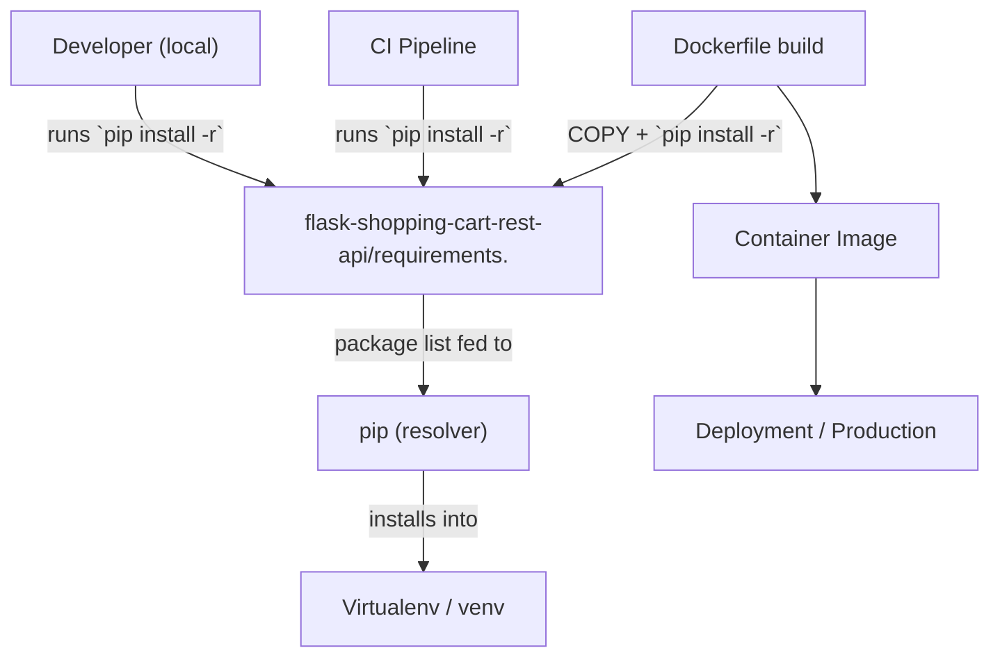
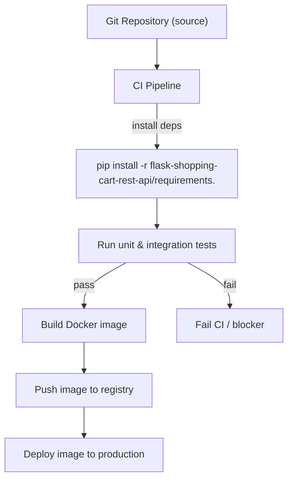

# Dependency management

## Overview (Dependency Management | Build & Tooling)
This subtopic documents the project's single dependency file used to create reproducible Python environments:

- File: `flask-shopping-cart-rest-api/requirements.`  
- Domain tags: dependency-management, python, mongodb  
- Module type: Dependency File (simple, pinned requirements)  
- Purpose: Provide an exact list of Python packages and pinned versions for local development, CI, Docker builds, and deployments so environments are reproducible across developers and pipelines.

## Key Abstractions
- **Pinned dependency manifest**  
  A single-file list of explicit package pins (e.g., `Flask==2.0.1`). Purpose: deterministic installs and reproducible builds.

- **Environment consumer boundaries**  
  Consumers include Local Developer environments (virtualenv), CI pipelines, and Docker image builds. The file is the single source of truth used by these consumers to install runtime dependencies.

- **Integration contract (install-time contract)**  
  The file acts as an installation contract: tools/scripts run `pip install -r <file>` and must respect the pinned versions. Upgrades are managed by changing the file and revalidating test suites.

## Collaborative Use Case
This example shows how the dependency file is consumed across development, CI, and Docker build flows. The file path used everywhere is `flask-shopping-cart-rest-api/requirements.` (note the trailing dot in the filename).

Developer (local) example:
```bash
python -m venv .venv
source .venv/bin/activate
pip install --upgrade pip
pip install -r flask-shopping-cart-rest-api/requirements.
```

Dockerfile snippet (build-time consumption):
```dockerfile
FROM python:3.9-slim
WORKDIR /app
COPY flask-shopping-cart-rest-api/requirements. /app/requirements.
RUN python -m pip install --upgrade pip \
 && pip install --no-cache-dir -r /app/requirements.
COPY . /app
```

CI job snippet (GitHub Actions style):
```yaml
- name: Set up Python
  uses: actions/setup-python@v4
  with:
    python-version: '3.9'
- name: Install dependencies
  run: |
    python -m venv venv
    source venv/bin/activate
    pip install -r flask-shopping-cart-rest-api/requirements.
- name: Run tests
  run: |
    source venv/bin/activate
    pytest
```

These examples demonstrate the file as the shared contract enabling consistent dependency resolution across environments.

## Application Flow Integration
Primary flows enabled by this dependency file:

- Development environment setup (local)
  - Purpose: Quickly create a developer environment matching CI and production.
  - Steps: create venv → pip install -r `flask-shopping-cart-rest-api/requirements.` → run app/tests.

- CI build & test
  - Purpose: Validate dependency compatibility and run automated tests.
  - Steps: checkout → setup Python → pip install -r `flask-shopping-cart-rest-api/requirements.` → run tests → on success proceed to build artifacts.

- Docker image build & deployment
  - Purpose: Produce runtime container images with pinned dependencies for deployment parity.
  - Steps: COPY requirements → pip install -r `flask-shopping-cart-rest-api/requirements.` during image build → produce image → push/deploy image.

Integration notes:
- The file must be present in the repository path referenced by Dockerfile/CI.  
- CI and Docker builds should use the same file to ensure parity between test and runtime environments.  
- Tests must run after installs to detect pin incompatibilities early.

## Visual Diagrams

### File collaboration (who/what consumes the dependency file)


### Build & test control flow (CI / build pipeline)


## Maintenance & Best Practices
- Use a virtual environment (venv) for local installs to avoid system-level conflicts.  
- Keep the file pinned for reproducibility, but schedule regular updates to pick up security fixes. Prefer upgrading one package or coherent groups (e.g., Flask+Werkzeug+Jinja2) and run full test suites.  
- Consider renaming to a conventional filename (`requirements.txt`) to reduce tooling friction; if the nonstandard name is required, document its usage clearly in README and CI scripts.  
- Consider adopting a two-file workflow if update ergonomics are desired: maintain a human-editable `requirements.in` and generate a fully pinned `requirements.txt` with pip-compile.  
- Automate dependency scanning and updates with tools (Dependabot, Renovate) and include security scanners in CI.

## Common Pitfalls & Checks
- Verify pip version (>=20.3) in CI and build images for better dependency resolution.  
- Ensure system-level or C-extension dependencies (not listed in this file) are available in build images if required.  
- After any dependency change, run the full suite of tests and a smoke test of the built Docker image to detect runtime incompatibilities.

