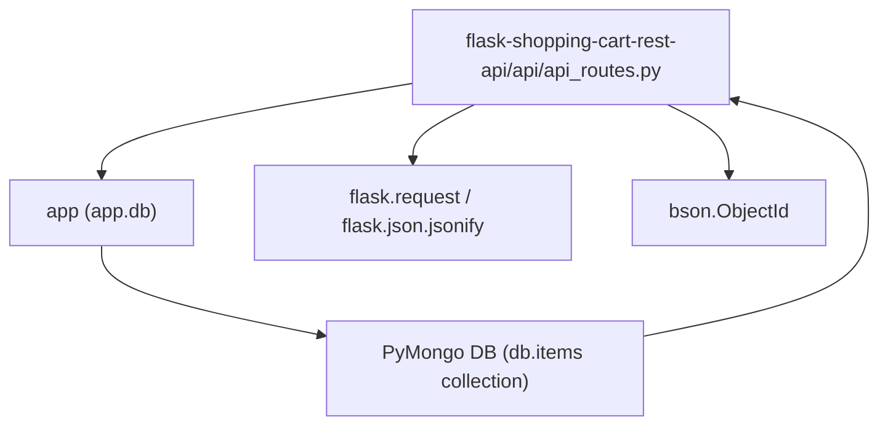
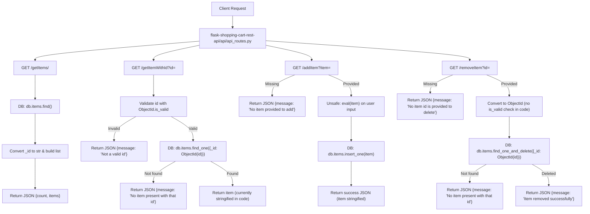

# Cart and item CRUD operations

## Overview
Domain: Shopping Cart / CRUD API  
Business purpose: Exposes HTTP endpoints for managing shopping cart items stored in MongoDB so clients can add, list, retrieve, and remove items.  
Layer: Presentation Layer (Flask HTTP controller interacting directly with PyMongo).

Key concerns/tags: crud, mongodb, validation, security

---

## Key Abstractions

- **Flask Blueprint (API Controller)**  
  - File: `flask-shopping-cart-rest-api/api/api_routes.py`  
  - Role: HTTP-facing controller that maps REST-style routes to data operations on the `items` collection. Implements routing, request parsing, and response serialization.

- **Direct Data Access (PyMongo coupling)**  
  - Pattern: routes call `app.db.items.*` directly (no service/repository layer). This is simple but couples presentation and persistence layers.

- **Identifier Validation & Serialization**  
  - Uses `bson.ObjectId.is_valid` for id validation (partial usage across endpoints). Converts MongoDB `_id` to string for JSON responses in some handlers. Current implementation is inconsistent and has serialization anti-patterns (stringifying full document via `str(item)`).

- **(Anti-)Patterns to note**  
  - Unsafe parsing: `eval` used to parse `item` query parameter — remote code execution risk.  
  - Wrong HTTP verbs: mutating operations exposed via GET.  
  - Inconsistent response shapes and missing HTTP status codes.

---

## Collaborative Use Case

How the blueprint collaborates with the application and DB to implement cart CRUD:

- Primary file:
  - `flask-shopping-cart-rest-api/api/api_routes.py` — defines a Flask `Blueprint` named `api_routes`.

- External collaborators (import / runtime dependencies):
  - `app` (application module) — provides `app.db` (PyMongo database handle).  
  - `flask.request`, `flask.json.jsonify` — read URL query params and return JSON responses.  
  - `bson.ObjectId` — id validation and conversion.  
  - MongoDB collection `db.items` — persistent store for cart items.

Registration example (how to wire the blueprint into an app):
```python
from flask import Flask
from flask-shopping-cart-rest-api.api.api_routes import api_routes  # path as package import

app = Flask(__name__)
# app.db must be set up elsewhere (PyMongo)
app.register_blueprint(api_routes, url_prefix="/api")
```

Route-to-DB collaboration (conceptual code snippets extracted from behavior):
```python
# Read all items (GET /getItems/)
items_cursor = app.db.items.find()
items = []
for item in items_cursor:
    item["_id"] = str(item["_id"])
    items.append(item)
return jsonify({"count": len(items), "items": items})

# Lookup by id (GET /getItemWithId?id=...)
if not ObjectId.is_valid(id):
    return jsonify({"message": "Not a valid id"})
item = app.db.items.find_one({"_id": ObjectId(id)})
if item:
    item["_id"] = str(item["_id"])
    return jsonify({"message": "Successfully found an item with that id", "item": item})
```

Safe replacement pattern for create (to avoid `eval` and use proper HTTP semantics):
```python
# POST /items  (recommended)
from flask import request, jsonify

@api_routes.route("/items", methods=["POST"])
def create_item():
    data = request.get_json(silent=True)
    if not data:
        return jsonify({"message": "Invalid or missing JSON"}), 400
    result = app.db.items.insert_one(data)
    created = app.db.items.find_one({"_id": result.inserted_id})
    created["_id"] = str(created["_id"])
    return jsonify({"message": "Item created", "item": created}), 201
```

---

## Application Flow Integration

This subtopic participates in the following business flows:

1. Cart Item Retrieval Flow (list all items)
   - Endpoint: `GET /getItems/`
   - Steps: HTTP request → `db.items.find()` → convert `_id` to string → return JSON `{count, items}`.
   - Current issues: no pagination, no error handling for DB failures.

2. Cart Item Lookup Flow (get single item by id)
   - Endpoint: `GET /getItemWithId?id=<id>`
   - Steps: Validate id using `ObjectId.is_valid` → `db.items.find_one({_id: ObjectId(id)})` → return item or not-found message.
   - Current issues: returns `str(item)` rather than structured JSON in current code path; missing consistent HTTP status codes.

3. Cart Item Add Flow (insert item)
   - Endpoint: `GET /addItem?item=<item>` (current, unsafe)
   - Steps: parse `item` via `eval` → `db.items.insert_one(item)` → return success message.
   - Current critical issue: `eval` on user input (RCE). Should be changed to `POST /items` with JSON body.

4. Cart Item Remove Flow (delete item)
   - Endpoint: `GET /removeItem?id=<id>`
   - Steps: convert id to `ObjectId` (current code sometimes lacks `is_valid` check) → `db.items.find_one_and_delete({_id: ObjectId(id)})` → return success or not-found.
   - Current issues: no id validation in some code paths; uses GET for mutating operation.

API surface (summary extracted from code):
- `GET /` — health check (returns HTML string)
- `GET /getItems/` — list items
- `GET /getItemWithId?id=<id>` — fetch single item
- `GET /addItem?item=<item>` — insert item (unsafe)
- `GET /removeItem?id=<id>` — delete item

---

## Visual Diagrams

### 1) File collaboration diagram (module <-> dependencies)



### 2) Data & control flow for request handling (endpoints and branching)



---

## Risks & Recommended Remediations

- Security: Remove `eval` usage; accept JSON bodies and parse safely (use `request.get_json()` or `json.loads`).  
- HTTP semantics: Use proper HTTP methods:
  - POST /items — create
  - GET /items — list
  - GET /items/<id> — read
  - DELETE /items/<id> — delete
- Validation: Always check `ObjectId.is_valid` before converting strings to `ObjectId`. Validate request body schema (required fields, types).  
- Responses: Return structured JSON for items (not `str(item)`), include proper HTTP status codes (200, 201, 400, 404, 500). Convert BSON types (ObjectId) to strings in response objects.  
- Error handling: Wrap DB operations with try/except and return sanitized error messages and status codes.  
- Testing: Add unit/integration tests for valid/invalid ObjectId, missing/invalid input, DB error paths.  
- Architecture: Consider introducing a thin service or repository layer to decouple persistence from the controller and enable easier testing.

---

## Implementation Notes & Examples

- Converting DB documents for JSON:
```python
def serialize_item(doc):
    doc["_id"] = str(doc["_id"])
    return doc
```

- Safe create endpoint (example):
```python
@api_routes.route("/items", methods=["POST"])
def create_item():
    data = request.get_json(silent=True)
    if not isinstance(data, dict):
        return jsonify({"message": "Invalid JSON body"}), 400
    try:
        res = app.db.items.insert_one(data)
    except Exception:
        return jsonify({"message": "Database error"}), 500
    created = app.db.items.find_one({"_id": res.inserted_id})
    created = serialize_item(created)
    return jsonify({"message": "Item created", "item": created}), 201
```

- Safe delete endpoint (example):
```python
@api_routes.route("/items/<id>", methods=["DELETE"])
def delete_item(id):
    if not ObjectId.is_valid(id):
        return jsonify({"message": "Not a valid id"}), 400
    deleted = app.db.items.find_one_and_delete({"_id": ObjectId(id)})
    if not deleted:
        return jsonify({"message": "No item present with that id"}), 404
    return jsonify({"message": "Item removed successfully"}), 200
```

---