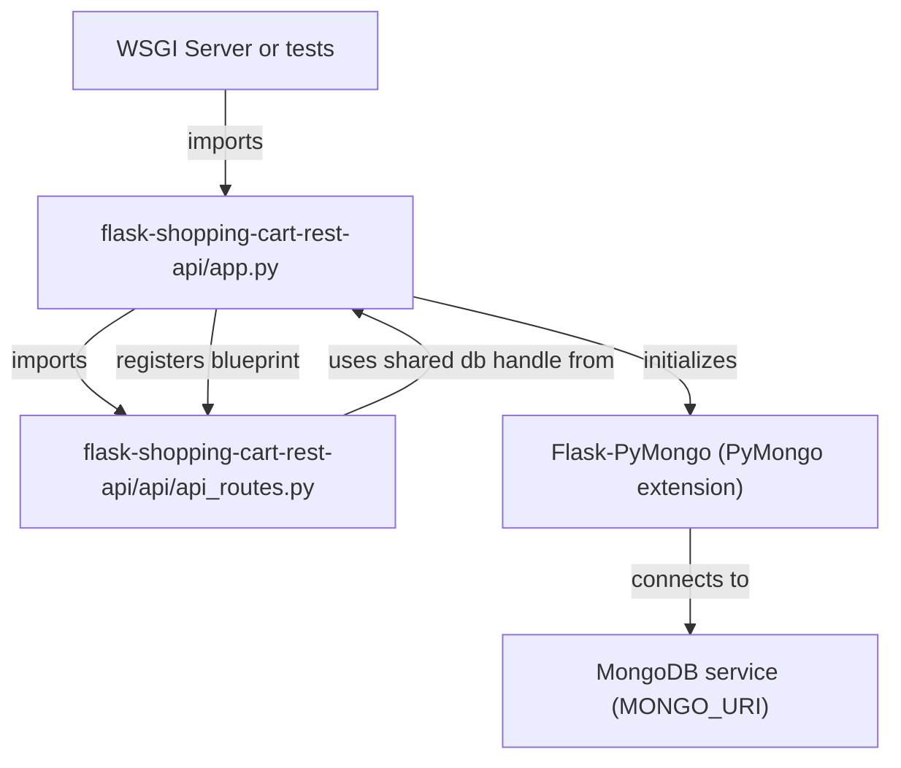
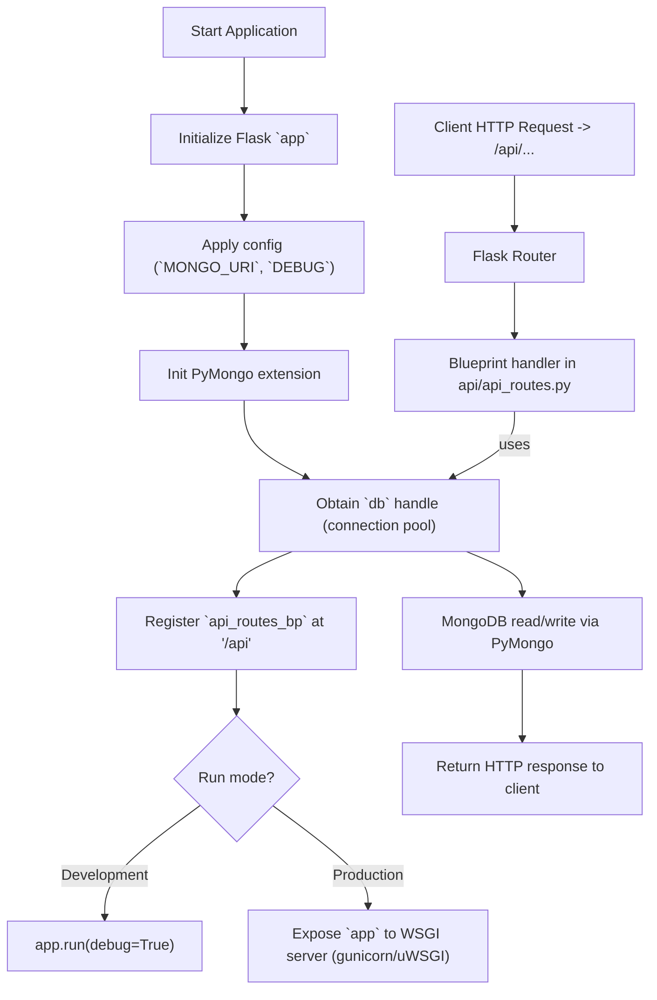

# Application bootstrap and initialization

## Overview
Domain: Application Infrastructure  
Relational tags: infrastructure, routing, mongodb, bootstrapping  
Architectural layer: Infrastructure

This subtopic documents the bootstrapper for the Flask-based shopping cart REST API (flask-shopping-cart-rest-api/app.py). It wires framework, persistence, and routing so the application can accept HTTP requests. It exposes a configured `app` instance and a shared `db` handle (via Flask-PyMongo) and mounts route handlers under `/api`.

---

## Key Abstractions

- **Application instance (`app`)**
  - A single, centralized Flask application object configured at startup.
  - Serves as the HTTP entry point and configuration container.

- **Persistence handle (`db`)**
  - PyMongo-backed database handle created from `app.config['MONGO_URI']`.
  - Shared across route handlers for database operations (connection pool managed by PyMongo).

- **Blueprint-based routing**
  - Route module exported as a Flask `Blueprint` (`api_routes_bp`) and registered under the `/api` prefix to keep routing modular and isolated.

- **Bootstrapper pattern (single-file wiring)**
  - Centralized wiring: configuration, extension initialization, blueprint registration, and developer server invocation occur in one place.
  - *Recommended evolution:* application factory pattern (`create_app`) for better testability and multiple configurations.

---

## Collaborative Use Case

Components:
- flask-shopping-cart-rest-api/app.py — bootstrap and wiring
- flask-shopping-cart-rest-api/api/api_routes.py — exported `api_routes_bp` blueprint
- PyMongo (Flask extension) — creates a MongoDB client and `db` handle
- External MongoDB service (connection configured by `MONGO_URI`)

How they work together (code-level examples):

- Typical contents of the bootstrapper (conceptual snippet):

```python
# flask-shopping-cart-rest-api/app.py (conceptual)
from flask import Flask
from flask_pymongo import PyMongo
from api.api_routes import api_routes_bp  # blueprint defined in api/api_routes.py

app = Flask(__name__)
app.config['MONGO_URI'] = "mongodb://localhost:27017/shoppingcart"
app.config['DEBUG'] = True

mongo = PyMongo(app)
db = mongo.db

# register routes under /api
app.register_blueprint(api_routes_bp, url_prefix='/api')

if __name__ == "__main__":
    app.run(debug=True)
```

- How a route handler consumes the shared `db`:

```python
# flask-shopping-cart-rest-api/api/api_routes.py (conceptual)
from flask import Blueprint, request, jsonify
from app import db  # imports the shared db handle

api_routes_bp = Blueprint('api', __name__)

@api_routes_bp.route('/items', methods=['GET'])
def list_items():
    items = list(db.items.find({}))
    return jsonify(items)
```

- Typical test or WSGI usage:

```python
# tests or WSGI process
from app import app, db

# Testing: obtain test client
client = app.test_client()
# Tests can seed db collections using `db` before requests
```

- Production invocation (no inline debug-run in production):
```
# Example WSGI runner command
gunicorn -w 4 'app:app'
```

---

## Application Flow Integration

Flows enabled by the bootstrapper:

1. Application Startup Flow
   - Initialize Flask application object (`app`).
   - Apply inline configuration (e.g., `MONGO_URI`, `DEBUG`).
   - Initialize the PyMongo extension which creates a connection pool (`mongodb_client`).
   - Expose `db` handle for runtime usage.
   - Register `api_routes_bp` blueprint at `/api`.
   - Start dev server (`app.run(debug=True)`) or expose `app` to a WSGI server in production.

2. API Request Routing Flow
   - Client HTTP request -> Flask router -> route handler in `api/api_routes.py` -> handler uses shared `db` handle to read/write MongoDB -> handler returns HTTP response.

3. Database Initialization Workflow
   - Read `MONGO_URI` from `app.config` -> PyMongo sets up client and connection pool -> `db` handle available to route handlers and tests.

Mapping of responsibilities:
- Configuration and startup: flask-shopping-cart-rest-api/app.py
- Routing and handlers: flask-shopping-cart-rest-api/api/api_routes.py
- Persistence lifecycle and pooling: Flask-PyMongo (managed by `PyMongo(app)`), external MongoDB service

---

## Configuration & Operational Guidance

- Move secrets and environment-specific values out of source:
  - Example:
    ```python
    import os
    app.config['MONGO_URI'] = os.environ.get('MONGO_URI')
    app.config['DEBUG'] = os.environ.get('FLASK_DEBUG', 'false').lower() == 'true'
    ```
- Do not run the production service with `debug=True`. Use a WSGI server (gunicorn/uWSGI) and set appropriate environment variables or a config object.
- For improved testability and flexibility, refactor to an application factory:
  - Provide `create_app(config_name=None)` that returns a configured `app` and allows lazy extension initialization.
- Use secret managers or environment variables for database credentials; remove hard-coded URIs from source control.

---

## Visual Diagrams

### File collaboration (imports and registrations)


### Application startup & request routing control flow


---