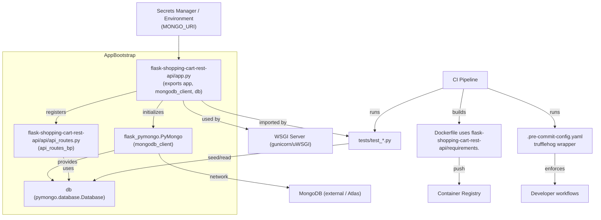
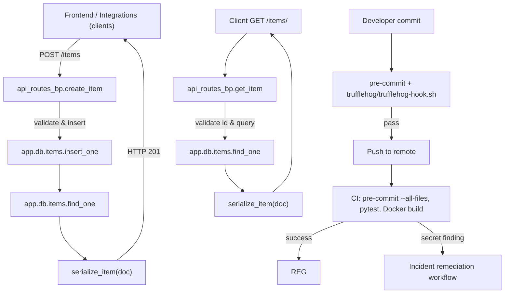
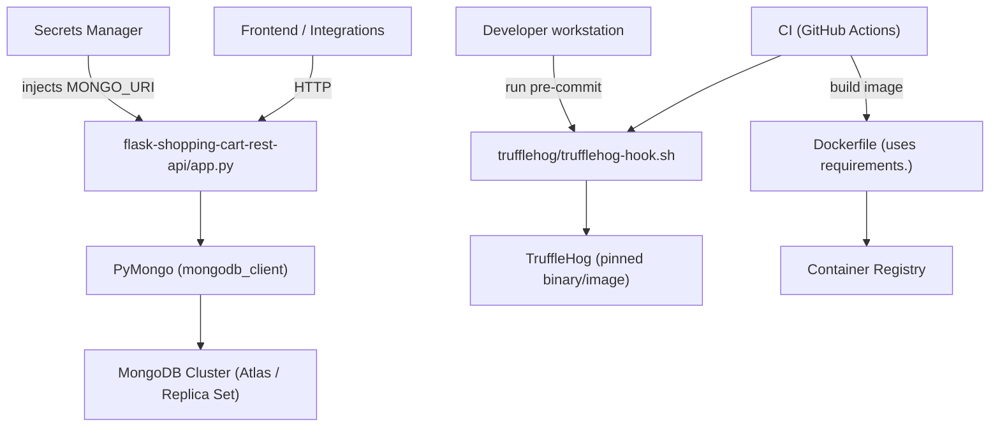
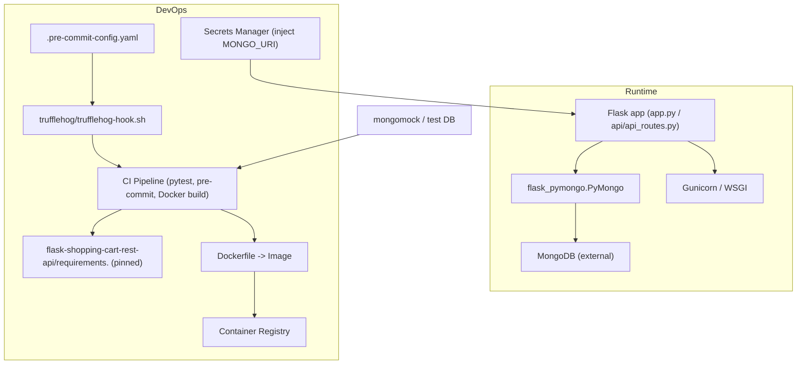

# flask-shopping-cart-rest-api - System Overview

## Frontend-Backend Topic Coordination Architecture
- API contract and migration notes live in docs/04-Shopping-Cart-API.md and docs/4.1-Cart-and-item-CRUD-operations.md; these docs coordinate changes to api/api_routes.py and client integrations.
- api/api_routes.py (api_routes_bp) is the runtime contract exported by app.py and consumed by frontend/integration clients; update docs when route shapes change (example: deprecating GET /addItem).
- Tests and CI enforce contract stability: CI runs pytest suites and Docker image smoke tests referenced by Developer Experience and Documentation flows.

## Key Application Flows
1. Application startup and configuration (process bootstrap)
   - Read environment: MONGO_URI (required), FLASK_DEBUG (optional).
   - Construct Flask app (flask-shopping-cart-rest-api/app.py).
   - Configure PyMongo: set app.config['MONGO_URI'] then initialize mongodb_client = PyMongo(app) (module-level) producing db = mongodb_client.db exported to routes.
   - Register api_routes_bp under /api so requests are routed to api/api_routes.py handlers.
   - In production, WSGI runs e.g. gunicorn -w <workers> 'app:app' (or factory:create_app() after refactor); coordinate PyMongo maxPoolSize with worker count.

2. Create Item (client POST /items → persistent cart add)
   - Client POST /items with JSON body → api_routes_bp.create_item handler.
   - Handler validates JSON (request.get_json(silent=True)), schema (name, price, quantity).
   - Insert via app.db.items.insert_one(data) (or repository.create_item); fetch inserted doc with app.db.items.find_one({'_id': inserted_id}).
   - Serialize document with serialize_item(doc) converting ObjectId → str; return HTTP 201 with created item payload.
   - Error handling: 400 on invalid JSON/fields; 500 on DB errors.

3. Retrieve / List / Delete Item (GET /items/<id>, GET /items, DELETE /items/<id>)
   - GET /items/<id>: validate id with bson.ObjectId.is_valid(id) → query app.db.items.find_one({'_id': ObjectId(id)}) → serialize_item() → 200 or 404.
   - GET /items?limit=&skip=: coerce query params to ints → cursor = app.db.items.find().skip(skip).limit(limit) → serialize each doc → return count + items.
   - DELETE /items/<id>: validate id, call app.db.items.find_one_and_delete({'_id': ObjectId(id)}), return 200 if deleted else 404.
   - Ensure all handlers use serialize_item and consistent ObjectId validation; replace any current unsafe patterns (GET-based mutations, eval usage).

4. Developer CI / Pre-commit / Secret-scan and Release flow
   - Local pre-commit installed via pre-commit install runs hooks defined in .pre-commit-config.yaml.
   - TruffleHog wrapper trufflehog/trufflehog-hook.sh invoked in pre-commit and pre-push stages to scan staged diffs and outgoing ranges.
   - CI runs deterministic scans (pre-commit run --all-files or direct wrapper invocation pinned to a version), runs pytest suite, and for dependency changes builds Docker image using flask-shopping-cart-rest-api/requirements. and executes smoke tests.
   - Incident remediation: on secret findings CI triggers rotation, full-repo TruffleHog, audit, and tracked changes to ignore rules via PRs.

## Architectural Principles
- Centralized Configuration and Fail-Fast Secrets: runtime configuration is read from environment (MONGO_URI); startup validation should fail-fast if required keys missing. Secrets are injected via environment or secrets manager, not in source.
- Explicit DB Wiring and Migration Path: current module-level PyMongo bootstrap (app.py exports app, mongodb_client, db) is simple but tightly couples modules; recommended migration to create_app(config=None) with mongo = PyMongo() + mongo.init_app(app) and get_db() helper to support test isolation and avoid circular imports.
- Small Surface Controllers + Optional Repository Layer: api/api_routes.py implements HTTP handlers; introduce a repository/service layer (create_item, list_items, get_item_by_id, delete_item_by_id) to decouple controllers from PyMongo for easier unit testing and clearer responsibilities.
- Reproducible Developer Environments: dependency manifest (flask-shopping-cart-rest-api/requirements.) is the single source of truth used by README, Dockerfile, and CI. Pre-commit hooks and scripts/verify_requirements.sh enforce consistency locally and in CI.
- Security-first Developer Workflow: secrets detection integrated into developer workflows via .pre-commit-config.yaml and trufflehog/trufflehog-hook.sh wrapper. CI enforces full-repo scans and blocks merges on findings; tracked ignore rules are maintained via PRs and reviewed.

## Local Development Setup
Prerequisites
- Python >= 3.8 (CI example uses 3.9); pip >= 20.3.
- Local MongoDB or use mongomock for tests.
- Git and pre-commit installed.

Quick start (commands, relative paths)
1. Create and activate a virtual env:
   - python -m venv .venv
   - source .venv/bin/activate (or .venv\Scripts\activate on Windows)
2. Install pinned dependencies:
   - pip install --upgrade pip
   - pip install -r flask-shopping-cart-rest-api/requirements.
3. Set environment variables per flask-shopping-cart-rest-api/.env.example:
   - export MONGO_URI="mongodb://localhost:27017/shoppingcart"
   - export FLASK_DEBUG=1
   - export PORT=5000
4. Make TruffleHog wrapper executable (one-time):
   - chmod +x trufflehog/trufflehog-hook.sh
5. Install pre-commit hooks:
   - pre-commit install
   - pre-commit run --all-files
6. Run development server:
   - python flask-shopping-cart-rest-api/app.py
   - Or run with WSGI (production-like): gunicorn -w 4 "app:app"
7. Run tests:
   - pytest -q tests/test_smoke.py
   - For integration tests use mongomock or point MONGO_URI to a disposable test DB (e.g., mongodb://localhost:27017/shoppingcart_test). Prefer create_app(test_config) pattern for isolated app instances.

Developer guidance and files to inspect
- Startup & bootstrap: flask-shopping-cart-rest-api/app.py
- Routes & handlers: flask-shopping-cart-rest-api/api/api_routes.py
- Dependency manifest: flask-shopping-cart-rest-api/requirements.
- Hooks & security: .pre-commit-config.yaml, trufflehog/trufflehog-hook.sh
- Validation script: scripts/verify_requirements.sh
- Docs to follow: docs/3.2-Project-documentation-and-onboarding.md, docs/02-Security-and-Secrets-Management.md, docs/04-Shopping-Cart-API.md

Recommended immediate refactors for contributors
- Add create_app(config=None) and move to mongo = PyMongo(); mongo.init_app(app) inside factory.
- Replace module-level from app import db imports with get_db() (current_app.extensions['pymongo'].db) or injection into repository layer.
- Implement/standardize serialize_item(doc) and ObjectId validation across all handlers.
- Add app.db fixture that uses mongomock for CI integration tests.

## Visual Diagrams

1) System architecture (how all topics work together)

2) System value flows (key processes and value creation)

3) Integration ecosystem (external connections and data flows)

4) Technology stack (technical architecture and deployment)

## Implementation Checklist (concise actionable items referenced above)
- Validate MONGO_URI at startup and fail-fast if missing.
- Migrate to create_app(config=None) and use mongo.init_app(app) for testable app instances.
- Replace module-level from app import db with get_db() helper using current_app.extensions['pymongo'].
- Standardize serialize_item(doc) and use bson.ObjectId.is_valid consistently across handlers.
- Ensure pre-commit hooks (trufflehog wrapper) are executable and pinned in CI; maintain ignore rules via PRs.
- Keep flask-shopping-cart-rest-api/requirements. in sync with README, Dockerfile, and scripts/verify_requirements.sh.