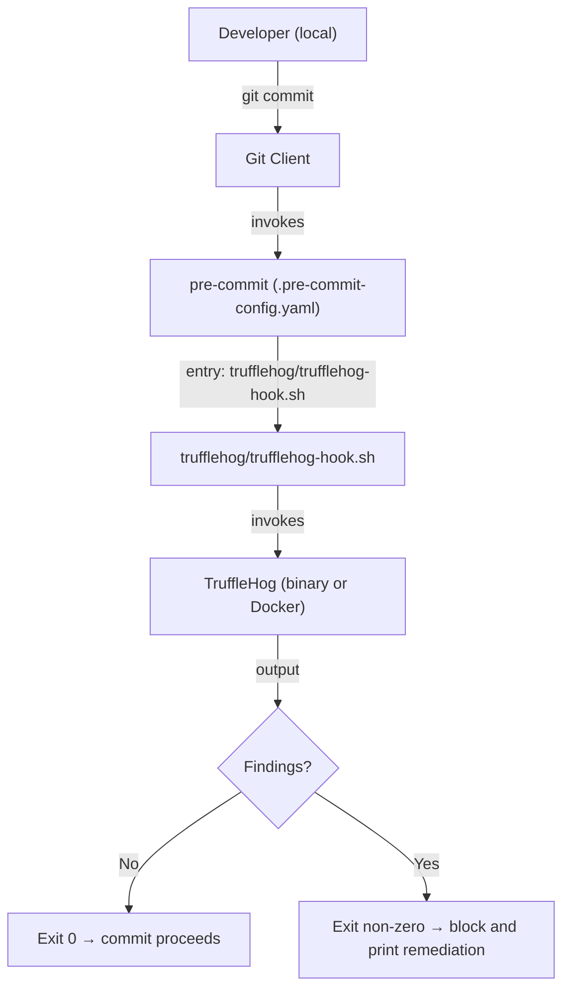
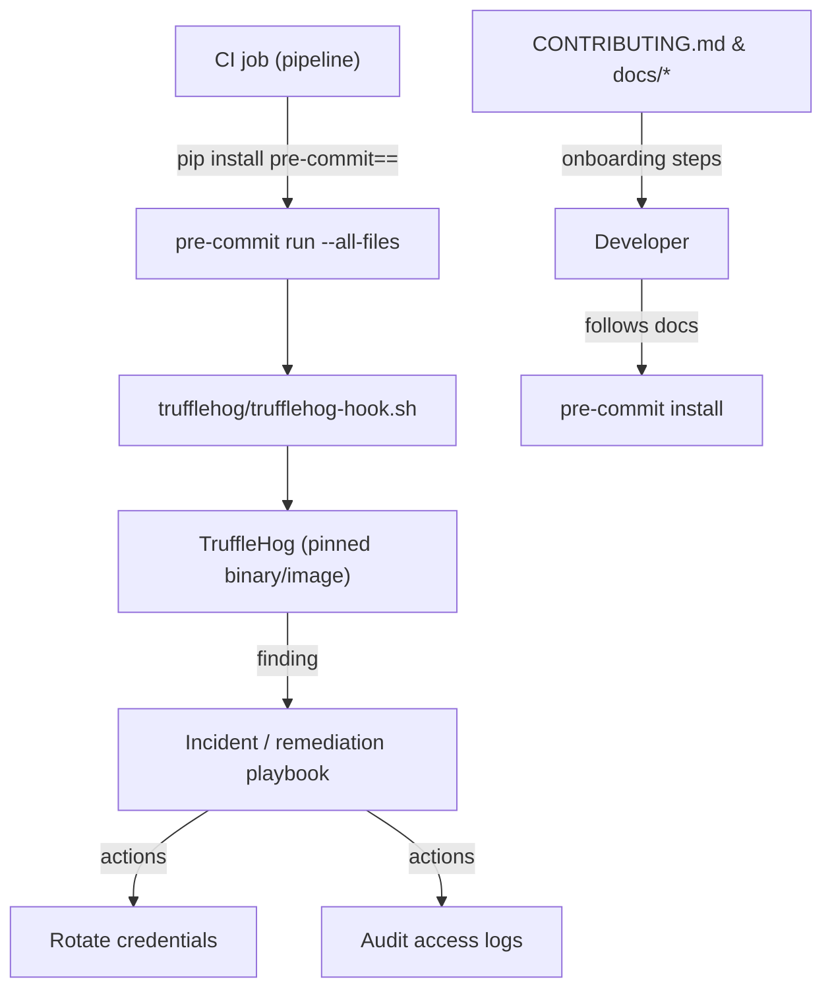
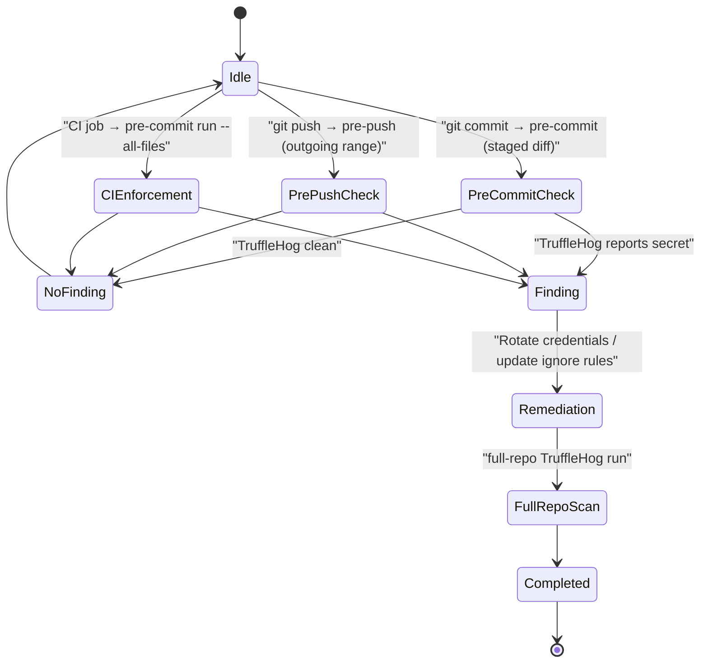
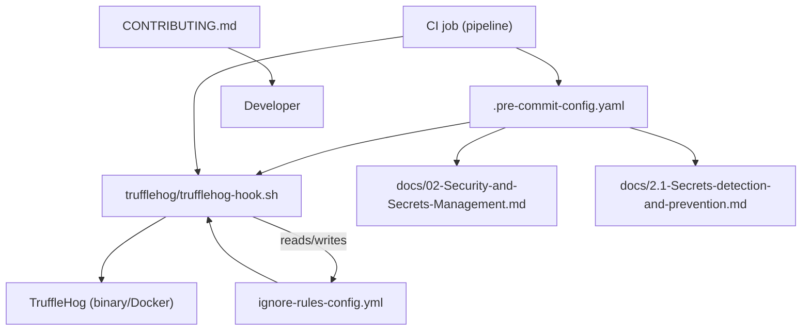

# Security and Secrets Management

## Cross-Topic Interactions: pre-commit Hook Wrapper and TruffleHog Collaboration across CI/CD and CONTRIBUTING docs

- .pre-commit-config.yaml (repo root)
  - Registers a local hook entry: trufflehog/trufflehog-hook.sh
  - Links developer git workflows to the repository-local wrapper and to CI enforcement via the same configuration.

- trufflehog/trufflehog-hook.sh (Hook Wrapper pattern)
  - Centralizes scanner invocation, ignore rules, version pins, and exit semantics consumed by pre-commit and CI.
  - Requirements: executable file with proper shebang and checked into source control.

- TruffleHog (binary or Docker)
  - Scanner implementation invoked by the wrapper. CI must pin specific TruffleHog binary or Docker image to avoid version drift.

- CI job (example: pipeline step running pre-commit)
  - Invokes pre-commit run --all-files or executes bash trufflehog/trufflehog-hook.sh directly for deterministic behavior.
  - Enforces checks irrespective of local hook bypass (e.g., --no-verify).

- CONTRIBUTING.md and docs/02-Security-and-Secrets-Management.md, docs/2.1-Secrets-detection-and-prevention.md
  - Document onboarding steps (pip install pre-commit && pre-commit install), expected remediation steps, and maintenance checklist for hooks and ignore rules.

- Incident / remediation playbook (credential rotation & audit)
  - When CI or periodic full-repo scans detect a leaked secret, actions include rotating credentials, running full-repo TruffleHog, auditing access, and optionally rewriting history per repository policy.
  - Ignore rules and scanner configuration are tracked files and changed via PRs (connects to repository governance topics).

Specific cross-topic examples:
- Pre-commit framework integration example: .pre-commit-config.yaml -> entry: trufflehog/trufflehog-hook.sh -> language: script -> stages: [pre-commit, pre-push]
- CI enforcement example: pipeline step uses pip install pre-commit==<pinned-version> and pre-commit run --all-files, or directly runs bash trufflehog/trufflehog-hook.sh for deterministic scanning.
- Onboarding example: CONTRIBUTING.md contains commands pip install pre-commit; pre-commit install and references trufflehog/trufflehog-hook.sh path.

## Key Application Flows: Pre-commit Checks, Pre-push Checks, CI Enforcement, Incident Remediation

1) Pre-commit Checks (diff-first staged scanning across Secrets detection and prevention)
- Trigger: git commit (pre-commit stage)
- Scope: staged changes only (git diff --staged)
- Files and components: .pre-commit-config.yaml → trufflehog/trufflehog-hook.sh → TruffleHog
- Behavior: wrapper fast-exits when nothing staged; pipes staged diff to TruffleHog; exit 0 allows commit, non-zero blocks and prints remediation hints.
- Value: immediate developer feedback, low friction, reduces accidental secret commits.

2) Pre-push Checks (outgoing-range scanning to catch bypasses)
- Trigger: git push (pre-push stage)
- Scope: outgoing commit range or configured wider scope
- Files and components: .pre-commit-config.yaml (pre-push entry) → trufflehog/trufflehog-hook.sh → TruffleHog
- Behavior: broader scan to detect secrets introduced by multiple commits or history rewrites before remote push.
- Value: catches cases where staged-diff missed secrets or where local commits were amended.

3) CI Enforcement (authoritative full-repo/all-files scanning)
- Trigger: CI pipeline on PR, merge, or scheduled full-repo scan
- Scope: pre-commit run --all-files or full-repo TruffleHog invocation
- Files and components: CI job definition → pinned pre-commit version → trufflehog/trufflehog-hook.sh or pinned TruffleHog binary/image
- Behavior: deterministic behavior via pinned versions; blocks merges when findings occur; prints findings and remediation guidance for security/operational teams.
- Value: prevents bypass via --no-verify and enforces organization policy centrally.

4) Incident Remediation Flow (historical leaks detection and rotation)
- Trigger: CI finding or periodic full-repo scan reports potential secret
- Actions and components: Run full-repo TruffleHog → notify repository owners via CI/issue → rotate exposed credentials per credential owner/process → audit access logs → optionally rewrite history following repository policy → update ignore rules when false positives are confirmed
- Value: reduces blast radius of leaked credentials and maintains repository integrity.

## Developer Onboarding Guide: Learning path for Secrets detection and prevention

1) Prerequisite concepts and first steps
   - Understand git hooks and pre-commit basics.
   - Read docs/02-Security-and-Secrets-Management.md and docs/2.1-Secrets-detection-and-prevention.md in the repository.

2) Local developer setup (day-1)
   - Run: pip install pre-commit
   - Run: pre-commit install
   - Confirm .pre-commit-config.yaml includes the trufflehog hook entry and that trufflehog/trufflehog-hook.sh exists and is executable.
   - Make wrapper executable if needed: chmod +x trufflehog/trufflehog-hook.sh

3) Hands-on learning path (order)
   - Examine .pre-commit-config.yaml to understand which stages invoke the wrapper (pre-commit, pre-push).
   - Open trufflehog/trufflehog-hook.sh to learn the wrapper contract: staged-diff detection, piping diff to TruffleHog, exit code semantics.
   - Run single hook locally: pre-commit run trufflehog --hook-stage pre-commit
   - Run repository-wide checks as CI will: pre-commit run --all-files

4) Typical change workflow inside this domain
   - Developer edits files → git add → git commit → pre-commit runs trufflehog/trufflehog-hook.sh on staged diff
   - If findings: fix secret exposure (rotate credentials if already committed), follow remediation guidance in docs, or update tracked ignore rules via PR when a false positive is confirmed.
   - For broader checks before push: git push triggers pre-push stage scanning outgoing range.
   - PR CI runs pre-commit run --all-files; resolve any findings before merge.

5) Handling findings and ongoing maintenance
   - For true positives: follow incident remediation flow—rotate credentials, run full-repo TruffleHog, audit, and, if allowed, rewrite history.
   - For false positives: update tracked ignore rules and scanner configuration via PR; ensure reviewers vet ignore rules.
   - Keep trufflehog/trufflehog-hook.sh and CI pinned versions under source control and update via PRs.

6) Required technical skills
   - Basic shell scripting and git proficiency.
   - Familiarity with pre-commit configuration and CI pipeline steps.
   - Understanding of credential rotation processes and repository governance for history rewrites.

## Visual Diagrams

### 1) Primary architecture: secrets detection flow across .pre-commit-config.yaml, wrapper, and TruffleHog

### 2) Cross-domain integration: CI job, CONTRIBUTING.md onboarding, and incident remediation interactions

### 3) Internal processes/workflows: Pre-commit, Pre-push, CI Enforcement, and full-repo scans

### 4) Component relationships: files and repository artifacts that implement Secrets detection and prevention
