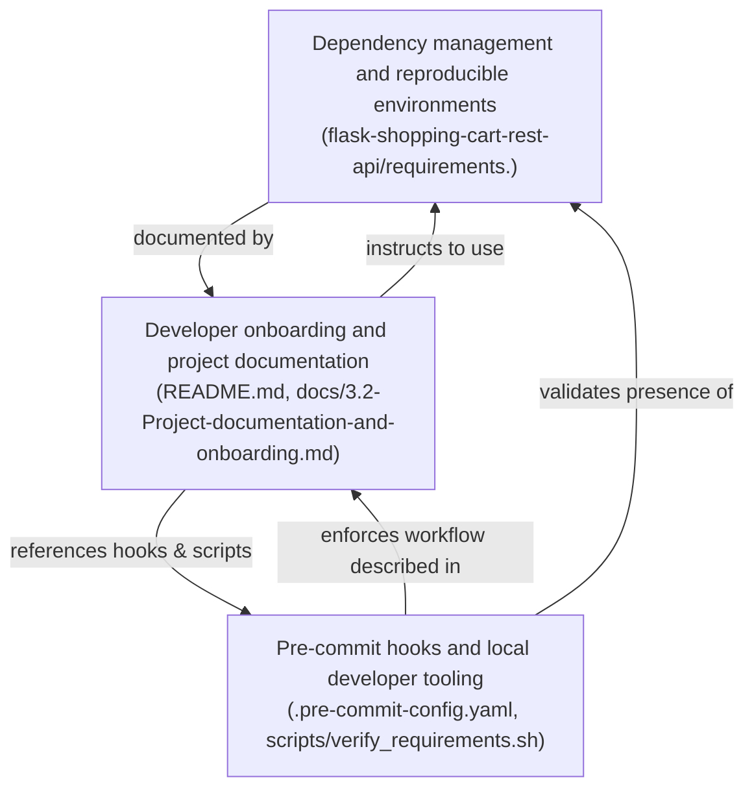
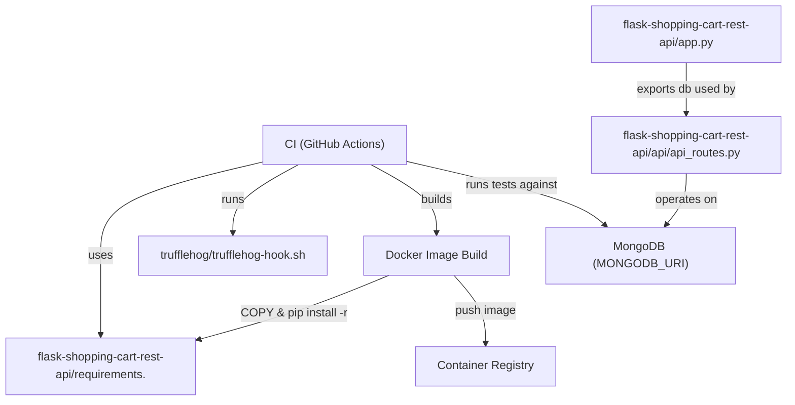
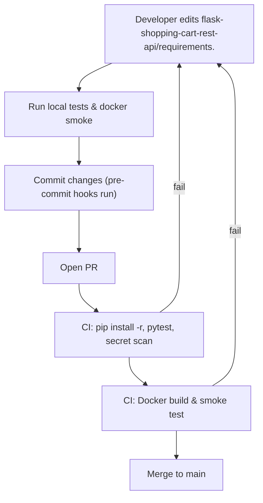

# Developer Experience and Documentation

## Cross-Topic Interactions

- Dependency management and reproducible environments ↔ Developer onboarding and project documentation
  - Source of truth: `flask-shopping-cart-rest-api/requirements.` (pinned manifest) is referenced by README, onboarding docs (`docs/3.1-Dependency-management.md`, `docs/3.2-Project-documentation-and-onboarding.md`) and by Dockerfile / CI steps. Onboarding docs instruct developers to run `pip install -r flask-shopping-cart-rest-api/requirements.` and to match pip >= 20.3.
  - Impact: Any change to `requirements.` requires updates to README, docs, CI job definitions, and Dockerfile COPY paths to avoid broken local installs or image builds.

- Developer onboarding and project documentation ↔ Pre-commit hooks and local developer tooling
  - Source of truth for developer workflows: `flask-shopping-cart-rest-api/README.md`, `docs/3.2-Project-documentation-and-onboarding.md` describe how to run `app.py`, required env vars (`MONGODB_URI`, `FLASK_ENV`, `PORT`), and how to enable pre-commit hooks. `.pre-commit-config.yaml` and `scripts/verify_requirements.sh` enforce the documented workflow.
  - Impact: Documentation must match `.pre-commit-config.yaml` and `scripts/verify_requirements.sh` so local checks mirror CI checks (same trufflehog invocation, same verify-requirements policy).

- Pre-commit hooks and local developer tooling ↔ Dependency management and reproducible environments
  - Enforcement and validation: `scripts/verify_requirements.sh` and a local pre-commit `verify-requirements` hook validate the presence and expected path of the pinned manifest (`flask-shopping-cart-rest-api/requirements.`), check pip version, and warn if README references differ (e.g., `requirements.txt` vs `requirements.`).
  - Impact: Pre-commit prevents commits that would create CI/Docker mismatches (wrong filename, missing manifest), and runs a lightweight smoke test (`tests/test_smoke.py`) to ensure the codebase remains importable.

- Cross-file / runtime dependencies
  - app runtime: `flask-shopping-cart-rest-api/app.py` exports `db` (PyMongo) used by `flask-shopping-cart-rest-api/api/api_routes.py`. Documentation and onboarding indicate this global `db` pattern and recommend migrating to an application factory for improved testability.
  - Secret scanning: `trufflehog/trufflehog-hook.sh` is invoked by `.pre-commit-config.yaml` and must be executable to match CI invocation.

## Key Application Flows

1. Development Environment Setup and Local Run
   - Trigger: New contributor clones repository.
   - Files and tools: `flask-shopping-cart-rest-api/README.md`, `flask-shopping-cart-rest-api/requirements.`, `.env.example`, `app.py`.
   - Steps:
     1. Create venv: `python -m venv .venv` and activate.
     2. Ensure pip >= 20.3.
     3. Install pinned deps: `pip install -r flask-shopping-cart-rest-api/requirements.`
     4. Set env vars per `.env.example` (`MONGODB_URI`, `FLASK_ENV`, `PORT`).
     5. Run `python3 flask-shopping-cart-rest-api/app.py` or `gunicorn -w 4 "app:app"`.
   - Validation: Use documented curl examples; verify `_id` serialization (ObjectId -> str) as described in docs.

2. Pre-commit Validation and Local Gates
   - Trigger: Developer commits changes.
   - Files and tools: `.pre-commit-config.yaml`, `scripts/verify_requirements.sh`, `tests/test_smoke.py`.
   - Steps:
     1. Pre-commit runs formatters (black, isort), linters (flake8), file hygiene hooks, `verify-requirements` script and a fast pytest smoke test.
     2. `verify-requirements` checks presence of `flask-shopping-cart-rest-api/requirements.` and pip version.
     3. trufflehog hook (`trufflehog/trufflehog-hook.sh`) runs for secret scanning.
   - Validation: Hooks must pass locally before push; failing hooks block commit or require local remediation.

3. CI Build, Test, and Dependency Upgrade Validation
   - Trigger: Push / PR.
   - Files and tools: GitHub Actions workflow, `flask-shopping-cart-rest-api/requirements.`, Dockerfile, pytest suite.
   - Steps:
     1. CI sets Python runtime (example: 3.9) and ensures pip >= 20.3.
     2. CI installs pinned dependencies: `pip install -r flask-shopping-cart-rest-api/requirements.`
     3. CI runs full pytest suite and repeats secret scan.
     4. For dependency change PRs: CI builds Docker image (Dockerfile copies `/app/requirements.`) and runs smoke tests against the built image.
   - Validation: Merge only when tests and image smoke tests pass; Dependabot/Renovate PRs must run full CI.

4. Docker Image Build and Release
   - Trigger: CI job or maintainer initiating image build.
   - Files and tools: Dockerfile, `flask-shopping-cart-rest-api/requirements.`, system package declarations in Dockerfile (e.g., `libpq-dev` if required).
   - Steps:
     1. Dockerfile COPY `flask-shopping-cart-rest-api/requirements.` -> `/app/requirements.`
     2. RUN `python -m pip install --upgrade pip` and `pip install --no-cache-dir -r /app/requirements.`
     3. Build image and run container-level smoke tests.
   - Validation: Smoke tests must pass before publishing image; ensure OS-level build deps are present in the image.

## Developer Onboarding Guide

Learning path (priority order)
1. Read `flask-shopping-cart-rest-api/README.md` and `flask-shopping-cart-rest-api/docs/3.2-Project-documentation-and-onboarding.md` to learn quick-start commands, required env vars, and the recommended local workflow.
2. Inspect `flask-shopping-cart-rest-api/app.py` and `flask-shopping-cart-rest-api/api/api_routes.py` to understand the API contract, the exported `db` handle, and current route implementations (note any legacy GET-based payloads).
3. Review `flask-shopping-cart-rest-api/requirements.` and `flask-shopping-cart-rest-api/docs/3.1-Dependency-management.md` to understand pinned dependencies and the reproducible environment contract used by local dev, CI, and Docker builds.
4. Configure local tooling: install pre-commit, run `pre-commit install`, and inspect `.pre-commit-config.yaml` and `scripts/verify_requirements.sh`.
5. Run a smoke import test: `pytest -q tests/test_smoke.py` to verify the environment is importable with installed deps.

Typical change workflow
- Small code change (endpoint, handler)
  1. Run local linters/formatters (`pre-commit` or `make format`/`make lint`).
  2. Run `pytest` (fast tests or smoke) locally.
  3. Commit and allow pre-commit hooks to run. Fix any hook failures.
  4. Push PR; CI runs full tests and Docker smoke build if applicable.
  5. Merge only when CI green.

- Dependency bump or manifest change
  1. Edit `flask-shopping-cart-rest-api/requirements.` to bump specific pins.
  2. Run local full test suite and a local Docker build (or CI branch build).
  3. Open PR; CI must run full pytest and build+smoke the Docker image.
  4. Merge only after CI + image smoke pass and secret scans succeed.

Recommended immediate actions for new contributors
- Run `pre-commit install` and `pre-commit run --all-files`.
- Start a local MongoDB (docker run mongo) or point `MONGODB_URI` to a dev service.
- Use `.env.example` to set env vars locally (do not commit credentials).
- Follow onboarding checklist in docs to ensure README, Dockerfile, and pinned manifest are consistent.

Required technical familiarity
- Basic Python packaging/pip usage and virtual environments.
- Flask application structure and request handling.
- Git, pre-commit concepts, and reading CI job logs.
- Basic Dockerfile build steps and how COPY + pip install interact with layer caching.
- Awareness of security scanning (trufflehog) and dependency scanning workflows.

## Visual Diagrams

1) Primary architecture — how subtopics work together


2) Cross-domain integration — connections to other system parts


3) Internal processes/workflows — dependency upgrade & validation lifecycle


4) Component relationships — files, checks, and runtime consumers
```mermaid
graph TD
  README["flask-shopping-cart-rest-api/README.md"]
  REQdot["flask-shopping-cart-rest-api/requirements."]
  Dockerfile["Dockerfile"]
  PreCommitCfg[".pre-commit-config.yaml"]
  VerifyScript["scripts/verify_requirements.sh"]
  SmokeTest["tests/test_smoke.py"]
  AppPy["flask-shopping-cart-rest-api/app.py"]
  ApiRoutes["flask-shopping-cart-rest-api/api/api_routes.py"]

  README -->|documents install| REQdot
  Dockerfile -->|COPY & install| REQdot
  PreCommitCfg -->|executes| VerifyScript
  PreCommitCfg -->|runs| SmokeTest
  VerifyScript -->|checks| REQdot
  AppPy -->|exports| "db (PyMongo)"
  ApiRoutes -->|imports| "db (from app.py)"
  SmokeTest -->|imports| AppPy
```