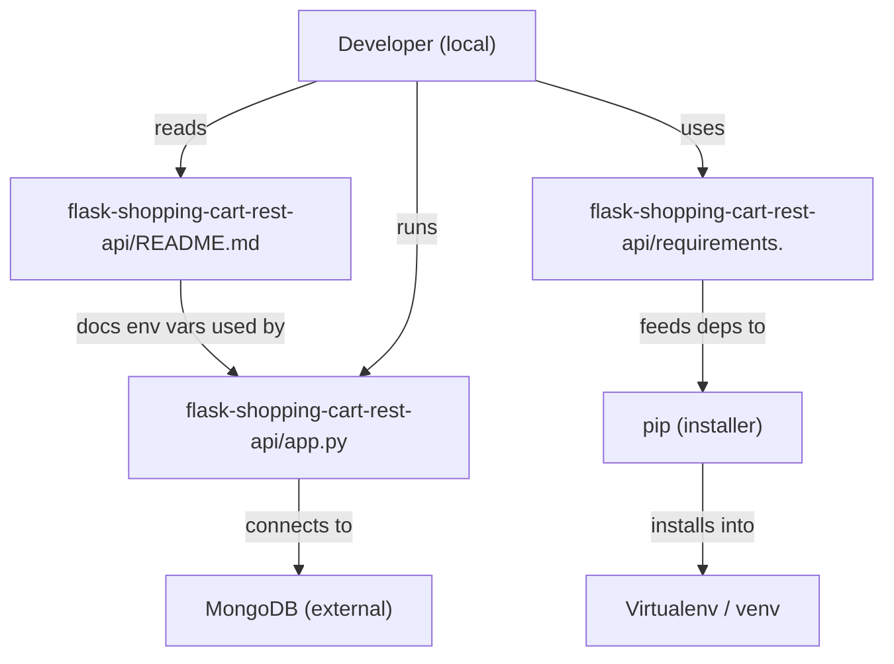
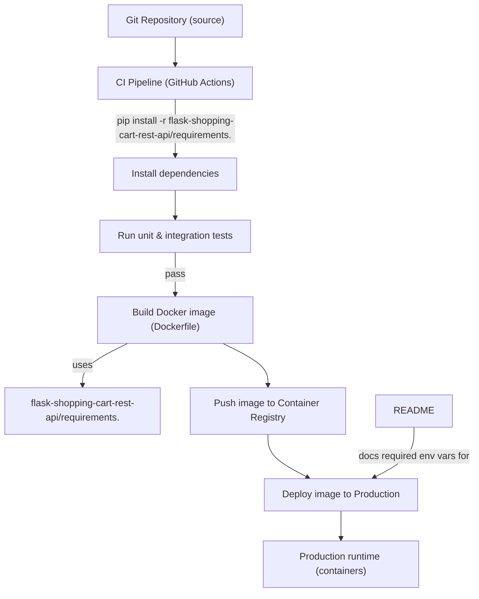
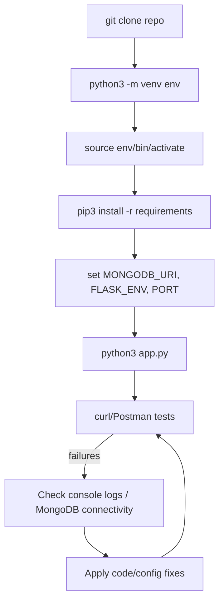
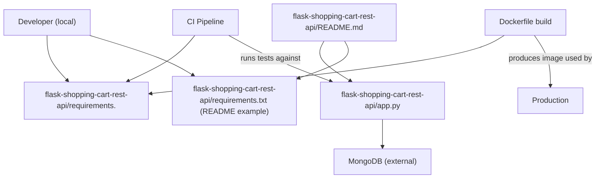

# Developer Experience and Tooling

## Cross-Topic Interactions

### Requirements file usage across Build & Runtime consumers
- The dependency manifest file located at `flask-shopping-cart-rest-api/requirements.` (nonstandard trailing dot) is consumed by:
  - Local developer environments via virtualenv and pip: `pip install -r flask-shopping-cart-rest-api/requirements.`
  - CI pipelines (GitHub Actions example) which run `pip install -r flask-shopping-cart-rest-api/requirements.` before tests.
  - Docker image builds where the Dockerfile copies `/app/requirements.` and runs `pip install -r /app/requirements.`.
- Interaction examples:
  - CI job: actions/setup-python -> create venv -> `pip install -r flask-shopping-cart-rest-api/requirements.` -> pytest.
  - Docker build: `COPY flask-shopping-cart-rest-api/requirements. /app/requirements.` -> `pip install --no-cache-dir -r /app/requirements.`

### README-driven configuration integration with runtime services
- `flask-shopping-cart-rest-api/README.md` documents environment-driven configuration required by `flask-shopping-cart-rest-api/app.py`.
- Environment variables referenced: `MONGODB_URI`, `FLASK_ENV`, `PORT`. These variables connect README guidance to MongoDB (external service) and runtime behavior of app.py.
- Interaction examples:
  - Local run: set `MONGODB_URI="mongodb://localhost:27017/shoppingcart"` -> `python3 app.py` -> app.py connects to MongoDB.
  - Troubleshooting: README points to checking console logs from `python3 app.py` and MongoDB connectivity.

### Dependency management interactions with security & tooling
- Dependency manifest is a contract for reproducible installs and is a surface for security tooling:
  - Automated scanners (Dependabot, Renovate) or CI security checks can operate against `flask-shopping-cart-rest-api/requirements.` to propose or apply upgrades.
  - CI must run tests after dependency changes to validate compatibility (pip resolver behavior, transitive dependency changes).

### Explicit cross-topic dependencies
- Infrastructure (MongoDB) required by Project documentation and onboarding: README assumes an available MongoDB instance reachable via `MONGODB_URI`.
- Build & Tooling (Dockerfile, CI): both refer to the same dependency file path. Mismatch risk: README refers to `requirements.txt` while dependency management uses `requirements.` — must be reconciled.
- Runtime Observability / Troubleshooting: logs produced by `app.py` are the primary developer diagnostic; README ties troubleshooting steps to those logs.

## Key Application Flows

### Requirements file consumption flow (Developer → CI → Docker)
1. Developer creates virtualenv → `pip install -r flask-shopping-cart-rest-api/requirements.` → run app/tests locally.
2. CI checks out repo → sets up Python → `pip install -r flask-shopping-cart-rest-api/requirements.` → run tests → on success triggers Docker build.
3. Dockerfile copies `flask-shopping-cart-rest-api/requirements.` → `pip install -r` during image build → produce container image → push to registry → deploy.

### README-driven local development flow (Onboard → Configure → Run)
1. Clone repository → inspect `flask-shopping-cart-rest-api/README.md` for required environment variables.
2. Create/activate venv → `pip3 install -r requirements.txt` (README example) — validate actual filename in repo.
3. Set `MONGODB_URI`, `FLASK_ENV`, `PORT` → `python3 app.py` → exercise endpoints with curl/Postman.

### CRUD API test & verification flow (Client → app.py → MongoDB → Response)
1. Client (curl/Postman) issues request (GET/POST/DELETE) to `app.py` endpoints:
   - GET /api/getItems
   - GET /api/getItemWithId?id=<id>
   - POST /api/addItem?item={...} (README shows query-encoded payload; confirm code accepts this)
   - DELETE /api/removeItem?id=<id>
2. app.py validates input, performs MongoDB operation, returns HTTP response codes (200/201/404/400).
3. Tests or manual checks verify expected semantics and detect changes in route behavior.

### Dependency upgrade & validation flow (Change pins → Test → Release)
1. Maintain pinned manifest (`requirements.` or `requirements.txt`) to control reproducible builds.
2. Upgrade one package or coherent group; run full unit/integration tests in CI.
3. Build and smoke-test Docker image to detect runtime incompatibilities; update README if runtime behavior changes.

## Developer Onboarding Guide

### Immediate learning path (first 1–2 hours)
1. Read `flask-shopping-cart-rest-api/README.md` to understand required env vars and available endpoints.
2. Inspect `flask-shopping-cart-rest-api/requirements.` and confirm filename vs README examples.
3. Open `flask-shopping-cart-rest-api/app.py` to review route handlers, request parsing semantics (query param vs JSON body), and MongoDB usage.

### Setup checklist (quick start)
- Clone the repo and change into project directory:
  - git clone https://github.com/dvjakhar31/shopping-cart-rest-api.git && cd shopping-cart-rest-api
- Create and activate virtualenv:
  - python3 -m venv env
  - source env/bin/activate
- Install pinned dependencies (verify actual file name in repo):
  - pip3 install -r flask-shopping-cart-rest-api/requirements.  (or `requirements.txt` if present)
- Configure environment variables:
  - export MONGODB_URI="mongodb://localhost:27017/shoppingcart"
  - export FLASK_ENV=development
  - export PORT=5000
- Run the application:
  - python3 app.py
- Exercise API routes with curl or Postman using the examples in README.

### Typical change workflows
- Code change that affects routes:
  - Update `app.py` route handlers → update README endpoint examples and expected responses → run tests locally → open PR.
- Dependency change:
  - Update `flask-shopping-cart-rest-api/requirements.` pins → run full test suite locally → push change to CI → ensure Docker build smoke test passes → merge.
- Config changes:
  - If changing env var names or semantics, update README and provide a sample `.env` snippet.

### Required developer skills
- Basic Python and Flask familiarity (routing, request parsing).
- Understanding of virtualenv and pip dependency installation.
- Familiarity with Docker basics for image builds and COPY/install patterns.
- Basic knowledge of MongoDB connectivity and common error modes (connection strings, ObjectId handling).
- Comfort reading CI pipeline YAML (GitHub Actions example present).

## Visual Diagrams

### 1) Primary architecture: Dependency management and README-driven runtime

### 2) Cross-domain integration: CI, Docker, Registry, Production

### 3) Internal process/workflow: Local setup → Run → Test → Troubleshoot

### 4) Component relationships: files and their consumers

## Reference: actionable reconciliation items (observed from artifacts)
- Verify actual dependency file name in repository and standardize: either retain `flask-shopping-cart-rest-api/requirements.` and update README/CI/Docker to reference that exact path, or rename to `requirements.txt` and update all consumers.
- Document exact POST payload format accepted by `app.py` (query-encoded `item` vs JSON body) and update README examples accordingly.
- Add a sample `.env` snippet in README and optionally include a Postman collection or example JSON bodies for each endpoint.
- Ensure CI and Docker use pip >= 20.3 for modern resolver behavior and include dependency/security scanning in CI.