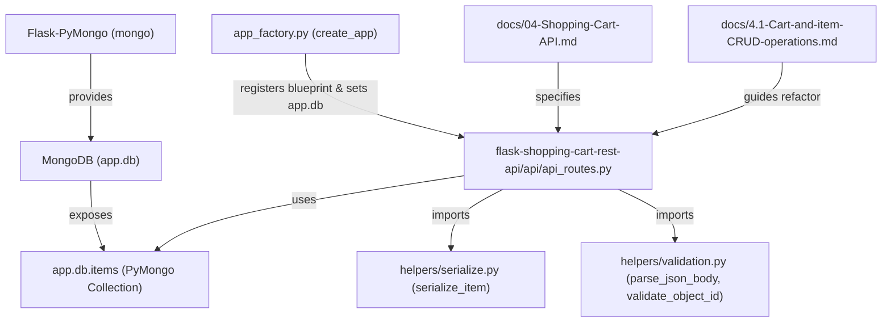
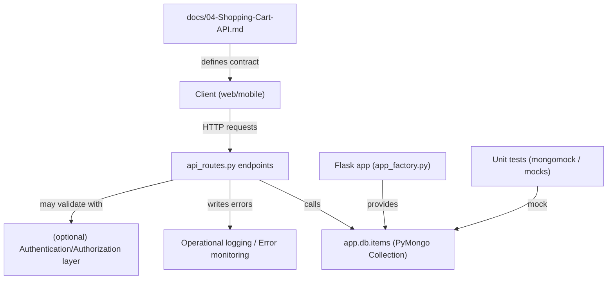
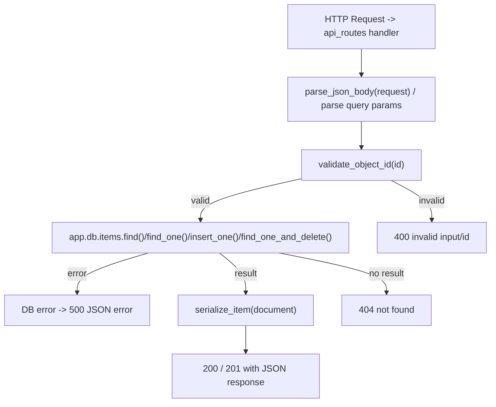
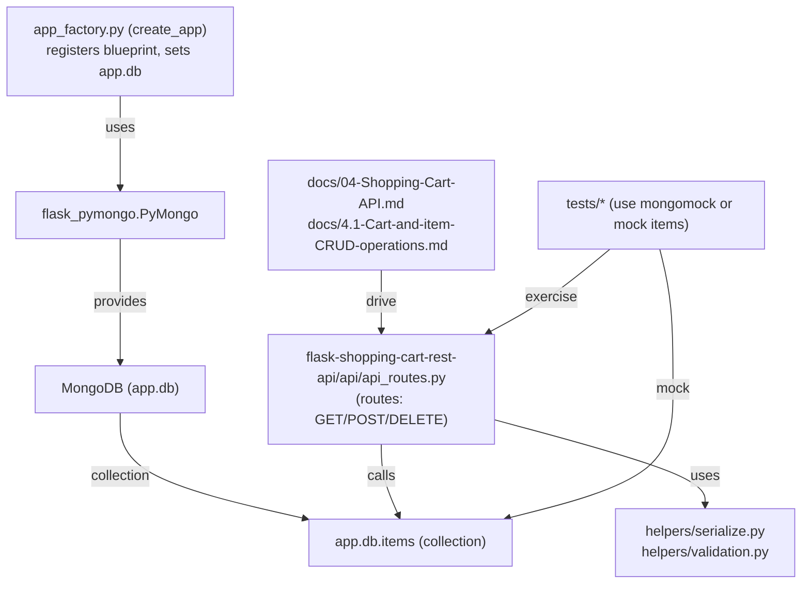

# Shopping Cart Operations

## Cross-Topic Interactions
- app wiring / Flask application factory
  - Example: app_factory.py registers the blueprint and provides the PyMongo DB handle:
    - from flask_shopping_cart_rest_api.api.api_routes import api_routes
    - mongo = PyMongo(app); app.db = mongo.db; app.register_blueprint(api_routes, url_prefix='/api')
  - Runtime dependency: api/api_routes.py expects app.db (PyMongo database) to expose the items collection as app.db.items.

- Persistence and PyMongo
  - api/api_routes.py calls collection methods directly: find(), find_one(), insert_one(), find_one_and_delete().
  - BSON handling: use bson.ObjectId.is_valid(id) before conversion; convert document['_id'] to str for JSON responses.

- Serialization & Validation helpers
  - helpers/serialize.py — serialize_item(doc) converts _id to string and returns a plain dict suitable for JSON.
  - Validation helper responsibilities referenced in docs:
    - validate_object_id(id): use bson.ObjectId.is_valid(id) -> return 400 on invalid ids.
    - parse_json_body(request): call request.get_json(silent=True) and apply schema validation.
  - These helpers are intended to be imported and used by api/api_routes.py to centralize logic and ensure consistent response shapes.

- Documentation / Developer guidance
  - docs/04-Shopping-Cart-API.md prescribes endpoint shapes, status codes, and canonical error payloads used by api/api_routes.py and tests.
  - docs/4.1-Cart-and-item-CRUD-operations.md documents anti-patterns to remove (eval, GET for mutating ops) and prescribes refactor steps for route handlers.

- Testing / Mocks
  - Unit tests should mock app.db.items (or use mongomock) to exercise success, not-found, invalid-id, and DB-exception paths. Example test target: api/api_routes functions that call app.db.items.insert_one / find_one_and_delete.

- Error handling / Operational monitoring
  - api/api_routes.py must wrap PyMongo calls in try/except to translate DB exceptions into 500 responses using the standardized JSON error format defined in docs/04-Shopping-Cart-API.md.

## Key Application Flows
- Cart Item List (GET /api/items)
  - Steps:
    1. api_routes handler receives GET /api/items.
    2. Handler calls app.db.items.find() (optionally with limit/skip for pagination).
    3. Map serialize_item over cursor results (convert _id to string).
    4. Return 200 JSON: { "count": n, "items": [...] }.
  - Concerns: add limit/skip query parsing, filter handling, and DB error mapping to 500.

- Cart Item Lookup (GET /api/items/<id>)
  - Steps:
    1. Handler validates id via bson.ObjectId.is_valid(id). If invalid -> 400.
    2. Handler does app.db.items.find_one({ "_id": ObjectId(id) }).
    3. If document found -> serialize_item and return 200 with item; if not -> return 404.
  - Concerns: consistent error payload structure; avoid raising unhandled exceptions when ObjectId conversion fails.

- Cart Item Add (POST /api/items)
  - Steps:
    1. Handler parses JSON body using request.get_json(silent=True) and validates required fields (e.g., name, price, quantity).
    2. On valid input, handler calls app.db.items.insert_one(item).
    3. Handler retrieves the inserted document (find_one by inserted_id), runs serialize_item, and returns 201 with the item and message "Item created".
  - Concerns: validate schema and types; handle DB insert exceptions and return 500 with sanitized message.

- Cart Item Remove (DELETE /api/items/<id>)
  - Steps:
    1. Handler validates id via bson.ObjectId.is_valid(id). If invalid -> 400.
    2. Handler calls app.db.items.find_one_and_delete({ "_id": ObjectId(id) }).
    3. If a document was deleted -> return 200 with message "Item removed successfully"; if none -> return 404.
  - Concerns: ensure id validation precedes any DB call; treat find_one_and_delete returning None as not-found.

## Developer Onboarding Guide
- Read the documentation artifacts in this order:
  1. flask-shopping-cart-rest-api/docs/04-Shopping-Cart-API.md — canonical endpoint shapes, status codes, and error payload examples used by clients and tests.
  2. flask-shopping-cart-rest-api/docs/4.1-Cart-and-item-CRUD-operations.md — anti-patterns to remove, recommended validation/serialization helpers, and refactor guidance.
  3. api/api_routes.py — concrete route handler implementations and current DB call patterns.
  4. helpers/serialize.py (or equivalent) — serialization helper(s) and any validation helper modules referenced by the routes.

- Typical change workflow
  1. Add/modify behavior in api/api_routes.py only after updating docs/04-Shopping-Cart-API.md if response shapes or status codes change.
  2. Centralize repeated logic in helper modules:
     - Move ObjectId validation, JSON body parsing, and schema validation into validation helpers.
     - Move BSON → JSON conversions into serialize_item and related serializers.
  3. Write unit tests that mock app.db.items or use mongomock:
     - Test invalid id -> handler returns 400.
     - Test not-found -> handler returns 404.
     - Test success paths for list/get/create/delete.
     - Test DB exception handling returns 500 and consistent error JSON.
  4. Run tests and ensure no regression in documented responses.
  5. Deploy changes ensuring app factory wiring still sets app.db and registers api_routes blueprint.

- Required technical skills
  - Familiarity with Flask Blueprints and route handlers.
  - PyMongo usage patterns and BSON/JSON conversions (bson.ObjectId, ObjectId serialization).
  - Basic request validation and JSON parsing in Flask (request.get_json()).
  - Unit testing with mocks (unittest.mock) or mongomock for DB emulation.
  - Understanding of HTTP status codes for RESTful CRUD semantics.

## Visual Diagrams

### 1) Primary architecture (how subtopics work together)

### 2) Cross-domain integration (connections to other system parts)

### 3) Internal processes/workflows (route → validate → DB → serialize → response)

### 4) Component relationships (files, runtime objects, and responsibilities)
