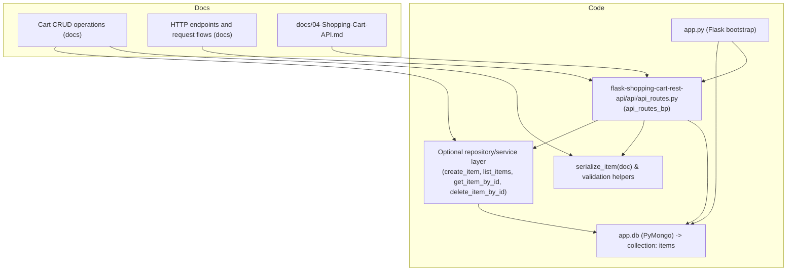
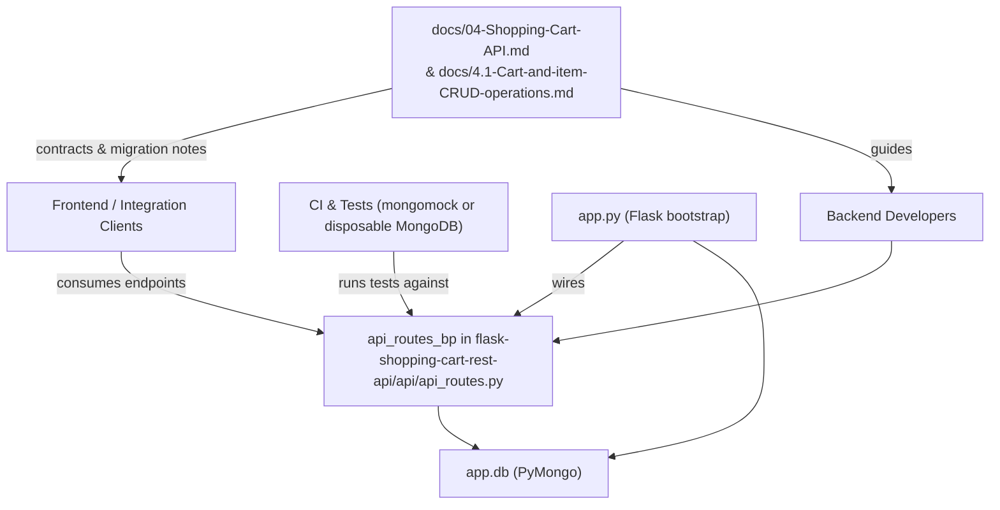
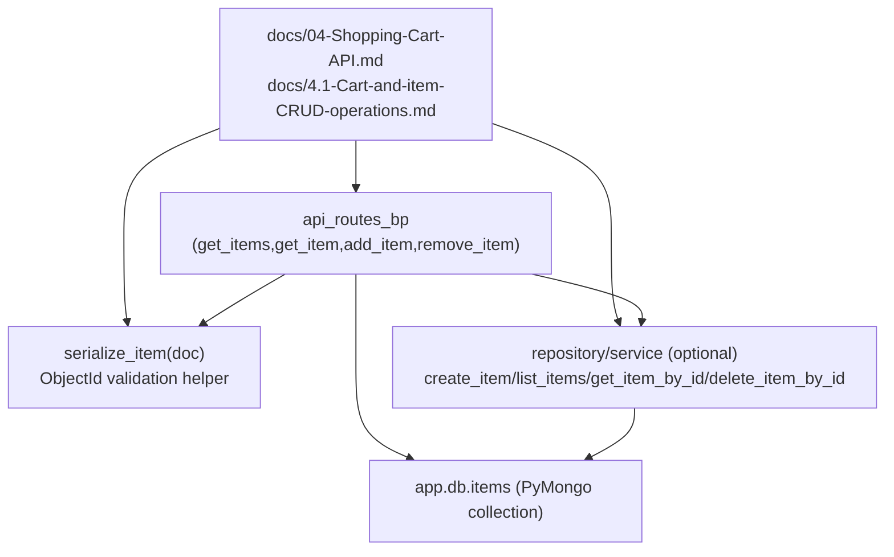

# Shopping Cart Service

## Cross-Topic Interactions

### app.db Wiring Across Cart CRUD operations and HTTP endpoints and request flows
- Runtime dependency: `app.py` must create and attach the PyMongo client / DB as `app.db` before registering the Blueprint in `flask-shopping-cart-rest-api/api/api_routes.py`.
  - Example: `app.db.items` is used by controllers (`get_items`, `get_item`, `add_item`, `remove_item`) and by the recommended repository/service layer functions (`create_item`, `list_items`, `get_item_by_id`, `delete_item_by_id`).
  - Failure mode: blueprint registered before `app.db` is set causes runtime AttributeError in handlers.

### serialize_item() and ObjectId Validation Across Cart CRUD operations and HTTP endpoints and request flows
- `serialize_item(doc)` is referenced by the Cart CRUD operations docs as the canonical serializer to convert `_id` (ObjectId) to string and to normalize non-JSON datatypes. All route responses should call this helper before returning documents.
- `bson.ObjectId.is_valid(id)` must be used consistently (documented in Cart CRUD operations) before calling `ObjectId(id)` (current HTTP endpoints docs show some places missing this check).

### Documentation & CI Integration Between docs/04-Shopping-Cart-API.md and Implementation
- `docs/04-Shopping-Cart-API.md` and `docs/4.1-Cart-and-item-CRUD-operations.md` are the consumer-facing API contract and security guidance referenced by developers and clients (frontend/integrations).
  - Example: when changing route shapes (e.g., deprecating `GET /addItem`), update those docs and include a migration plan for clients.
- CI/test suites referenced in Cart CRUD operations should provide an `app.db` fixture (mongomock or disposable MongoDB) to run integration tests against `api_routes_bp`.

### Testing Boundaries Between Controller and Repository
- The Cart CRUD operations subtopic recommends an optional service/repository layer to decouple `api_routes.py` from PyMongo. Tests should either:
  - Mock `app.db.items` for controller-level unit tests, or
  - Unit-test repository functions separately and run integration tests with mongomock for end-to-end validation.

## Key Application Flows

### Create Item (recommended flow: POST /items)
- Entry: Client POST /items with JSON body.
- Steps:
  1. Route: `flask-shopping-cart-rest-api/api/api_routes.py` → handler `create_item` (Blueprint `api` / `api_routes_bp`).
  2. Parse body using `request.get_json(silent=True)` and run schema checks (presence and types of `name`, `price`, `quantity`).
  3. Call repository/service: `create_item(data)` (optional layer) which wraps `app.db.items.insert_one(data)` and returns inserted_id.
  4. Retrieve created doc: `app.db.items.find_one({'_id': inserted_id})`.
  5. Serialize: `serialize_item(created_doc)` (convert `_id` to string).
  6. Response: HTTP 201 `{ "message": "Item created", "item": <serialized> }`.
- Error responses:
  - 400 for invalid JSON or missing fields.
  - 500 for DB errors (handler should log and return generic 500 message).

### Retrieve Item (GET /items/<id>)
- Entry: Client GET /items/<id>.
- Steps:
  1. Route: `get_item` handler in `api_routes.py`.
  2. Validate id: `bson.ObjectId.is_valid(id)` → return 400 if invalid.
  3. Query DB: `app.db.items.find_one({'_id': ObjectId(id)})`.
  4. If found: `serialize_item(item)` and return HTTP 200 `{ "message": "...", "item": <serialized> }`.
  5. If not found: HTTP 404 `{ "message": "No item present with that id" }`.
- Operational note: current implementation returns `str(item)` — replace with `serialize_item()`.

### Delete Item (DELETE /items/<id>)
- Entry: Client DELETE /items/<id>.
- Steps:
  1. Route: `delete_item` handler in `api_routes.py`.
  2. Validate id with `ObjectId.is_valid`.
  3. Call `app.db.items.find_one_and_delete({'_id': ObjectId(id)})`.
  4. If deleted: HTTP 200 `{ "message": "Item removed successfully" }`.
  5. If not found: HTTP 404 `{ "message": "No item present with that id" }`.
- Safety: ensure consistent validation to avoid unhandled exceptions.

### List Items (GET /items?limit=&skip=)
- Entry: Client GET /items with optional `limit` and `skip`.
- Steps:
  1. Route: `get_items` handler in `api_routes.py`.
  2. Read and coerce query params to integers with safe defaults.
  3. Call `app.db.items.find().skip(skip).limit(limit)` (or repository `list_items(limit, skip)`).
  4. Serialize each document via `serialize_item`.
  5. Return HTTP 200 `{ "count": <n>, "items": [ ... ] }`.
- Edge cases: return empty items array if no docs; ensure `_id` converted to string.

## Developer Onboarding Guide

### Learning path (order to read and inspect)
1. Read "HTTP endpoints and request flows" to understand the current runtime shape, endpoints, handler names (`home`, `get_items`, `get_item`, `add_item`, `remove_item`), and anti-patterns (GET-based mutations, `eval` usage).
2. Read "Cart CRUD operations" for recommended safe patterns: `serialize_item`, `ObjectId.is_valid`, schema checks, and the suggested repository/service layer.
3. Inspect source: `flask-shopping-cart-rest-api/api/api_routes.py` to map docs to actual handlers (`get_items`, `get_item`, `add_item`, `remove_item`).
4. Inspect `docs/04-Shopping-Cart-API.md` and `docs/4.1-Cart-and-item-CRUD-operations.md` for API contract and migration notes.
5. Set up local environment: either start a local MongoDB or use `mongomock` for tests. Ensure `app.db` initialization in `app.py` matches tests’ expectations.

### Typical change workflow
1. Make code change in `api_routes.py` or create/modify repository functions (`create_item`, `list_items`, `get_item_by_id`, `delete_item_by_id`).
2. Add or update `serialize_item(doc)` and validation helpers if response shape or schema changes.
3. Add unit tests that either:
   - Mock `app.db.items` (controller unit tests), or
   - Unit-test repository functions directly against mongomock.
4. Add integration tests that run against a disposable MongoDB or mongomock and exercise HTTP endpoints.
5. Update `docs/04-Shopping-Cart-API.md` with new endpoint shapes, example requests/responses, and deprecation/migration notes for clients.
6. Run CI: unit + integration test suites. Ensure `app.db` fixture is available for test runtime.

### Required developer skills
- Familiarity with Flask Blueprints and routing.
- Knowledge of PyMongo (collection operations: find, find_one, insert_one, find_one_and_delete).
- Understanding BSON ObjectId lifecycle and `bson.ObjectId.is_valid`.
- Experience writing JSON-safe serialization (`serialize_item`) and handling non-JSON types.
- Basic testing frameworks and use of mongomock or test DBs for CI.

## Visual Diagrams

### 1) Primary architecture (how subtopics work together)


### 2) Cross-domain integration (connections to other system parts)


### 3) Internal process/workflow: Create request (safe vs current unsafe)
```mermaid
graph TD
  Client["Client POST /items (JSON)"] --> APIReq["create_item() in api_routes.py"]
  APIReq --> ParseJson{"request.get_json(silent=True)?"}
  ParseJson -->|invalid| Bad400["HTTP 400 Invalid JSON"]
  ParseJson -->|valid| SchemaCheck{"schema fields present?"}
  SchemaCheck -->|missing| Bad400Fields["HTTP 400 Missing required fields"]
  SchemaCheck -->|ok| ToRepo["call create_item(data)"]
  ToRepo --> DBWrite["app.db.items.insert_one(data)"]
  DBWrite --> DBRead["app.db.items.find_one({_id: inserted_id})"]
  DBRead --> Serialize["serialize_item(doc)"]
  Serialize --> Resp201["HTTP 201 {message, item}"]

  subgraph Current unsafe path (documented in HTTP endpoints and request flows)
    Client2["Client GET /addItem?item=<py-literal>"] --> UnsafeHandler["add_item() using eval(item)"]
    UnsafeHandler --> UnsafeInsert["db.items.insert_one(item)"]
    UnsafeInsert --> UnsafeResp["HTTP 200 with str(item)"]
  end
```

### 4) Component relationships (controllers, persistence, helpers, docs)
