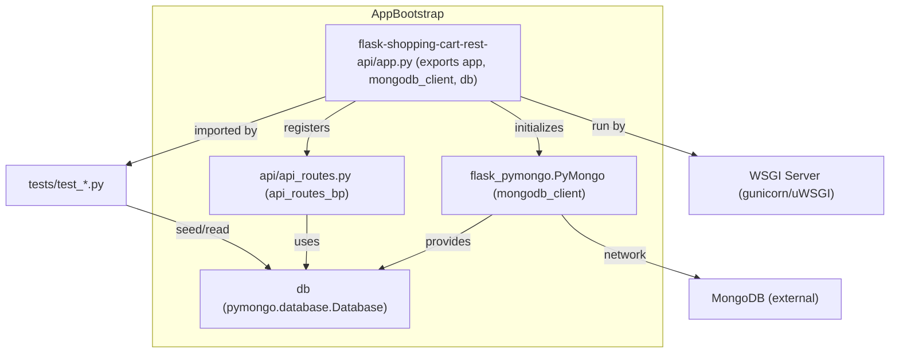
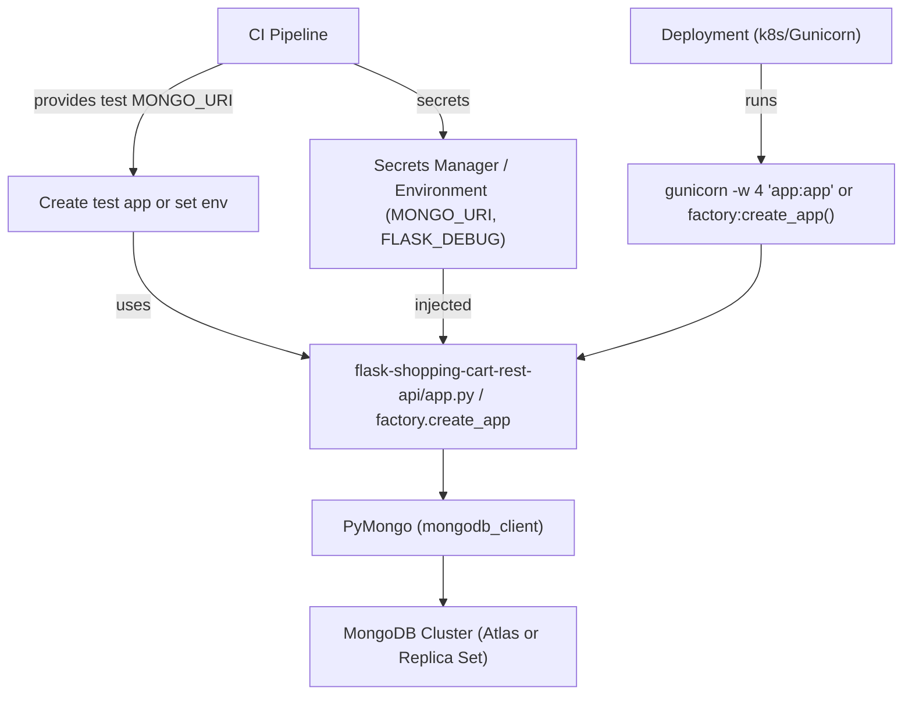
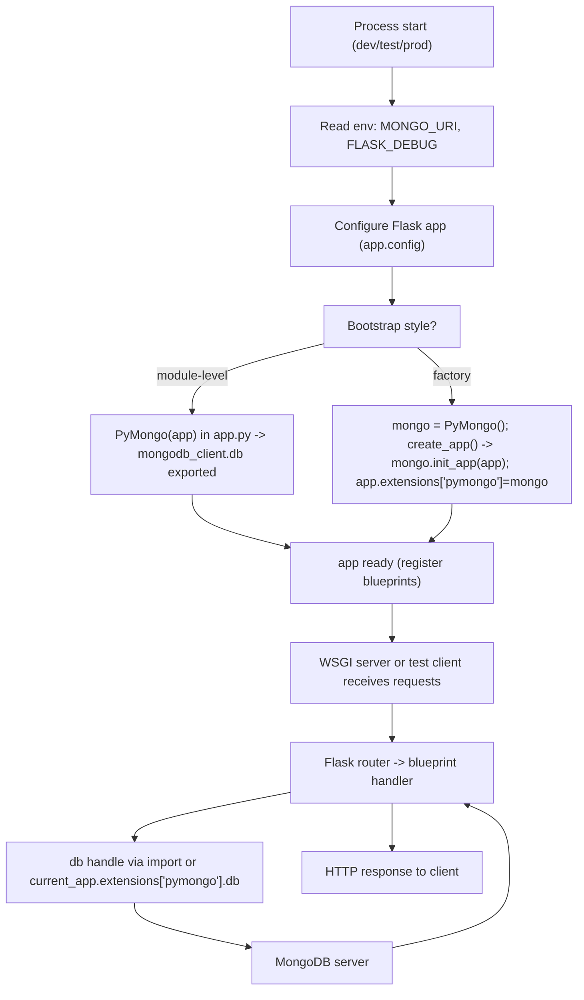
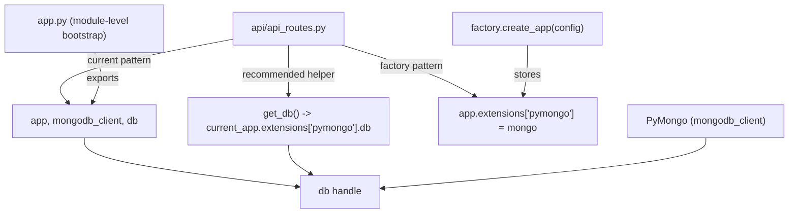

# Application Bootstrap and Configuration

## Overview of Subtopics
- Application initialization and wiring — single-module bootstrapper (flask-shopping-cart-rest-api/app.py) that constructs Flask `app`, sets configuration, initializes `flask_pymongo.PyMongo`, exposes `app`, `mongodb_client`, `db`, and registers `api_routes_bp` under `/api`.
- Configuration management and environment settings — how runtime configuration (MONGO_URI, FLASK_DEBUG) is read, consumed, validated, recommended migration to `create_app(config=None)` factory and `init_app` extension pattern for testability, and guidelines for secrets and pool tuning.

## Application initialization and wiring ↔ Configuration management and environment settings
- app.py sets `app.config['MONGO_URI']` (from environment) before calling `PyMongo(app)`. The PyMongo constructor reads config to create the pooled client; `db = mongodb_client.db` is exported for route modules and tests.
- api/api_routes.py currently imports `db` from app (module-level coupling). After factory refactor, route code should use `current_app.extensions['pymongo'].db` or a `get_db()` helper.
- Tests and WSGI runners import `app` (module-level) today; recommended CI/tests should call `create_app(test_config)` to create isolated app instances and seed test DB via `app.extensions['pymongo'].db` within an app context.

## Cross-Topic Interactions
- Application initialization and wiring ↔ api/api_routes.py  
  - Example: api/api_routes.py imports `db` from app: `from app import db` and defines `api_routes_bp`. app.py registers `api_routes_bp` at startup: `app.register_blueprint(api_routes_bp, url_prefix='/api')`.
- Application initialization and wiring ↔ Tests (tests/test_*.py)  
  - Example: tests import `app` and `db` to seed data and call `app.test_client()`. After factory refactor tests should call `create_app({'MONGO_URI': 'mongodb://..._test'})` and use `with app.app_context(): db = app.extensions['pymongo'].db`.
- Configuration management and environment settings ↔ Deployment pipelines / Secret Manager  
  - Example: production must inject `MONGO_URI` via environment or secret manager rather than hard-coding in app.py. CI should inject a test MONGO_URI or use mongomock.
- Configuration management and environment settings ↔ WSGI servers (gunicorn/uWSGI)  
  - Example: production runs `gunicorn -w 4 'app:app'` (module-level) or `gunicorn -w 4 'factory:create_app()'` (factory) — PyMongo pool sizing (`maxPoolSize`) must align with worker count to avoid connection exhaustion.
- Configuration management and environment settings ↔ External MongoDB cluster  
  - Example: `MONGO_URI` may be an SRV string for Atlas; PyMongo creates the connection pool and manages network connections to the external cluster.

## Key Application Flows
1. Application Startup Flow (module-level bootstrap)
   - Read environment variables: MONGO_URI, FLASK_DEBUG
   - Construct Flask app: `app = Flask(__name__)` and set `app.config`
   - Initialize PyMongo: `mongodb_client = PyMongo(app)` → pool created
   - Assign DB handle: `db = mongodb_client.db` (exported)
   - Register blueprint: `app.register_blueprint(api_routes_bp, url_prefix='/api')`
   - Hand off `app` to WSGI server or `app.run()` in development

2. API Request Handling Flow
   - Client HTTP request → Flask `app` entrypoint
   - Flask router selects blueprint handler (api_routes_bp)
   - Handler uses `db` (module-level import or via `current_app.extensions['pymongo']`) to query/write collections
   - Handler returns JSON response via Flask

3. Database Initialization & Connection Pooling
   - `app.config['MONGO_URI']` read before PyMongo initialization
   - PyMongo builds a pooled `mongodb_client` connected to the configured MongoDB
   - `db = mongodb_client.db` provides `pymongo.database.Database` handle used across handlers
   - Production tuning: set `maxPoolSize` and coordinate with WSGI worker count

4. Testing and CI Flow (factory pattern recommended)
   - CI/test harness calls `create_app(test_config)` providing an isolated `MONGO_URI` (or uses mongomock)
   - Within `app.app_context()` tests seed collections via `app.extensions['pymongo'].db` and run requests using `app.test_client()`
   - Tests teardown or drop test collections between runs

## Developer Onboarding Guide
1. Read "Application initialization and wiring" to understand current module-level bootstrap:
   - Inspect flask-shopping-cart-rest-api/app.py: exported symbols `app`, `mongodb_client`, `db`
   - Locate blueprint: flask-shopping-cart-rest-api/api/api_routes.py and note `from app import db` usage
2. Read "Configuration management and environment settings" to learn required environment variables:
   - Required: MONGO_URI
   - Optional: FLASK_DEBUG
   - Learn where to provide secrets (env variables / secret manager)
3. Run locally (quick start)
   - Export MONGO_URI for local DB: `export MONGO_URI='mongodb://localhost:27017/shoppingcart'`
   - Run development server: `python app.py` (development only; do not use in production)
   - Use `app.test_client()` in an interactive Python session or run test suite
4. Tests and seeding
   - Use a dedicated test DB URI (e.g., `shoppingcart_test`) or mongomock for CI
   - Seed test data inside `with app.app_context(): db = app.extensions['pymongo'].db`
5. Recommended refactor path for maintainability
   - Implement `create_app(config=None)` and `mongo = PyMongo()` at module scope, then `mongo.init_app(app)` inside factory
   - Update routes to use `current_app.extensions['pymongo'].db` or a `get_db()` helper
   - Update tests to create isolated apps via factory and seed via `app_context()`
6. Typical change workflow
   - Change config (add new env key) → add validation/fail-fast in startup
   - Add new blueprint → register in factory or app.py after app exists
   - Modify DB access → update `get_db()` helper or route imports to avoid circular imports
   - Adjust production pool sizing → coordinate `maxPoolSize` with WSGI worker count and update deployment config

## Visual Diagrams

### 1) Primary architecture — Application initialization and wiring with current module-level bootstrap

### 2) Cross-domain integration — Configuration sources, CI, deployment and runtime consumers

### 3) Internal process/workflow — Startup flow (factory and module-level variants)

### 4) Component relationships — Blueprints, db handle exposure, and recommended get_db() pattern

## Implementation Checklist (concise)
- Validate MONGO_URI at startup and fail fast if missing.
- Migrate to `create_app(config=None)` and `mongo.init_app(app)` to enable test isolation.
- Replace module-level `from app import db` in routes with `get_db()` using `current_app.extensions['pymongo']`.
- Update tests to call factory with test config and seed via `with app.app_context(): app.extensions['pymongo'].db`.
- Configure deployment to inject `MONGO_URI` from secrets manager and tune PyMongo pool sizes with WSGI worker count.

## References (code patterns from repository)
- Module-level bootstrap example:
  - app.py: set `app.config['MONGO_URI']`, `mongodb_client = PyMongo(app)`, `db = mongodb_client.db`, `app.register_blueprint(api_routes_bp, url_prefix='/api')`.
- Factory pattern example:
  - factory.py: `mongo = PyMongo()`; `create_app()` sets config, `mongo.init_app(app)`, `app.extensions['pymongo'] = mongo`, register blueprints.
- Route transition:
  - Current: `from app import db` → use `db.items.find()`
  - Recommended: `from flask import current_app` and `db = current_app.extensions['pymongo'].db` or `get_db()` helper.