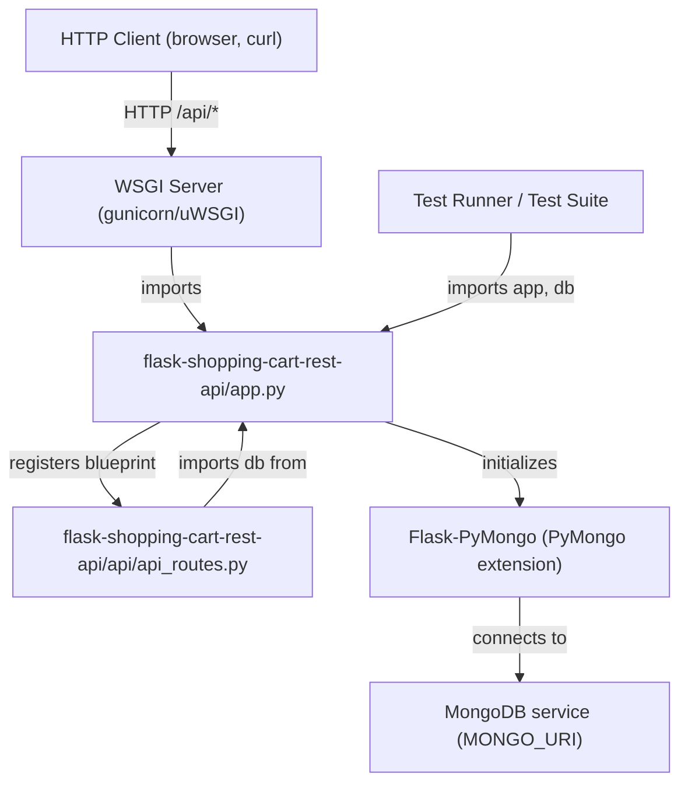
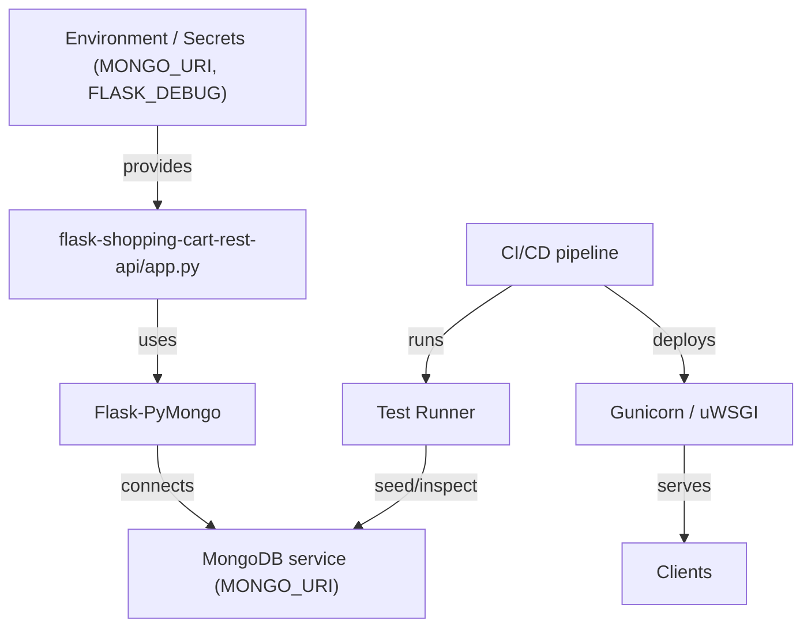
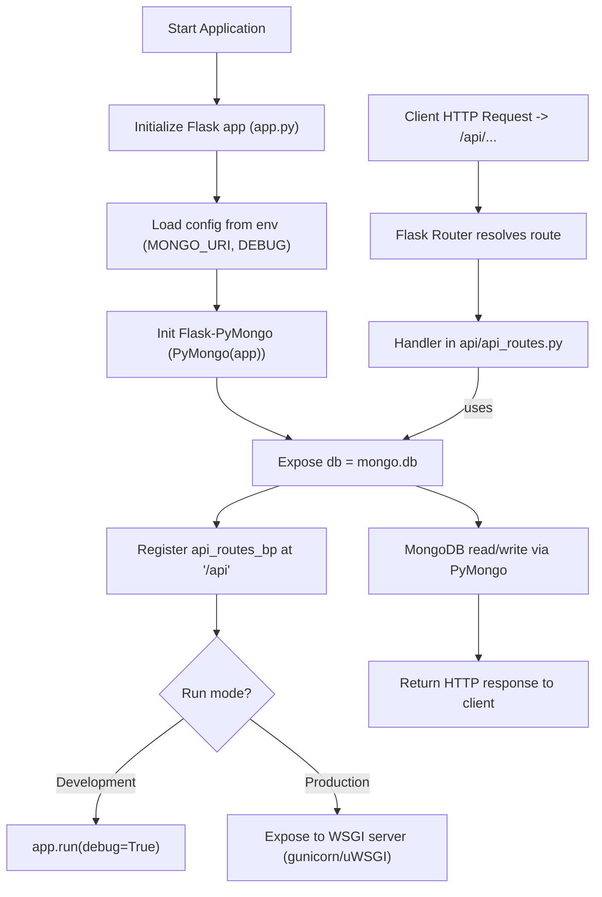
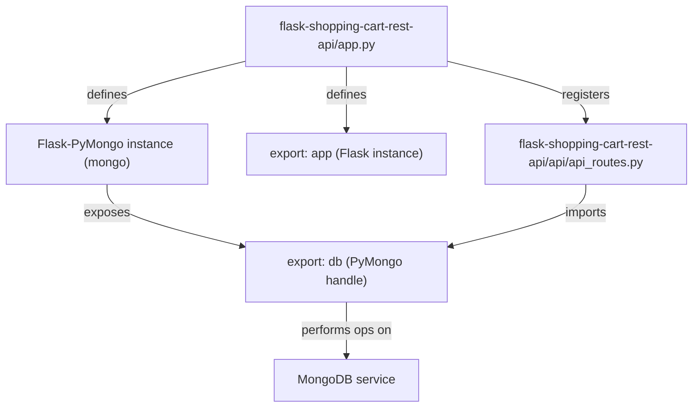

# Application Configuration and Infrastructure

## Cross-Topic Interactions

- Interaction: flask-shopping-cart-rest-api/app.py ↔ flask-shopping-cart-rest-api/api/api_routes.py  
  - app.py imports api.api_routes and registers the exported Blueprint `api_routes_bp` under the `/api` prefix. api_routes.py imports the shared `db` handle from app.py to perform MongoDB operations.
  - Concrete example: api/api_routes.py calls `from app import db` and performs `db.items.find({})`.

- Interaction: flask-shopping-cart-rest-api/app.py ↔ PyMongo (Flask-PyMongo) ↔ MongoDB service  
  - app.py sets `app.config['MONGO_URI']` (ideally from environment) and initializes `mongo = PyMongo(app)`; PyMongo creates the client/connection pool and exposes `db = mongo.db` used by route handlers.
  - Concrete example: `app.config['MONGO_URI'] = os.environ.get('MONGO_URI')` → `PyMongo(app)` → `db = mongo.db`.

- Interaction: flask-shopping-cart-rest-api/app.py ↔ Tests / Test Runner  
  - Tests import `app` and `db` from app.py to seed collections and exercise endpoints via `app.test_client()`. Tests rely on the single-file bootstrapper exposing a concrete `app` and a usable `db` handle.

- Interaction: flask-shopping-cart-rest-api/app.py ↔ WSGI Server (gunicorn/uWSGI)  
  - Production processes import the `app` object from app.py (or the application factory, if refactored). Example invocation: `gunicorn -w 4 'app:app'`.

- Interaction: Configuration/Environment Management ↔ app.py  
  - Secrets and environment-specific configuration (MONGO_URI, FLASK_DEBUG) must be injected into app.py via environment variables or secret manager integrations rather than hard-coded values.

- Recommended evolution (affects cross-topic usage): application factory (`create_app(config_name=None)`)  
  - Moving to `create_app` changes how tests, WSGI, and route modules interact: tests and WSGI import `create_app` and construct separate app instances with test or production configs rather than importing a global `app` and `db`.

## Key Application Flows

- Application Startup Flow (flask-shopping-cart-rest-api/app.py)  
  1. Instantiate Flask application object: `app = Flask(__name__)`.  
  2. Apply configuration from environment or inline (e.g., `MONGO_URI`, `DEBUG`).  
  3. Initialize Flask-PyMongo extension: `mongo = PyMongo(app)` → PyMongo opens MongoDB client and connection pool.  
  4. Expose shared persistence handle: `db = mongo.db`.  
  5. Register routing blueprint: `app.register_blueprint(api_routes_bp, url_prefix='/api')`.  
  6. Choose runtime: start development server (`app.run(debug=True)`) or expose `app` to a WSGI server (`gunicorn -w 4 'app:app'`).

- API Request Routing Flow (flask-shopping-cart-rest-api/api/api_routes.py uses app.py exports)  
  1. Client issues HTTP request to /api/*.  
  2. Flask router resolves endpoint to handler in `api_routes_bp`.  
  3. Handler uses shared `db` handle imported from app.py (e.g., `from app import db`) to perform MongoDB read/write via PyMongo (connection pooled).  
  4. Handler returns HTTP response to the client.

- Database Initialization and Lifecycle Workflow (app.py → PyMongo → MongoDB service)  
  1. app.config['MONGO_URI'] read at startup.  
  2. PyMongo initializes a MongoClient, sets up connection pooling, and exposes `mongo.db`.  
  3. Route handlers and tests reuse the same `db` handle; PyMongo manages socket pooling and reconnection behavior.

- Test / WSGI Execution Flow (tests and deployment)  
  1. Tests import `app` and `db` from app.py, seed collections via `db`, acquire `client = app.test_client()`, execute requests, and assert responses.  
  2. WSGI servers import `app` and serve requests concurrently; concurrency is handled by the WSGI worker model (e.g., gunicorn workers) and PyMongo's connection pool.

## Developer Onboarding Guide

- Prerequisite knowledge  
  - Python and Flask fundamentals (app, routes, Blueprints).  
  - Basic MongoDB and PyMongo usage (collections, queries).  
  - WSGI server concepts (gunicorn/uWSGI) and environment-based configuration.

- Learning path (order to review files and concepts)  
  1. Read flask-shopping-cart-rest-api/app.py (Application bootstrap and initialization) to understand how the application, configuration, and PyMongo are wired and how `app` and `db` are exported.  
  2. Read flask-shopping-cart-rest-api/api/api_routes.py to see concrete route handlers consuming the exported `db` and returning JSON responses.  
  3. Inspect environment handling patterns and adopt environment variables: MONGO_URI, FLASK_DEBUG. Confirm local dev MongoDB availability.  
  4. Run the application locally with a test MongoDB instance (set MONGO_URI to a local replica or single node). Use `app.run()` for dev or `gunicorn -w 4 'app:app'` to exercise WSGI deployment.  
  5. Review and run tests: import `app` and `db` in test code, seed test fixtures with `db`, and exercise endpoints via `app.test_client()`.

- First-day checklist (practical steps)  
  - Ensure Python virtualenv and pip dependencies installed (Flask, Flask-PyMongo).  
  - Start or point to a MongoDB instance; set environment variable: `export MONGO_URI='mongodb://localhost:27017/shoppingcart'`.  
  - Run `python -m flask-shopping-cart-rest-api.app` or `python flask-shopping-cart-rest-api/app.py` in dev mode (or `gunicorn -w 4 'app:app'` for WSGI).  
  - Run unit/integration tests that import `app` and `db`; use `db` to seed test data.

- Typical change workflow within this domain  
  1. Modify routing logic in api/api_routes.py (or add Blueprints).  
  2. If configuration changes are required, update app.py to load from environment or refactor to application factory `create_app`.  
  3. Update tests to seed or expect changed data shapes using `db`.  
  4. Validate locally with `app.test_client()` and run CI tests; deploy via WSGI configuration.

- Recommended refactor for maintainability and testability  
  - Implement an application factory pattern `create_app(config=None)` in app.py (or app_factory.py) so tests and WSGI runners can create isolated app instances with separate PyMongo initialization and configuration. This removes global `db` coupling and enables parallelized test setups.

## Visual Diagrams

### Primary architecture: Application bootstrap and routing collaboration

### Cross-domain integration: Configuration, secrets, and deployment

### Internal processes/workflows: Startup and request routing control flow

### Component relationships: exports, imports, and shared handles
