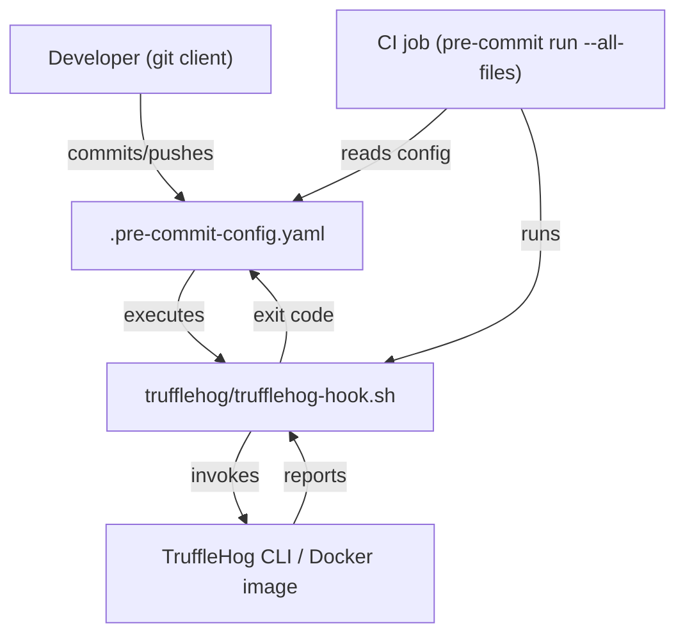
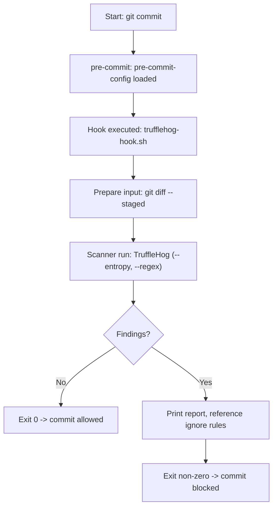
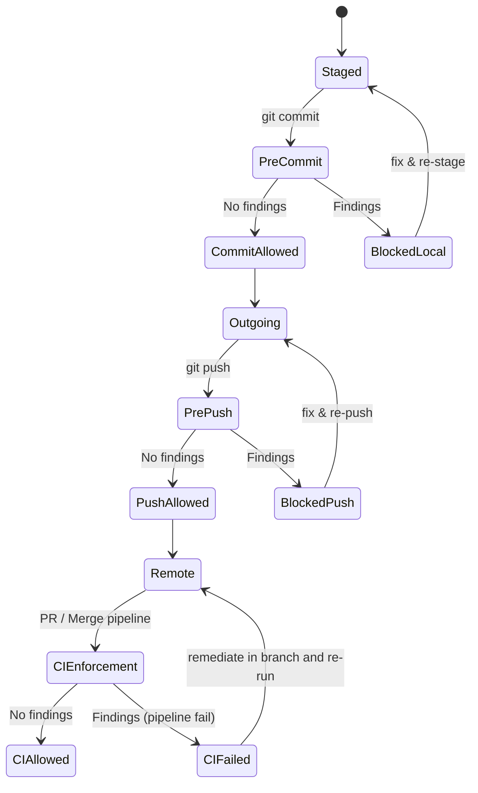

# Secrets detection and pre-commit blocking

## Summary
Domain: Developer Tooling & Security (DevSecOps)  
Relational tags: security, hooks, pre-commit, ci-cd, git-hooks

This subtopic documents the repository-level secrets detection and pre-commit/pre-push gating implemented with a TruffleHog wrapper and the pre-commit framework. It prevents accidental secrets from entering version control by scanning staged diffs and outgoing commit ranges locally, and by enforcing the same checks in CI. It also outlines remediation flows for historical leaks.

## Key Abstractions

- **Hook Adapter / Wrapper**
  - Purpose: adapter pattern that normalizes inputs (staged diffs or commit ranges), invokes the TruffleHog scanner (binary or container), formats output, and maps scanner exit codes to Git hook behavior.
  - Location: `flask-shopping-cart-rest-api/trufflehog/trufflehog-hook.sh`
  - Responsibilities: prepare diff input, apply tracked ignore rules, call TruffleHog with pinned options (`--entropy`, `--regex`, `--no-update`), produce human-readable report, return non-zero on findings to block.

- **Gatekeeper Hook**
  - Purpose: a pre-commit/pre-push runtime policy enforcement point that blocks Git operations when secrets are detected.
  - Configuration: `flask-shopping-cart-rest-api/.pre-commit-config.yaml` with a `local` repo entry and `stages: ["pre-commit","pre-push"]`.
  - Behavior: fast, diff-based checks on pre-commit; broader outgoing commit-range scans on pre-push.

- **CI Policy Enforcement**
  - Purpose: ensure hooks cannot be bypassed via `--no-verify` or local misconfiguration by running checks on the repository snapshot in CI.
  - Pattern: run `pre-commit run --all-files` or a pinned TruffleHog invocation in CI, with pinned versions for deterministic detection.

## Collaborative Use Case

Files involved
- `flask-shopping-cart-rest-api/.pre-commit-config.yaml` — registers the local hook and binds stages.
- `flask-shopping-cart-rest-api/trufflehog/trufflehog-hook.sh` — wrapper script invoked by pre-commit.
- CI job (example stored in repository CI definitions) — runs pre-commit across all files to prevent bypass.

How they work together (concrete examples)

- Minimal `.pre-commit-config.yaml` snippet
```yaml
repos:
  - repo: local
    hooks:
      - id: trufflehog
        name: TruffleHog
        entry: trufflehog/trufflehog-hook.sh
        language: script
        stages: [pre-commit, pre-push]
```

- Skeleton of the wrapper `trufflehog-hook.sh`
```bash
#!/usr/bin/env bash
set -euo pipefail

# Exit early when no staged changes
git diff --staged --name-only | grep -q . || exit 0

# Prepare diff input
diff_content="$(git diff --staged)"

# Run TruffleHog (binary or container)
echo "$diff_content" | trufflehog --entropy --regex --no-update --stdin

# trufflehog returns non-zero on findings; propagate that exit code
exit_code=$?
exit $exit_code
```

- Developer local workflow
```bash
pip install pre-commit
cd flask-shopping-cart-rest-api
pre-commit install
# On git commit, pre-commit runs the trufflehog wrapper and blocks the commit if secrets are found.
```

- CI enforcement example (GitHub Actions / CI job)
```yaml
- name: Install pre-commit and run hooks
  run: |
    pip install pre-commit==<pinned-version>
    pre-commit run --all-files
```

Behavioral expectations
- Hook returns 0 -> Git operation allowed.
- Hook returns non-zero -> Git operation blocked; wrapper prints findings and references ignore rules and remediation steps.
- Developers can bypass locally with `--no-verify`, therefore CI must enforce the same policy.

## Application Flow Integration

Key flows enabled by this subtopic (flowParticipation):
1. Pre-commit Checks (Local Development)
   - Scope: staged diffs only.
   - Goal: fast feedback to prevent secrets in new commits.
   - Trigger: `git commit` -> pre-commit -> wrapper scans staged diff -> allow/deny commit.

2. Pre-push Checks (Local Developer & Outgoing Range)
   - Scope: outgoing commit range or broader file set.
   - Goal: catch secrets introduced across multiple commits before they reach remote.
   - Trigger: `git push` -> pre-push -> wrapper computes outgoing range -> run TruffleHog -> allow/deny push.

3. CI Enforcement (CI/CD Pipeline)
   - Scope: repository snapshot or `--all-files`.
   - Goal: prevent bypass after `--no-verify` and ensure consistent pinned-tool scanning.
   - Trigger: CI job runs `pre-commit run --all-files` (with pinned versions) -> fail pipeline on findings.

Incident remediation flow (brief)
- If a secret is found (local or CI):
  - Rotate the secret immediately.
  - Run a full-repo TruffleHog scan to locate historical leaks.
  - Remediate commits (audit, rotate, and if necessary rewrite history following organization policy).
  - Update ignore rules or tuning only with documented justification under version control.

## Diagrams

### File collaboration (how repository files and CI interact)


### Control/data flow for a single commit (pre-commit)


### Commit lifecycle state diagram (pre-commit → pre-push → CI)


## Practical Implementation Notes

- File permissions and shebang
  - Ensure `trufflehog/trufflehog-hook.sh` is executable: `chmod +x trufflehog/trufflehog-hook.sh`.
  - Include a portable shebang: `#!/usr/bin/env bash`.

- Path resolution
  - `entry` paths in `.pre-commit-config.yaml` are relative to the repository root. Confirm `entry: trufflehog/trufflehog-hook.sh` is correct.

- Performance considerations
  - Use diff-based scans for pre-commit for speed; use pre-push and CI for broader scans.

- Version pinning and deterministic behavior
  - Pin `pre-commit` and TruffleHog versions in CI to avoid detection drift.
  - Track ignore rules and scanner options in version control (within wrapper or a config file).

- Handling false positives
  - Add scoped ignore rules tracked in the repository with documented rationale.
  - Tune regex/entropy thresholds via PR, not via local untracked overrides.

- Bypass mitigation
  - Treat local bypass (`--no-verify`) as non-authoritative; CI must run the same or stronger checks before merges.

## Maintenance Checklist

- Validate `.pre-commit-config.yaml` syntax after edits.
- Keep `trufflehog-hook.sh` executable and test locally with:
```bash
pre-commit run trufflehog --hook-stage pre-commit
pre-commit run --all-files
```
- Pin TruffleHog and pre-commit versions in CI workflow definitions.
- Document contributor onboarding in `CONTRIBUTING.md`:
  - `pip install pre-commit`
  - `pre-commit install`
  - What to do when a hook blocks (rotate secret, update branch).
- Schedule periodic full-repo scans in CI to detect latent historical leaks.

## References (file-level)
- `flask-shopping-cart-rest-api/.pre-commit-config.yaml` — hook registration and stage binding
- `flask-shopping-cart-rest-api/trufflehog/trufflehog-hook.sh` — scanner wrapper
- CI job definitions — must run `pre-commit run --all-files` with pinned versions