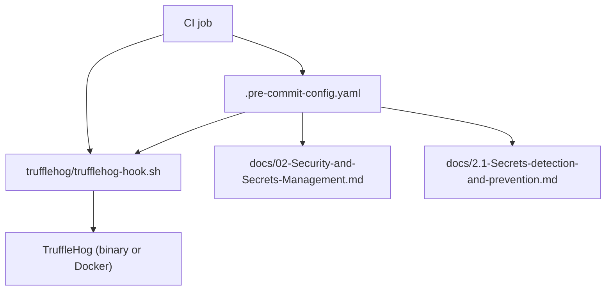
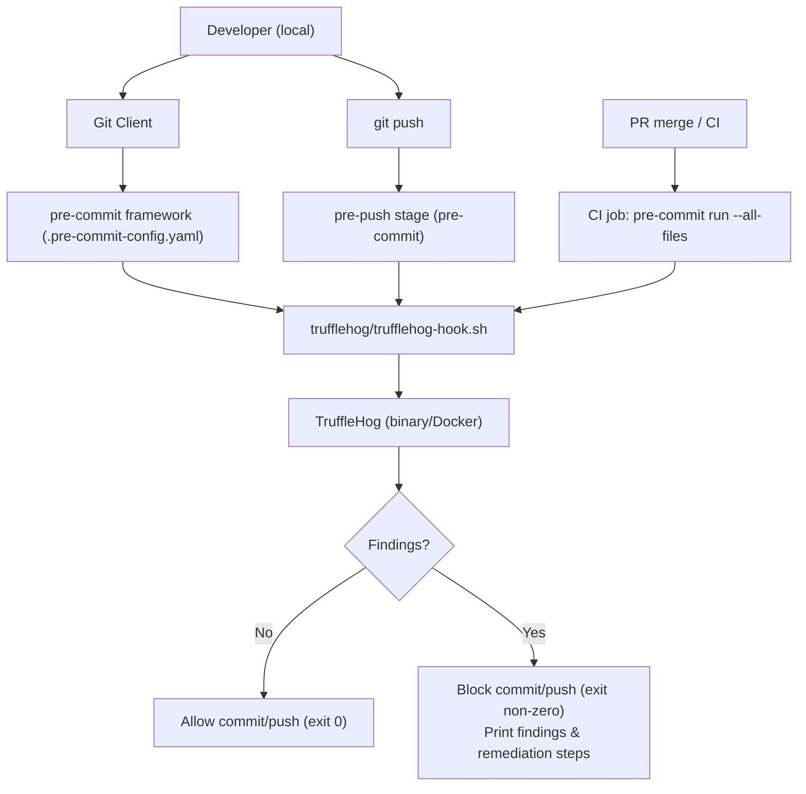
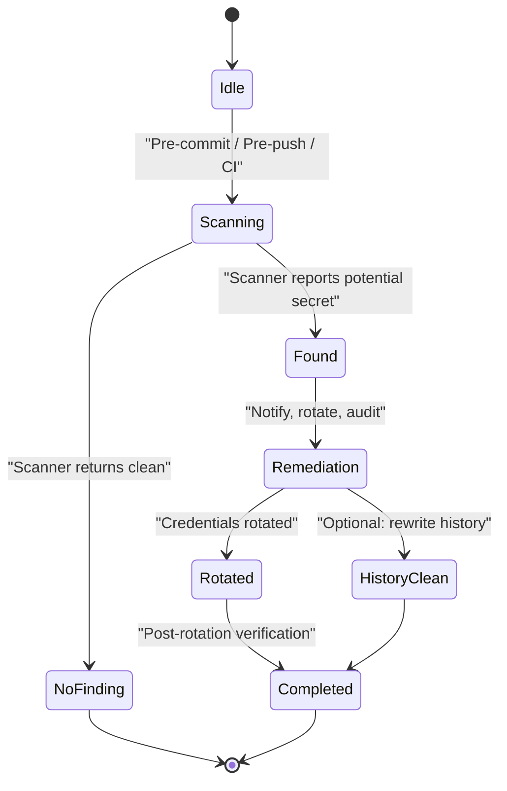

# Secrets detection and prevention

## Overview

This subtopic documents the repository-level secrets detection and prevention integration implemented with the pre-commit framework and a TruffleHog-based wrapper. It explains the core abstractions, how repository artifacts collaborate, the primary flows that are enforced (local and CI), and operational guidance for maintainers.

Domains: Developer Tooling & Security, Security & Secrets Management  
Layer: Build & Tooling  
Relational tags: hooks, security, ci-cd, secrets, pre-commit

---

## Key Abstractions

- **Hook Wrapper pattern**
  - A repository-local wrapper script (trufflehog/trufflehog-hook.sh) centralizes scanner invocation, configuration, ignore rules, version pins, and exit semantics. The wrapper exposes a simple contract to pre-commit: exit `0` when no findings, non-zero when findings exist.

- **Diff-first scanning**
  - Local hooks use staged-diff inputs (fast, scoped) to minimize developer friction. Broader scans (commit ranges, all-files) are used in pre-push and CI to catch bypasses.

- **Pipeline enforcement (Local + CI)**
  - Local enforcement via pre-commit prevents most accidental commits. CI mirrors the same checks (pinned scanner version and `pre-commit run --all-files`) to prevent bypass via `--no-verify` or missing local setup.

---

## Collaborative Use Case

Files involved
- `.pre-commit-config.yaml` (repo root): registers a local hook that points to the wrapper script.
- `trufflehog/trufflehog-hook.sh`: wrapper script that prepares input and executes TruffleHog (binary or Docker).
- Documentation files (`docs/02-Security-and-Secrets-Management.md`, `docs/2.1-Secrets-detection-and-prevention.md`): describe onboarding, CI integration, and remediation steps.

How they work together (concrete examples)

1. .pre-commit-config.yaml snippet (registers local hook)
```yaml
repos:
  - repo: local
    hooks:
      - id: trufflehog
        name: TruffleHog
        entry: trufflehog/trufflehog-hook.sh
        language: script
        stages: [pre-commit, pre-push]
```

2. trufflehog/trufflehog-hook.sh (core behaviors)
```bash
#!/usr/bin/env bash
set -euo pipefail

# Fast exit when nothing staged
git diff --staged --name-only | grep -q . || exit 0

# Prepare diff content for scanner
diff_content=$(git diff --staged --no-color)

# Run TruffleHog (local binary or docker; ensure pinned version for CI)
echo "$diff_content" | trufflehog --entropy --regex --no-update || exit 2
```

3. CI enforcement (example job step)
```bash
# Pin interpreter and pre-commit version in CI
pip install pre-commit==<pinned-version>
pre-commit run --all-files
# or run wrapper directly for deterministic behavior:
bash trufflehog/trufflehog-hook.sh
```

Notes on exit contract
- Exit 0 → no findings; commit/push proceeds.
- Non-zero → findings present; pre-commit blocks the action and prints formatted output for remediation.

---

## Application Flow Integration

Primary flows enabled by this subtopic:

1. Pre-commit Checks (fast, staged-diff)
   - Trigger: `git commit` (pre-commit stage)
   - Scope: staged changes only
   - Purpose: fast feedback to developer; reduces accidental commits
   - Artifact interaction: `.pre-commit-config.yaml` → `trufflehog/trufflehog-hook.sh` → TruffleHog

2. Pre-push Checks (broader commit-range)
   - Trigger: `git push` (pre-push stage)
   - Scope: outgoing commit range (or full repo if configured)
   - Purpose: catch issues missed by staged-diff or introduced by history rewrite

3. CI Enforcement (full-repo / all-files)
   - Trigger: CI job on PR or merge
   - Scope: `--all-files` or full-repo TruffleHog scan
   - Purpose: authoritative enforcement to prevent bypass from local hook skip
   - Implementation: pinned pre-commit and pinned TruffleHog binary/image

Incident / remediation flow (historical leaks)
- Trigger: secret detected in CI or by periodic full-repo scan
- Actions: rotate credentials, run full-repo TruffleHog, audit access, optionally rewrite history following repository policy and legal constraints, update ignore rules if false positive

---

## Visual Diagrams

### 1) File collaboration (how files reference each other)


### 2) Data / control flow (developer -> git -> hook -> CI)


### 3) Secret detection lifecycle (state diagram)


---

## Operational Guidance

Common pitfalls
- Non-executable wrapper or missing shebang: ensure `chmod +x trufflehog/trufflehog-hook.sh` and proper shebang.
- Incorrect `entry` path: `.pre-commit-config.yaml` `entry` is relative to repo root.
- False positives: avoid overly broad regex/entropy settings; prefer tracked ignore rules and PR-reviewed exceptions.
- Hook bypass: local `--no-verify` allows commits to skip hooks—CI must enforce checks.
- Version drift: pin TruffleHog and pre-commit versions in CI to maintain deterministic behavior.

Maintenance checklist
- Keep `trufflehog/trufflehog-hook.sh` executable and under source control.
- Pin scanner versions or Docker image tags used by the wrapper and CI.
- Store ignore rules and scanner configuration in tracked files reviewed via PRs.
- Reference hook installation steps in CONTRIBUTING.md (e.g., `pip install pre-commit && pre-commit install`).
- Periodically run a full-repo scan and follow the incident response playbook for any findings.

---

## Quick commands & examples

- Install and enable pre-commit locally:
```bash
pip install pre-commit
pre-commit install
```

- Run all hooks across repository (CI pattern):
```bash
pre-commit run --all-files
```

- Run only the trufflehog hook locally:
```bash
pre-commit run trufflehog --hook-stage pre-commit
```

- Make the wrapper executable:
```bash
chmod +x trufflehog/trufflehog-hook.sh
```

---