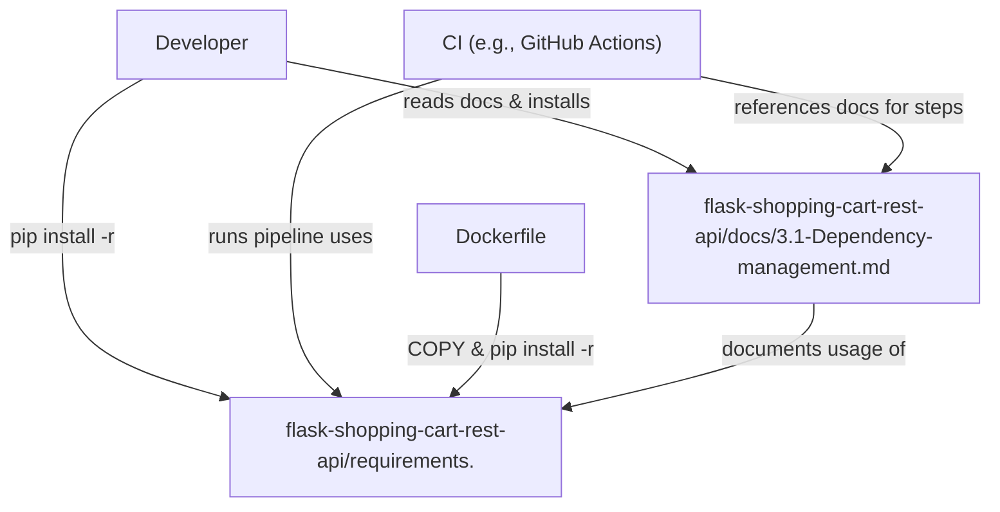
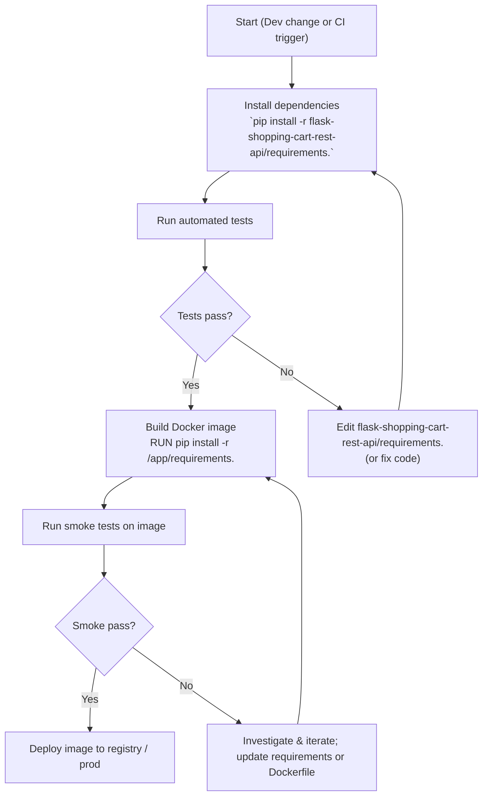

# Dependency management and reproducible environments

## Overview

This subtopic documents the project's single pinned Python dependency manifest and its role in producing deterministic, reproducible environments for local development, CI, and Docker image builds.

Domain: Dependency Management  
Relational tags: dependency-management, python, ci-cd, dependencies, database  
Architectural layer: Build & Tooling

Primary purpose: provide a single, explicit installation contract (pinned package versions) consumed by developers, CI pipelines, and Docker builds so runtime behavior is repeatable across environments.

Files of interest:
- `flask-shopping-cart-rest-api/requirements.` (pinned requirements file)
- `flask-shopping-cart-rest-api/docs/3.1-Dependency-management.md` (human-facing usage and guidance)

## Key Abstractions

### 1. Pinned dependency manifest
- Representation: a plain-text list of `package==x.y.z` lines.
- Role: *single source of truth* for exact dependency versions to guarantee reproducible pip installs across environments.

### 2. Environment consumer boundary
- Consumers: Local developer virtualenvs, CI jobs, Docker image builds.
- Contract: Consumers run `pip install -r <path>` against the same pinned file to reproduce the environment.

### 3. Upgrade & validation workflow
- Edit the pinned manifest to change versions.
- Validate via automated test suite and Docker smoke builds before merging.
- Optionally: adopt a generator/lock workflow (e.g., `requirements.in` + `pip-compile`) to separate human-editable intent from fully resolved pins.

## Collaborative Use Case

This section shows how the two repository files collaborate to enable reproducible installs and the typical commands used by each consumer.

Files:
- `flask-shopping-cart-rest-api/requirements.` (runtime pins)
- `flask-shopping-cart-rest-api/docs/3.1-Dependency-management.md` (usage & guidance)

Typical developer workflow (commands):
```bash
python -m venv .venv
source .venv/bin/activate
python -m pip install --upgrade pip
pip install -r flask-shopping-cart-rest-api/requirements.
```

CI (example job steps):
```yaml
- name: Set up Python
  uses: actions/setup-python@v3
  with:
    python-version: '3.9'

- name: Install deps
  run: |
    python -m venv .venv
    . .venv/bin/activate
    python -m pip install --upgrade pip
    pip install -r flask-shopping-cart-rest-api/requirements.
```

Dockerfile install snippet (cache-friendly pattern):
```dockerfile
COPY flask-shopping-cart-rest-api/requirements. /app/requirements.
RUN python -m pip install --upgrade pip && \
    pip install --no-cache-dir -r /app/requirements.
```

Upgrade & validation example (branch workflow):
1. Edit `flask-shopping-cart-rest-api/requirements.` (bump one or a small set of pins).
2. Push branch → CI runs tests using the same pinned file.
3. CI builds a Docker image that installs from `/app/requirements.` and runs smoke tests.
4. Merge only when CI + smoke tests pass.

## Application Flow Integration

This subtopic enables the following key flows. For each flow, the concrete interactions with the files are shown.

### Development Environment Setup
- Purpose: let a developer reproduce the exact runtime environment locally.
- Steps:
  - create a venv: `python -m venv .venv`
  - install: `pip install -r flask-shopping-cart-rest-api/requirements.`
- Notes: ensure local pip >= 20.3 for stable resolver behavior; match Python runtime used in CI (example: 3.9).

### CI Build & Test
- Purpose: run the test matrix against the exact set of runtime dependencies.
- Steps:
  - CI sets up Python (match runtime)
  - install: `pip install -r flask-shopping-cart-rest-api/requirements.`
  - run tests; fail on incompatibilities
- Notes: the CI pipeline should reference the same file path as Docker and local docs.

### Docker Image Build & Deployment
- Purpose: embed deterministic runtime packages within production images.
- Steps:
  - COPY `flask-shopping-cart-rest-api/requirements.` into the image
  - RUN `python -m pip install --upgrade pip && pip install --no-cache-dir -r /app/requirements.`
  - Build and smoke-test the image before release
- Notes: system-level packages (e.g., libpq-dev) and C build deps must be handled in the Dockerfile separately; pinned Python packages do not include OS-level dependencies.

## Technical guidance (concise)

- File path: `flask-shopping-cart-rest-api/requirements.` (nonstandard trailing dot). Consider renaming to `requirements.txt` or document in README/CI.
- Pin style: exact `==` pins; results in deterministic installs but manual upgrades.
- Recommended pip: >= 20.3
- Recommended verification: run full test suite and a Docker smoke build for any pin change.
- Security: consider hash-locked files or a lock-generator (pip-tools / pip-compile) and automated updates (Dependabot / Renovate).

## Visual Diagrams

### File collaboration: who consumes what


### Data / control flow: install, test, and upgrade lifecycle


## Common pitfalls and mitigation (summary)

- Nonstandard filename: `requirements.` may be overlooked by tools; ensure CI/Docker reference exact path or rename to `requirements.txt`.
- Missing system dependencies: include OS-level build dependencies in Docker/CI images as required.
- Over-pinning conflicts: prefer small, grouped upgrades and CI validation; consider constraint files or generated lockfiles for larger projects.
- Pip resolver differences: use modern pip (>=20.3) consistently across local, CI, and Docker environments.

## Maintenance checklist

- Ensure CI, Dockerfile, and README reference the same path: `flask-shopping-cart-rest-api/requirements.`
- Run a controlled upgrade process: small bumps → CI tests → Docker smoke → merge.
- Periodically audit dependencies for security fixes and plan grouped upgrades for core framework libraries (Flask + Werkzeug + Jinja2).
- Consider introducing `requirements.in` + `pip-compile` or a lockfile workflow for larger dependency surfaces.