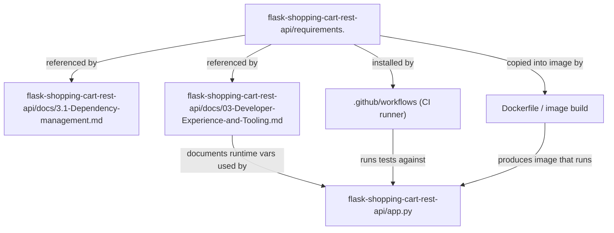
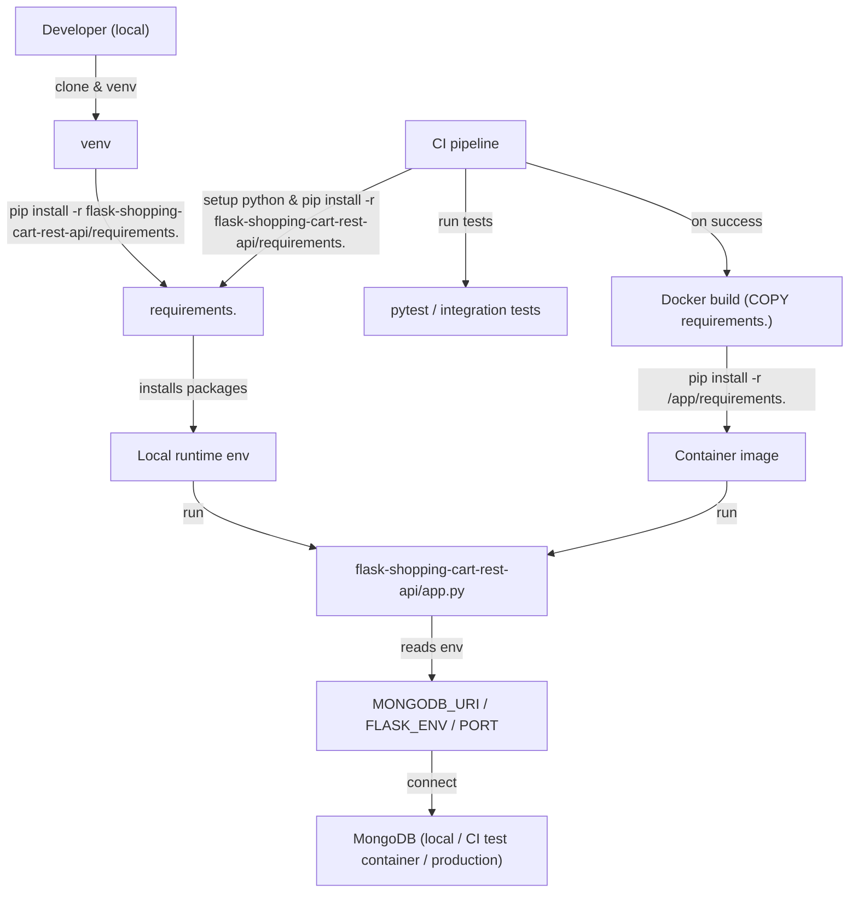
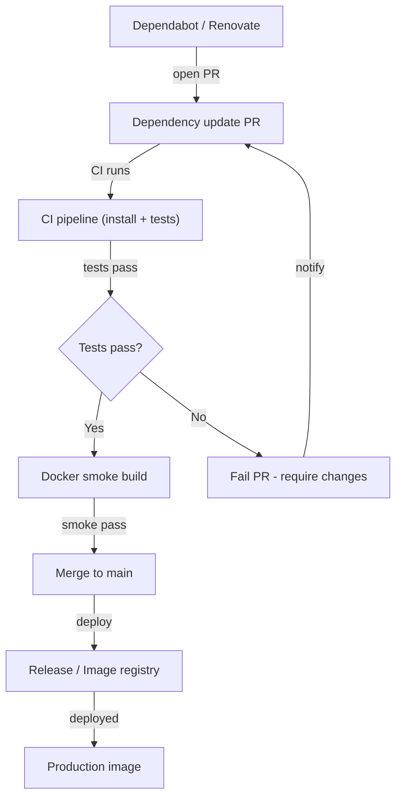

# Dependency pinning and reproducible environments

## Overview: domain, purpose, and problem solved

- Domain: **Developer Experience & Tooling**, **Dependency Management | Build & Tooling**
- Relational tags: *dependency-management*, *python*, *ci-cd*, *docker*, *mongodb*, *onboarding*
- Purpose: provide a single, pinned dependency manifest that enables *deterministic installs* for local development, CI test runs, and Docker image builds so runtime behavior is reproducible and upgradeable in a controlled way.
- Problem solved: prevent version drift and environment mismatch between developer machines, CI, and container images by enforcing a single source-of-truth dependency file consumed by all tooling and documenting the integration points and lifecycle for safe updates.

## Key Abstractions

1. **Pinned dependency manifest (single source-of-truth)**  
   - Concrete file: `flask-shopping-cart-rest-api/requirements.`  
   - Pattern: exact-version pins (`package==x.y.z`) to guarantee repeatable installs.

2. **Consumer separation pattern**  
   - Consumers include: *local developer venv*, *CI pipeline*, and *Docker image build*. Each consumer performs the same install step (`pip install -r <manifest>`) to preserve parity.

3. **Reproducible build workflow**  
   - Pattern: manifest → install in isolated env (venv / CI runner / container build) → run tests → build image. Includes automation for dependency updates (Dependabot/Renovate + CI security scanning) and a smoke test to validate images post-build.

## Collaborative use case (how the files work together)

Files involved (exact paths):
- `flask-shopping-cart-rest-api/requirements.` (pinned dependency file)
- `flask-shopping-cart-rest-api/docs/3.1-Dependency-management.md` (dependency management guidance)
- `flask-shopping-cart-rest-api/docs/03-Developer-Experience-and-Tooling.md` (onboarding and DX guidance)
- Supporting runtime consumer: `flask-shopping-cart-rest-api/app.py` (runtime behavior driven by env vars; referenced by docs)
- Consumers not stored as files here but referenced: CI (GitHub Actions), Dockerfile

Concrete examples:

- Local install (developer):
```bash
python3 -m venv env
source env/bin/activate
pip install --upgrade pip  # recommend pip >= 20.3
pip install -r flask-shopping-cart-rest-api/requirements.
python3 flask-shopping-cart-rest-api/app.py
```

- Dockerfile fragment (as recommended by docs):
```dockerfile
COPY flask-shopping-cart-rest-api/requirements. /app/requirements.
RUN python -m pip install --upgrade pip \
    && pip install --no-cache-dir -r /app/requirements.
COPY flask-shopping-cart-rest-api /app
CMD ["python", "/app/app.py"]
```

- CI install/test snippet (YAML-style pseudo):
```yaml
- uses: actions/setup-python@v3
  with: { python-version: '3.9' }
- run: python -m pip install --upgrade pip
- run: pip install -r flask-shopping-cart-rest-api/requirements.
- run: pytest
```

Collaborative responsibilities:
- `requirements.` is the canonical pin list; documentation files (`docs/3.1-Dependency-management.md` and `docs/03-Developer-Experience-and-Tooling.md`) define how tooling consumes it and timing for updates.
- CI and Docker must reference the same path string used in the repository; any filename change must be propagated to both docs and tooling.
- App runtime behavior (env vars like `MONGODB_URI`, `FLASK_ENV`, `PORT`) must be documented in onboarding docs and validated by integration tests.

## Application flow integration

The manifest and docs participate in these flows:

1. Local Development (onboarding)
   - Developer gets repo → venv → `pip install -r flask-shopping-cart-rest-api/requirements.` → run app (`python3 app.py`) → exercise endpoints (GET/POST/DELETE).
   - Docs provide `.env` examples and endpoint payload formats.

2. CI Build & Test
   - CI runner sets Python version, upgrades pip, installs exact pins from `requirements.`, then runs unit/integration tests (`pytest`).
   - CI must include dependency/security scans and fail on test regressions before merging dependency updates.

3. Docker Image Build
   - Dockerfile must COPY the manifest and run `pip install -r` in the build stage so the built image contains the exact pinned packages used in CI.
   - Docker builds should use `--no-cache-dir` and explicit pip upgrade to avoid resolver discrepancies; update build cache strategy when pins change.

4. Dependency Upgrade Lifecycle
   - Automation (Dependabot/Renovate) proposes updates → PR triggers CI → run full test matrix + Docker smoke build → pass → merge → release.
   - If tests fail, PR is blocked; human review coordinates grouped upgrades when cross-package compatibility (e.g., Flask + Werkzeug + Jinja2) is required.

## Visual diagrams

### 1) File collaboration (which files are read/updated and by whom)


### 2) Data/control flow: developer → CI → Docker → runtime


### 3) Dependency upgrade lifecycle and decision points


## Common pitfalls & gotchas

- Nonstandard filename: `requirements.` (trailing dot) is unconventional and can break editor/automation assumptions. Ensure the exact filename is used in all references or rename to `requirements.txt`.
- Pip resolver variance: older pip (<20.3) can produce different dependency resolution outcomes. Always upgrade pip in CI and Docker build steps: `python -m pip install --upgrade pip`.
- Transitive dependency drift: pinning top-level packages only may still result in different transitive versions across environments if tooling/resolver behavior differs. Consider pinning via a generated `requirements.txt` (pip-compile) to include transitive pins.
- System-level dependencies: some packages may require OS libraries; Docker/CI images must include those apt packages before pip install.
- Inconsistent consumer references: ensure README, CI, Dockerfile, and docs point to the same manifest path.

## Usage & maintenance guidance (actionable)

- Recommended immediate reconciliation:
  - Rename `flask-shopping-cart-rest-api/requirements.` → `flask-shopping-cart-rest-api/requirements.txt` OR update all references (README, Dockerfile, CI).
  - Add `python -m pip install --upgrade pip` to CI and Docker build stages.
  - Add `.env.example` documenting `MONGODB_URI`, `FLASK_ENV`, `PORT`.

- Safe dependency update procedure:
  1. Create a branch; update a single package or a related group.
  2. Run local `pip install -r` in a fresh venv and run `pytest`.
  3. Open PR (or accept Dependabot PR); let CI run full tests and Docker smoke build.
  4. Merge only after tests and smoke build succeed.

- Recommended automation:
  - Enable Dependabot or Renovate to propose updates.
  - Add `pip-audit` or similar to CI for vulnerability checks.
  - Add a Docker smoke test stage in CI to catch runtime regressions caused by dependency changes.

## Actionable checklist (pull-through from docs)

- [ ] Standardize manifest filename across: `flask-shopping-cart-rest-api/requirements.` → prefer `requirements.txt`
- [ ] Ensure CI and Dockerfile reference the exact manifest path
- [ ] Upgrade pip in CI and Docker builds (`python -m pip install --upgrade pip`)
- [ ] Add `.env.example` with `MONGODB_URI`, `FLASK_ENV`, `PORT`
- [ ] Clarify POST payload format accepted by `app.py` in the README and docs; add example JSON and Postman collection
- [ ] Add dependency update automation (Dependabot/Renovate) and CI security scanning + Docker smoke test

## References (paths and key snippets)

- Pinned manifest: `flask-shopping-cart-rest-api/requirements.`  
  - Example install: `pip install -r flask-shopping-cart-rest-api/requirements.`

- Dependency docs: `flask-shopping-cart-rest-api/docs/3.1-Dependency-management.md`  
  - Recommends pip >= 20.3 and pip-compile workflows as alternatives.

- Developer Experience docs: `flask-shopping-cart-rest-api/docs/03-Developer-Experience-and-Tooling.md`  
  - Onboarding commands, environment variables, and reconciliation checklist.

- Runtime: `flask-shopping-cart-rest-api/app.py` (reads `MONGODB_URI`, `FLASK_ENV`, `PORT`) — ensure docs match actual behavior.

