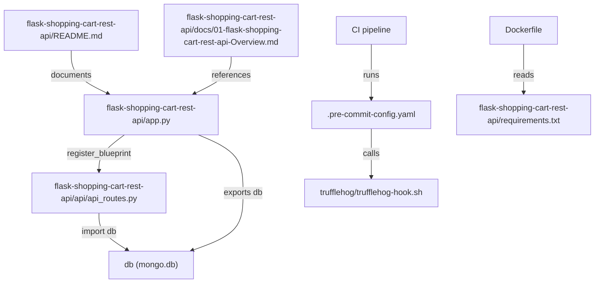
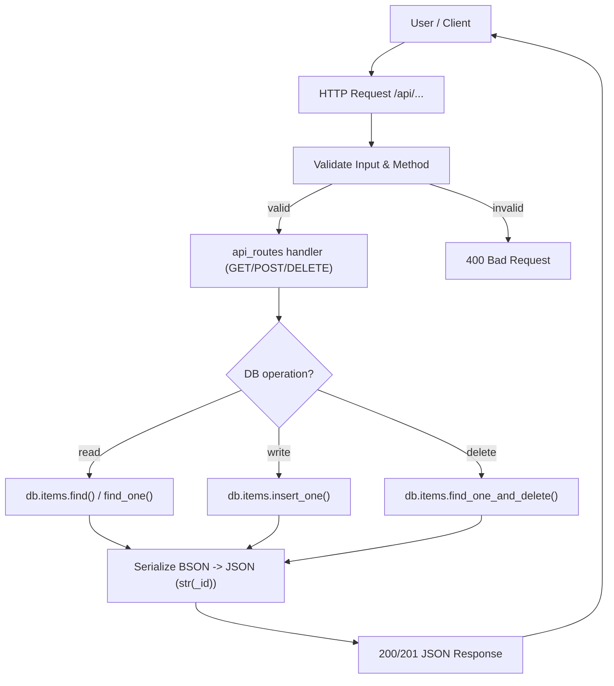
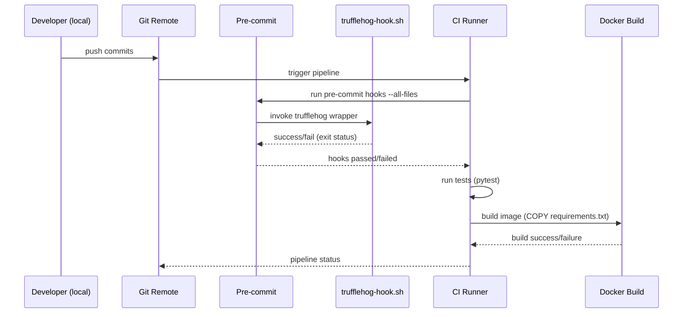

# Developer onboarding and project documentation

## Overview

This document consolidates developer onboarding and project-level documentation for the flask-shopping-cart-rest-api repository. It includes the key abstractions used by the codebase, a concrete collaborative use case showing how files interact, the primary application flows supported for contributors and CI operators, visual diagrams showing file collaboration and runtime flows, and a pragmatic quick-start and troubleshooting checklist.

Relevant files
- flask-shopping-cart-rest-api/README.md
- flask-shopping-cart-rest-api/docs/01-flask-shopping-cart-rest-api-Overview.md
- flask-shopping-cart-rest-api/docs/3.2-Project-documentation-and-onboarding.md
- Primary runtime artifacts referenced by these docs: flask-shopping-cart-rest-api/app.py, flask-shopping-cart-rest-api/api/api_routes.py, flask-shopping-cart-rest-api/requirements.txt, trufflehog/trufflehog-hook.sh, .pre-commit-config.yaml, Dockerfile

Domains & tags: API Backend & Documentation, Developer Tooling & Application Architecture, Developer Documentation — relational tags include rest-api, shopping-cart, documentation, ci-cd, security, api, backend, onboarding.

## Key Abstractions

- Global DB handle (Flask-PyMongo export)
  - Pattern: `mongo = PyMongo(app)` and `db = mongo.db` exported from app entrypoint.
  - Tradeoffs: simple for small services and quick onboarding; complicates testing and parallel instantiation. Consider migrating to an *application factory* pattern to enable test isolation and DI.

- Blueprint-based routing
  - Pattern: API logic grouped under a Flask blueprint (e.g., `api_routes_bp`) and registered under `/api`.
  - Benefit: keeps routing modular and enables clearer import boundaries for tests and WSGI usage.

- Request handler patterns and unsafe legacy routes
  - Current repo includes legacy GET endpoints that parse/execute user-provided payloads (e.g., `GET /addItem` with `eval`) — must be replaced by RESTful handlers (POST/DELETE) and server-side validation.
  - Use schema validation (jsonschema, marshmallow) to validate JSON bodies before DB writes.

- CI/Git hooks and secret scanning
  - Pre-commit + trufflehog wrapper invoked locally and by CI to detect secrets.
  - Hook wrapper must be executable and CI must run the same invocation to avoid bypass gaps.

## Collaborative Use Case: How files work together

Purpose: Allow a contributor to run the API locally, exercise CRUD operations, and ensure CI gating prevents secret leakage.

File collaboration map (high-level)
- flask-shopping-cart-rest-api/app.py
  - Boots the Flask app, configures `MONGO_URI`/`MONGODB_URI`, instantiates PyMongo, exports `db`, registers blueprint `api_routes_bp`, and may call `app.run` for dev.
- flask-shopping-cart-rest-api/api/api_routes.py
  - Implements route handlers (GET/POST/DELETE). Imports `db` from app.py and performs `db.items` operations.
- .pre-commit-config.yaml + trufflehog/trufflehog-hook.sh
  - Local and CI hooks invoked on commit/push and in pipeline for secret scanning.
- requirements.txt / Dockerfile
  - Dependency manifest used by pip and by Docker build. Ensure filename matches across README and Dockerfile.

Concrete code examples (canonicalized from documentation)

app.py (conceptual snippet)
```python
from flask import Flask
from flask_pymongo import PyMongo

app = Flask(__name__)
app.config["MONGO_URI"] = os.environ.get("MONGODB_URI", "mongodb://localhost:27017/shoppingcart")
mongo = PyMongo(app)
db = mongo.db  # exported persistence handle

from api.api_routes import api_routes_bp
app.register_blueprint(api_routes_bp, url_prefix="/api")
```

api/api_routes.py (conceptual snippet)
```python
from flask import Blueprint, request, jsonify
from flask import current_app as app
from bson.objectid import ObjectId

api_routes_bp = Blueprint("api_routes", __name__)

@api_routes_bp.route("/items", methods=["GET"])
def list_items():
    items = list(app.db.items.find())
    # convert ObjectId to str before returning
    for it in items:
        it["_id"] = str(it["_id"])
    return jsonify(items), 200
```

Sample curl requests (canonical examples)
```bash
# List items
curl "http://localhost:5000/api/getItems"

# Get item by id
curl "http://localhost:5000/api/getItemWithId?id=5f8f8c44abcdef0123456789"

# Create item (recommended JSON body POST)
curl -X POST "http://localhost:5000/api/addItem" \
  -H "Content-Type: application/json" \
  -d '{"name":"apple","price":1.25,"qty":3}'

# Delete item (recommended DELETE)
curl -X DELETE "http://localhost:5000/api/removeItem?id=5f8f8c44abcdef0123456789"
```

Notes on collaboration:
- The authoritative source for request/response semantics is app.py and api/api_routes.py. Update README and docs when these change.
- When migrating to an application factory, update imports in api_routes.py to accept `db` from app context rather than importing a global `db`.

## Application Flow Integration

Primary flows enabled by this documentation and repository layout:

1. Local Development (developer onboarding)
   - Goals: get the service running locally, exercise endpoints, inspect code.
   - Key artifacts: README.md, docs/3.2-Project-documentation-and-onboarding.md, app.py, requirements.txt.
   - Steps: create venv, install deps, set env vars (MONGODB_URI, FLASK_ENV, PORT), run `python3 app.py` or `gunicorn`.

2. Manual & Automated Testing
   - Manual: curl/Postman examples documented in README and docs file; ensure ObjectId string handling in responses.
   - Automated: pytest (recommended) should point at a test DB via `MONGODB_URI` (e.g., `shoppingcart_test`), or use a local ephemeral DB container.

3. CI/CD Pipeline & Secret Scanning
   - Pre-commit hooks run locally and should be run in CI with the same arguments.
   - trufflehog wrapper is invoked via pre-commit or CI step; ensure script is executable and configured to the same ignore/exclude rules.
   - Docker build step must reference the correct requirements filename; mismatches cause CI failure.

Recommended flow responsibilities
- Developers: follow docs to run locally, use pre-commit hooks, and validate DB connectivity.
- Maintainers/CI: enforce pre-commit/trufflehog in pipeline, run tests, validate Docker build and requirements file name.

## Visual Diagrams

1) File collaboration (file -> imports/registrations)


2) Request handling & data control flow (user -> API -> DB)


3) CI/CD and secret scanning sequence


## Quick-start onboarding (commands & env vars)

Environment variables
- MONGODB_URI (or MONGO_URI): `mongodb://localhost:27017/shoppingcart`
- FLASK_ENV: `development` or `production`
- PORT: `5000` (example)

Local dev quick-start
```bash
# clone
git clone https://github.com/dvjakhar31/shopping-cart-rest-api.git
cd shopping-cart-rest-api

# create and activate venv (Unix-like)
python3 -m venv env
source env/bin/activate

# install dependencies (correct command)
pip install -r requirements.txt

# set env vars (example)
export MONGODB_URI="mongodb://localhost:27017/shoppingcart"
export FLASK_ENV="development"
export PORT="5000"

# run
python3 app.py
# or (WSGI)
gunicorn -w 4 "app:app"
```

Recommended local tooling
- Install pre-commit and enable hooks:
```bash
pip install pre-commit
pre-commit install
pre-commit run --all-files
```
- Seed a local MongoDB instance (via Docker) or point to a hosted dev database.
- Add `.env.example` to repo with placeholders for env vars (do NOT commit credentials).

## Common Pitfalls & Remediations

- Incorrect pip install usage in README
  - Problem: `pip3 install requirements.txt` (wrong)
  - Remediation: Use `pip install -r requirements.txt` and update README.

- Dependency filename mismatch
  - Problem: Dockerfile or docs reference `requirements.` (trailing dot) but `requirements.txt` is expected.
  - Remediation: Standardize on `requirements.txt` and update Dockerfile/README/CI.

- Unsafe eval usage and GET-based payloads
  - Problem: legacy `GET /addItem` that uses `eval` leads to RCE risk.
  - Remediation: Replace with `POST /api/items` accepting JSON body, apply schema validation, and remove eval.

- Global db export complicates tests
  - Remediation: Implement app factory `create_app(config)` and inject DB handle for testability.

- BSON ObjectId in JSON responses
  - Problem: ObjectId not serializable
  - Remediation: Centralize BSON->JSON serializer to convert `_id` to `str(_id)`.

- Pre-commit/trufflehog gaps between local and CI
  - Problem: Different arguments or non-executable hook script
  - Remediation: Ensure trufflehog wrapper is executable (`chmod +x`) and CI runs pre-commit with same flags.

## Onboarding checklist (practical)

- [ ] Fix README pip command to `pip install -r requirements.txt`.
- [ ] Confirm Dockerfile copies and installs the correct requirements filename.
- [ ] Run `pre-commit install` and confirm trufflehog hook executes locally.
- [ ] Start a local MongoDB (or docker-compose) and set `MONGODB_URI`.
- [ ] Verify endpoints against app.py and update README examples to match actual HTTP methods and payload formats.
- [ ] Replace unsafe GET endpoints and remove any use of `eval`.
- [ ] Add a Postman collection or example curl scripts into `docs/` and update docs accordingly.
- [ ] Add `.env.example` with required env var names and example values.

## Maintenance guidance

- Treat app.py and api/api_routes.py as the source of truth for API contract; update onboarding docs when those files change.
- Keep requirements.txt and Dockerfile aligned and version-pinned.
- Run secret-scanning in CI with identical parameters as local pre-commit hooks; maintain trufflehog ignore rules in repo.
- When migrating to an application factory, update docs and tests to demonstrate creating a test app and injecting a test DB URI.

