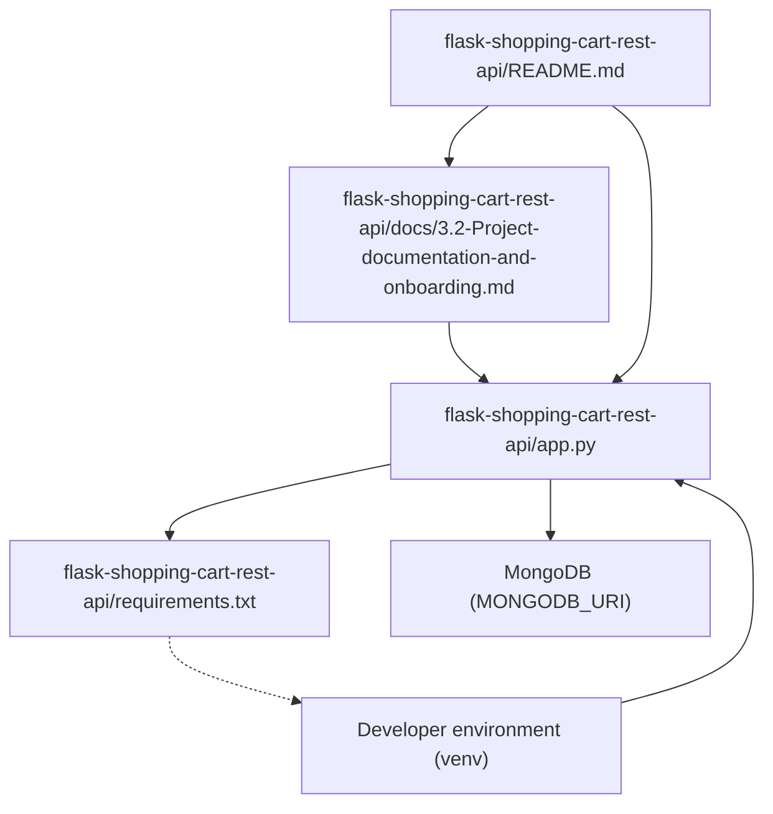
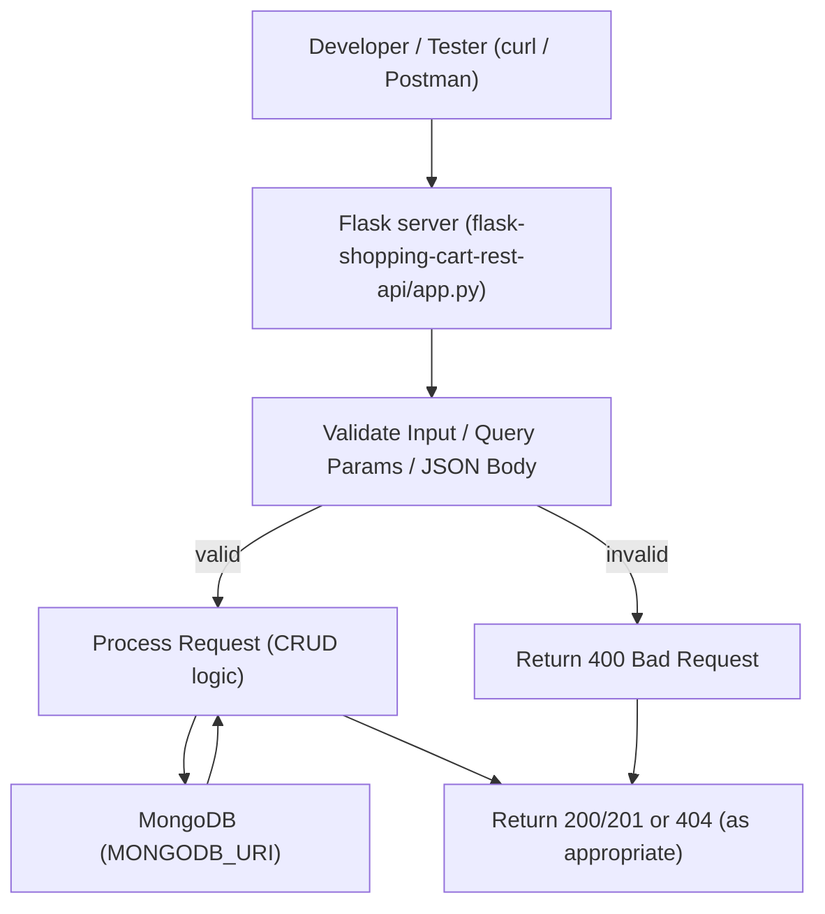

# Onboarding and project documentation

## Overview

This subtopic documents developer onboarding and project documentation for the flask-shopping-cart-rest-api project. It collects the actionable setup steps, runtime configuration, testing patterns, and where to modify behavior in the codebase to accelerate contributor onboarding and maintain consistent developer experience.

Domain: Developer Documentation  
Tags: documentation, api, backend  
Architectural layer: Documentation (supports API + backend development)  
Primary flows enabled: Development, Testing

## Key Abstractions

- **RESTful CRUD resource pattern**
  - Endpoints map HTTP verbs to CRUD operations for an "items" resource (list, get-by-id, create, delete).
  - Canonical endpoints referenced in docs: `GET /api/getItems`, `GET /api/getItemWithId?id=<id>`, `POST /api/addItem`, `DELETE /api/removeItem?id=<id>`.

- **Configuration-as-environment**
  - Runtime configuration is supplied via environment variables such as:
    - `MONGODB_URI` (e.g., `mongodb://localhost:27017/shoppingcart`)
    - `FLASK_ENV` (development/production)
    - `PORT` (override default 5000)
  - A sample `.env` snippet is provided below for reproducible local development.

- **Single-process Flask API with MongoDB persistence**
  - A single Flask server entrypoint (app.py) provides HTTP routes and delegates persistence to MongoDB (via pymongo or similar).
  - Dependency management and reproducible installs are provided by `requirements.txt`.

## Collaborative Use Case

This section explains how the documentation files work together with runtime artifacts to onboard a new contributor and where to look to change behavior.

Files:
- `flask-shopping-cart-rest-api/README.md` — primary README with quick start and route examples.
- `flask-shopping-cart-rest-api/docs/3.2-Project-documentation-and-onboarding.md` — expanded onboarding doc with environment, examples, pitfalls.
- Runtime artifacts referenced (authoritative sources for behavior):
  - `flask-shopping-cart-rest-api/app.py` — server entrypoint and route handler implementations.
  - `flask-shopping-cart-rest-api/requirements.txt` — pinned dependencies.

Workflow example (how docs and code collaborate):
- README provides quick commands to clone, create venv, install deps, set env vars, and run server.
- The docs file expands on semantics (status codes, payload formats) and provides curl examples.
- `app.py` is the authoritative source for exact route names and payload parsing. When README/docs differ, update the docs after verifying `app.py`.

Code examples (clone, setup, run):

```bash
# clone and enter repo
git clone https://github.com/dvjakhar31/shopping-cart-rest-api.git && cd shopping-cart-rest-api

# create and activate venv (Unix-like)
python3 -m venv env
source env/bin/activate

# install pinned deps
pip3 install -r requirements.txt

# set example env vars
export MONGODB_URI='mongodb://localhost:27017/shoppingcart'
export FLASK_ENV=development
export PORT=5000

# run server
python3 app.py
```

Sample `.env` (provide in repo as sample.env; add to .gitignore if secrets):

```bash
MONGODB_URI='mongodb://localhost:27017/shoppingcart'
FLASK_ENV=development
PORT=5000
```

Typical curl examples (confirm exact payload semantics in `flask-shopping-cart-rest-api/app.py`):

```bash
# List items
curl 'http://localhost:5000/api/getItems'

# Get item by id
curl 'http://localhost:5000/api/getItemWithId?id=5f8f8c44abcdef0123456789'

# Add item (JSON body form - recommended)
curl -X POST 'http://localhost:5000/api/addItem' -H 'Content-Type: application/json' -d '{"name":"apple","price":1.25,"qty":3}'

# Remove item
curl -X DELETE 'http://localhost:5000/api/removeItem?id=5f8f8c44abcdef0123456789'
```

Where to change behavior:
- Update route paths, validation, and payload parsing in `flask-shopping-cart-rest-api/app.py`.
- Update dependency versions in `flask-shopping-cart-rest-api/requirements.txt`.
- Update onboarding commands, env var examples, and sample requests in `flask-shopping-cart-rest-api/README.md` and `flask-shopping-cart-rest-api/docs/3.2-Project-documentation-and-onboarding.md`.

## Application Flow Integration

Key flows the documentation supports and how to exercise them:

1. Development startup flow (Development)
   - Tasks: clone repo → create venv → install deps → set env vars → run server.
   - Files involved: `README.md`, `docs/3.2-Project-documentation-and-onboarding.md`, `requirements.txt`, `app.py`.
   - Expected outcome: Flask server listens on `PORT` and connects to MongoDB via `MONGODB_URI`.

2. API testing flow (Testing)
   - Tasks: use curl/Postman to call CRUD endpoints, verify status codes (200, 201, 400, 404).
   - Files involved: `docs/3.2-Project-documentation-and-onboarding.md` (examples), `app.py` (actual handlers).
   - Expected outcome: Responses reflect persistence in MongoDB; errors for malformed IDs or invalid payloads.

3. Maintenance flow (Development)
   - Tasks: change payload schema or endpoint names → update `app.py` → pin updated libs in `requirements.txt` → update README/docs examples and sample .env.
   - Files involved: `app.py`, `requirements.txt`, `README.md`, `docs/3.2-Project-documentation-and-onboarding.md`.

## Common Pitfalls & Remediation

- Installation typo: use `pip3 install -r requirements.txt` (include `-r`).
- Payload format mismatch: README shows query-param POST examples; prefer JSON body POST. Verify `app.py` handlers to confirm supported formats and update docs accordingly.
- Missing virtualenv activation: include `source env/bin/activate` for Unix and `env\Scripts\activate` for Windows.
- Missing MongoDB config: ensure `MONGODB_URI` is set; recommend local MongoDB or Docker Compose.
- ObjectId validation: malformed IDs should be handled to return 400 rather than uncaught exceptions; ensure route handlers validate IDs.

## Visual Diagrams

### File collaboration (how docs and runtime files relate)


### Data / control flow for a typical API request


## Maintenance Recommendations

- Keep `README.md` and `docs/3.2-Project-documentation-and-onboarding.md` synchronized with `app.py` after any route or payload changes.
- Pin dependency versions in `requirements.txt` and update when changing imports or using newer APIs.
- Add a Postman collection or OpenAPI (Swagger) spec into `docs/` to reduce friction for manual testing.
- Provide an automated test script (pytest) and a local test DB (Docker Compose) for CI/testing workflows.
- Add a sample `.env` and mention adding secrets to `.gitignore`.

## Reference pointers

- Primary onboarding: `flask-shopping-cart-rest-api/README.md`
- Detailed onboarding & semantics: `flask-shopping-cart-rest-api/docs/3.2-Project-documentation-and-onboarding.md`
- Server entrypoint & authoritative routing: `flask-shopping-cart-rest-api/app.py`
- Dependencies: `flask-shopping-cart-rest-api/requirements.txt`
- External runtime: MongoDB (configured via `MONGODB_URI`)