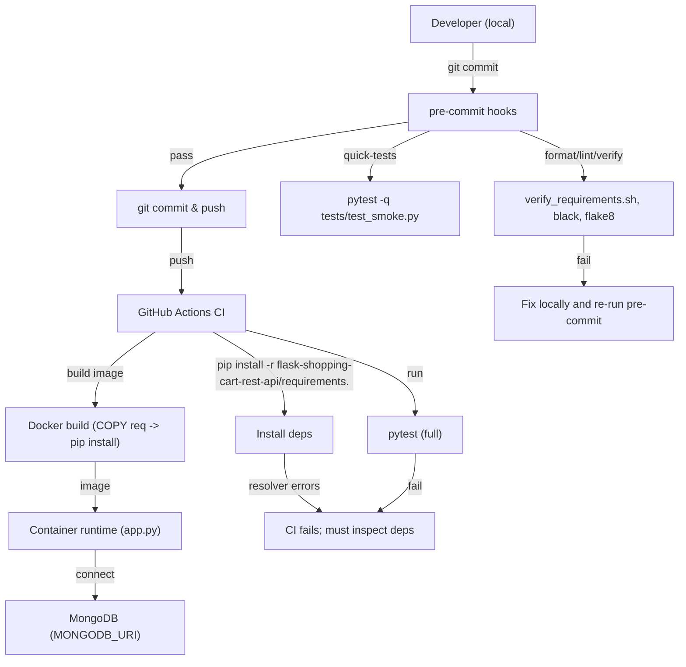
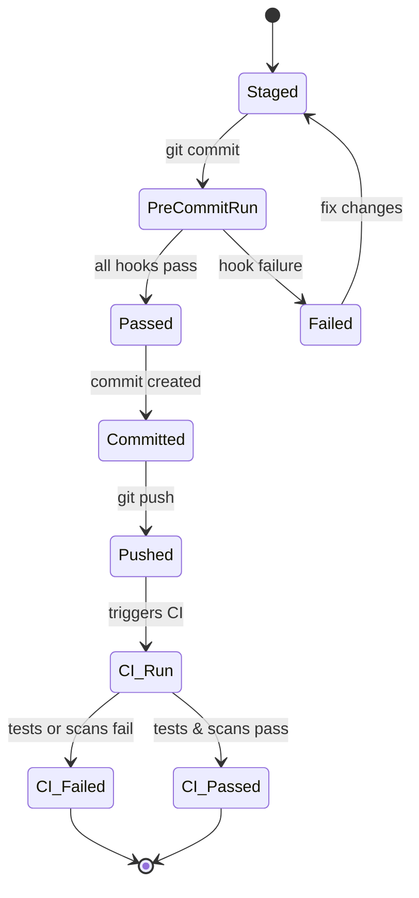

# Pre-commit hooks and local developer tooling

## Purpose & Scope
This subtopic documents recommended local developer tooling and pre-commit hooks for the flask-shopping-cart-rest-api project. It focuses on enforcing repository conventions (especially the nonstandard dependency manifest), improving consistency between README/CI/Docker, catching breaking dependency or API contract changes early, and streamlining developer onboarding for the flows described in project documentation (Local Development, CI Build, Docker Image Build, Dependency Upgrade).

## Key Abstractions
- **Repository Policy Enforcement** — a small set of enforcement checks (pre-commit hooks / scripts) that validate critical repository invariants before commit: canonical dependency filename, README consistency, `.env.example` presence.
- **Local Tooling Task Runners** — Makefile or task scripts that provide repeatable local commands for setup, linting, testing, and running the app so developers run the same steps as CI/Docker.
- **Pre-flight Validation Pipeline** — a compact, fast sequence of checks run in pre-commit: formatting (black/isort), linting (flake8), lightweight tests (unit smoke), and file/manifest validation (requirements filename, pip version). This pipeline is a gate to surface issues quickly and keep CI focused on slower, deeper checks (integration tests, full dependency scans).

## Collaborative Use Case
This section shows how repository artifacts interact and how a developer's local workflow integrates with CI and Docker. The canonical files and paths referenced are taken from repository analysis:
- `flask-shopping-cart-rest-api/requirements.` (observed nonstandard filename)
- `flask-shopping-cart-rest-api/README.md`
- `flask-shopping-cart-rest-api/app.py`
- `Dockerfile` or Docker build steps in CI
- GitHub Actions workflow that runs `pip install -r flask-shopping-cart-rest-api/requirements.` and `pytest`

Concrete local developer example (commands):
```bash
# clone and prepare
git clone https://github.com/dvjakhar31/shopping-cart-rest-api.git
cd shopping-cart-rest-api
python3 -m venv .venv
source .venv/bin/activate

# verify pip version (CI expects >=20.3)
python -m pip --version
python -m pip install --upgrade "pip>=20.3"

# install dependencies (note repository currently uses trailing-dot filename)
pip3 install -r flask-shopping-cart-rest-api/requirements.

# run the app
export MONGODB_URI="mongodb://localhost:27017/shoppingcart"
export FLASK_ENV=development
export PORT=5000
python3 flask-shopping-cart-rest-api/app.py
```

Code snippets and hooks below show how to enforce the dependency filename and run quick checks pre-commit.

### Example: repository-checked script (scripts/verify_requirements.sh)
```bash
#!/usr/bin/env bash
set -euo pipefail

REQ_PATH="flask-shopping-cart-rest-api/requirements."
EXPECTED_NAME="requirements.txt"  # change policy here if renaming to recommended name

# Check file exists
if [[ ! -f "$REQ_PATH" ]]; then
  echo "ERROR: Expected dependency manifest at '$REQ_PATH' (file missing)."
  exit 1
fi

# Optional: ensure README references match
if grep -q "requirements.txt" flask-shopping-cart-rest-api/README.md; then
  echo "WARN: README references 'requirements.txt' but repo contains 'requirements.'"
  # return non-zero if you want to fail the commit
fi

# Check pip version locally (fast check)
PIP_VER=$(python -c "import pkg_resources,sys;print('%s' % ('.'.join(map(str,__import__('pip').__version__.split('.')[:3]))))")
# Basic semantic check (>=20.3)
python - <<PY
from packaging.version import Version
from importlib import import_module
import pip as pipmod
v=Version(pipmod.__version__)
if v < Version("20.3"):
    print("ERROR: pip version must be >= 20.3, found", pipmod.__version__)
    raise SystemExit(2)
PY

echo "verify_requirements.sh: OK"
```

### Example: .pre-commit-config.yaml
```yaml
repos:
  - repo: https://github.com/pre-commit/pre-commit-hooks
    rev: v4.5.0
    hooks:
      - id: end-of-file-fixer
      - id: trailing-whitespace
      - id: check-yaml
  - repo: https://github.com/psf/black
    rev: 24.1.0
    hooks:
      - id: black
        language_version: python3
  - repo: https://github.com/PyCQA/isort
    rev: 5.12.0
    hooks:
      - id: isort
  - repo: https://github.com/PyCQA/flake8
    rev: 6.1.0
    hooks:
      - id: flake8
        args: [--max-line-length=88]
  - repo: local
    hooks:
      - id: verify-requirements
        name: verify-requirements
        entry: bash scripts/verify_requirements.sh
        language: system
        files: ^flask-shopping-cart-rest-api/
```

## Application Flow Integration
This subtopic directly supports these flows (from the project analysis):

1. Local Development
   - Pre-commit hooks validate developer changes quickly (format, lint, manifest checks) before commit.
   - Local Make targets and scripts provide reproducible environment setup and run commands that mirror CI/Docker steps (installing from `flask-shopping-cart-rest-api/requirements.`, setting MONGODB_URI, running `app.py`).

2. CI Build
   - Pre-commit pipeline reduces noise in PRs and ensures the changes entering CI meet a baseline standard.
   - CI still performs full `pip install -r flask-shopping-cart-rest-api/requirements.` + pytest + security scans on dependency upgrades.

3. Docker Image Build
   - Pre-commit checks ensure the Dockerfile COPY path and dependency filename are correct before creating PRs that affect build.
   - Local linting and manifest validation reduce broken image builds caused by filename mismatches (COPY path must match manifest).

4. Dependency Upgrade
   - Hooks and scripts perform a fast sanity check when dependency changes are staged (verify file format, run quick test subset).
   - CI runs full test suite and dependency scanning (Dependabot/ Renovate) and must be required for dependency PRs.

## Recommended pre-commit hooks (practical list)
- Formatting: black, isort
- Linting: flake8
- File hygiene: end-of-file-fixer, trailing-whitespace, check-yaml
- Repo-policy checks (local hook): scripts/verify_requirements.sh to ensure canonical dependency manifest and README consistency
- Lightweight tests: a small smoke test runner to exercise importability and key config parsing (fast unit)
- Security lint: optional fast safety check using `safety` CLI (only advisory; CI runs full security scan)

### Example lightweight smoke test (tests/test_smoke.py)
```python
def test_app_importable():
    import importlib
    importlib.import_module("flask-shopping-cart-rest-api.app")
```

Hook to run it quickly in pre-commit:
```yaml
  - repo: local
    hooks:
      - id: pytest-smoke
        name: pytest-smoke
        entry: pytest -q tests/test_smoke.py
        language: system
        types: [python]
```

## Local developer tooling & recipes
- Makefile snippet
```makefile
.PHONY: setup install lint format test smoke verify-req

setup:
	python -m venv .venv
	. .venv/bin/activate && python -m pip install --upgrade "pip>=20.3" setuptools wheel

install:
	. .venv/bin/activate && pip install -r flask-shopping-cart-rest-api/requirements.

format:
	. .venv/bin/activate && black .

lint:
	. .venv/bin/activate && flake8

smoke:
	. .venv/bin/activate && pytest -q tests/test_smoke.py

verify-req:
	bash scripts/verify_requirements.sh
```

- .env.example (commit to repo)
```
MONGODB_URI="mongodb://localhost:27017/shoppingcart"
FLASK_ENV=development
PORT=5000
```

## Troubleshooting and common failures (short)
- pip install fails in Docker/CI: verify `COPY` path and filename in Dockerfile match `flask-shopping-cart-rest-api/requirements.` (or rename to `requirements.txt` and update all references).
- README examples differ from repo artifact: run `scripts/verify_requirements.sh` locally before PRs to catch mismatches.
- Tests fail only in CI: ensure pip versions are consistent (CI should pin pip >= 20.3) and that CI runs dependency scans + full test suite on dependency updates.
- MongoDB connectivity errors: confirm MONGODB_URI is set in env or use a test fixture/mocked DB for unit-level tests.

## Visual Diagrams

### 1) File collaboration (shows repository artifacts and consumers)
```mermaid
graph TD
  README["flask-shopping-cart-rest-api/README.md"]
  REQ["flask-shopping-cart-rest-api/requirements."] 
  APP["flask-shopping-cart-rest-api/app.py"]
  DOCKERFILE["Dockerfile / Docker build step"]
  CI[".github/workflows/CI (pytest & pip install)"]
  PRECOMMIT[".pre-commit-config.yaml + scripts/verify_requirements.sh"]

  README -->|documents| REQ
  README -->|documents| APP
  PRECOMMIT -->|validates| REQ
  PRECOMMIT -->|runs| "tests/test_smoke.py"
  CI -->|uses| REQ
  DOCKERFILE -->|COPY & pip install| REQ
  APP -->|reads env| "MONGODB_URI / FLASK_ENV / PORT"
```

### 2) Data / control flow for local developer -> pre-commit -> CI -> Docker -> Runtime


### 3) Pre-commit lifecycle (state diagram)


## Maintenance & CI alignment
- Standardize the dependency manifest name across the repository. Recommendation: rename `flask-shopping-cart-rest-api/requirements.` -> `flask-shopping-cart-rest-api/requirements.txt` and update README, Dockerfile, and CI. The local verification script/hook should be removed or updated after this change.
- Ensure CI uses pip >= 20.3 and runs dependency scans (Dependabot / Renovate PRs must run full CI including tests).
- Keep `.env.example` and cURL/Postman examples in README aligned with `app.py` payload expectations (document whether POST /api/addItem accepts query param `item` or JSON body).

## Appendix — Example quick-add pre-commit local hook (enforce filename)
scripts/verify_requirements.sh (referenced earlier) plus pre-commit hook entry ensure the repository policy is enforced before commits, reducing broken CI/Docker builds and onboarding friction.