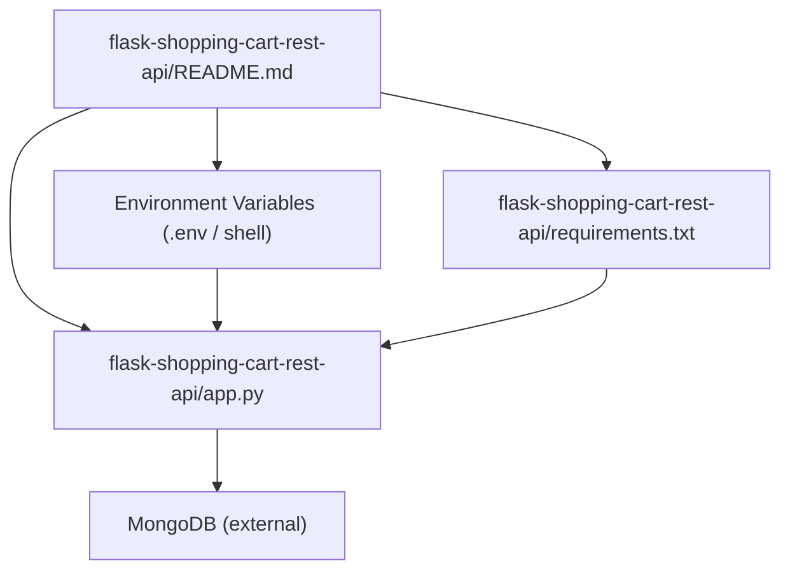
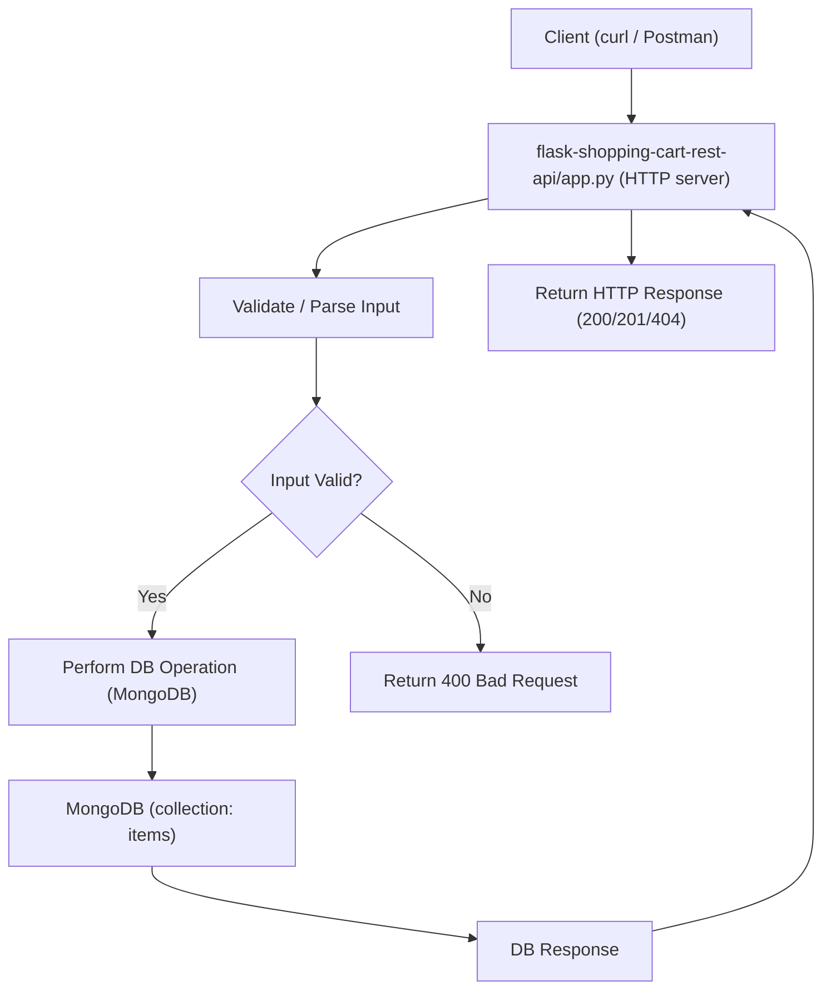

# Project documentation and onboarding

## Overview

This document captures onboarding and developer-facing guidance for the "Shopping-Cart-Rest-Api" project (developer documentation layer). Primary artifact: `flask-shopping-cart-rest-api/README.md`. Domain: Developer Documentation. Relational tags: **documentation**, **api**, **backend**. Flows enabled: **Development**, **Testing**.

Purpose: provide concise setup, testing and integration guidance so contributors can install dependencies, run the Flask + MongoDB service locally, exercise CRUD API routes, and understand where to look in the codebase to change behavior.

## Key Abstractions

- RESTful CRUD Resource Pattern
  - The API exposes item-level CRUD operations (list, get-by-id, add, remove). Endpoints map HTTP verbs to CRUD behavior.
- Configuration-as-Environment
  - Runtime configuration is expected to come from environment variables (e.g., MONGODB_URI, FLASK_ENV, PORT) rather than hard-coded values.
- Minimal App Boundary (API vs Data)
  - The codebase centers around a single HTTP server process (`app.py`) that handles HTTP routing and delegates persistence to MongoDB. The README is the onboarding bridge between local tooling and runtime services.

## Collaborative Use Case

This section shows how the README collaborates with runtime files and external services to enable development and testing.

Files referenced:
- `flask-shopping-cart-rest-api/README.md` (onboarding + API table)
- `flask-shopping-cart-rest-api/requirements.txt` (dependency spec)
- `flask-shopping-cart-rest-api/app.py` (Flask server entrypoint; mentioned in README)
- External service: MongoDB (local or remote; connection via MONGODB_URI)

Developer onboarding example (concrete commands):

```bash
# clone and enter repo
git clone https://github.com/dvjakhar31/shopping-cart-rest-api.git && cd shopping-cart-rest-api

# create and activate virtualenv (Unix-like)
python3 -m venv env
source env/bin/activate

# install pinned deps
pip3 install -r requirements.txt

# set required env vars (example)
export MONGODB_URI="mongodb://localhost:27017/shoppingcart"
export FLASK_ENV=development
export PORT=5000

# run server
python3 app.py
```

Sample API requests (examples based on README route table):

- List items (GET)
```bash
curl "http://localhost:5000/api/getItems"
```

- Get item by id (GET)
```bash
curl "http://localhost:5000/api/getItemWithId?id=5f8f8c44abcdef0123456789"
```

- Add item (POST via query param style as shown in README)
```bash
curl -X POST "http://localhost:5000/api/addItem?item={\"name\":\"apple\",\"price\":1.25,\"qty\":3}"
```

- Remove item (DELETE)
```bash
curl -X DELETE "http://localhost:5000/api/removeItem?id=5f8f8c44abcdef0123456789"
```

Notes and concrete checks:
- Ensure `requirements.txt` exists and contains pinned versions used by `app.py`.
- Activate virtualenv before `pip3 install` to avoid installing globally.
- The README shows POST payload via query string (`addItem?item={...}`); confirm `app.py` accepts this form or expect JSON body POST. Inspect `app.py` route handlers to confirm semantics.

## Application Flow Integration

Three key flows enabled by the README and the codebase:

1. Local development setup
   - README describes environment creation, dependency install, and run command.
   - External dependency: running MongoDB instance reachable using `MONGODB_URI`.
   - Files involved: `README.md` (instructions), `requirements.txt` (deps), `app.py` (server), environment variables.

2. Add / Update / Remove item (CRUD API flow)
   - Request from client (curl/Postman) → Flask route in `app.py` → input validation/parsing → DB operation (insert/update/delete) → HTTP response.
   - Typical error paths: malformed JSON/query param, missing fields, invalid object id, DB connectivity errors (missing/incorrect MONGODB_URI).

3. Manual testing & troubleshooting
   - README recommends Postman for manual testing; testers should use `curl` examples or Postman collections (not provided).
   - Log and error troubleshooting: check console logs from `python3 app.py` and MongoDB connectivity.

Expected HTTP semantics (examples to standardize in README):
- GET /api/getItems → 200 OK with array of items
- GET /api/getItemWithId?id=<id> → 200 OK with item, or 404 if not found, 400 if id malformed
- POST /api/addItem → 201 Created (or 200) with created item, 400 for invalid payload
- DELETE /api/removeItem?id=<id> → 200 OK on success, 404 if id not present

Common pitfalls (actionable checklist):
- Fix the installation command typo: use `pip3 install -r requirements.txt`.
- Add explicit `source env/bin/activate` instruction for venv activation.
- Document exact accepted POST payload format (query param vs JSON body).
- Provide example `MONGODB_URI` and a sample `.env` file.

Sample `.env` snippet to include in README (or sample config file):
```bash
# sample .env
MONGODB_URI="mongodb://localhost:27017/shoppingcart"
FLASK_ENV=development
PORT=5000
```

## Visual Diagrams

### 1) File collaboration (how README relates to code + runtime)


### 2) Request / control flow (client → app.py → DB → response)


## Practical Maintenance Guidance

- Keep `README.md` in sync with `app.py` route signatures and `requirements.txt` versions.
- Add a Postman collection or example JSON bodies for each endpoint and include expected sample responses.
- Add an explicit "Environment & Configuration" section listing required env vars and their example values (MONGODB_URI, FLASK_ENV, PORT).
- If route semantics change (e.g., move from query param payloads to JSON body), update README examples and provide code pointers to the route handlers in `app.py`.

## Reference: Key artifacts and where to look

- Onboarding/readme: `flask-shopping-cart-rest-api/README.md`
- Server entrypoint & routes: `flask-shopping-cart-rest-api/app.py` (inspect for exact request parsing and validation)
- Dependency list: `flask-shopping-cart-rest-api/requirements.txt`
- Runtime service: MongoDB (configure via `MONGODB_URI`)

