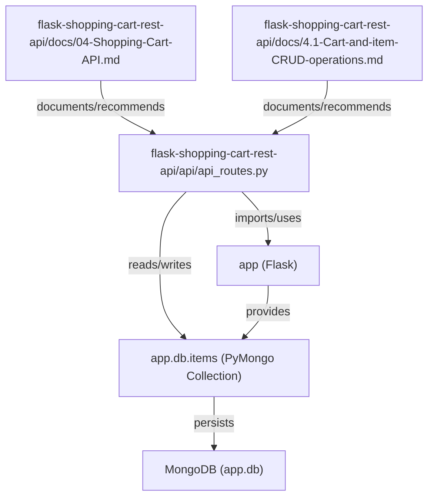
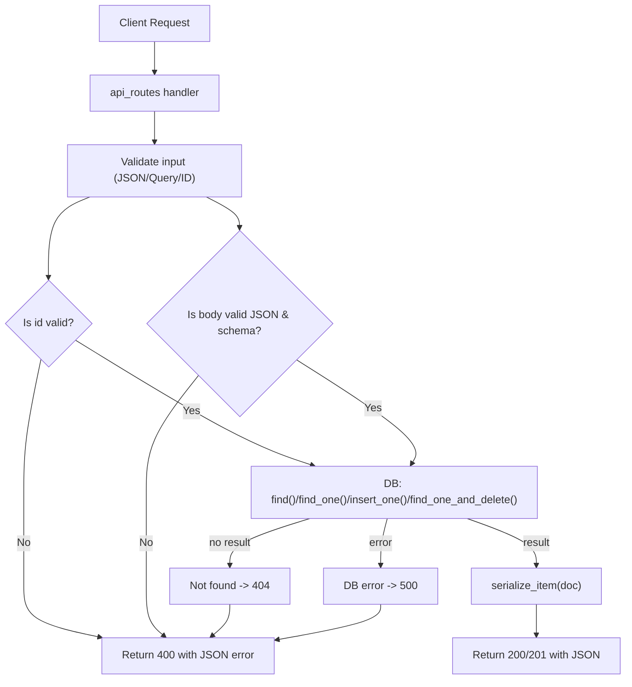
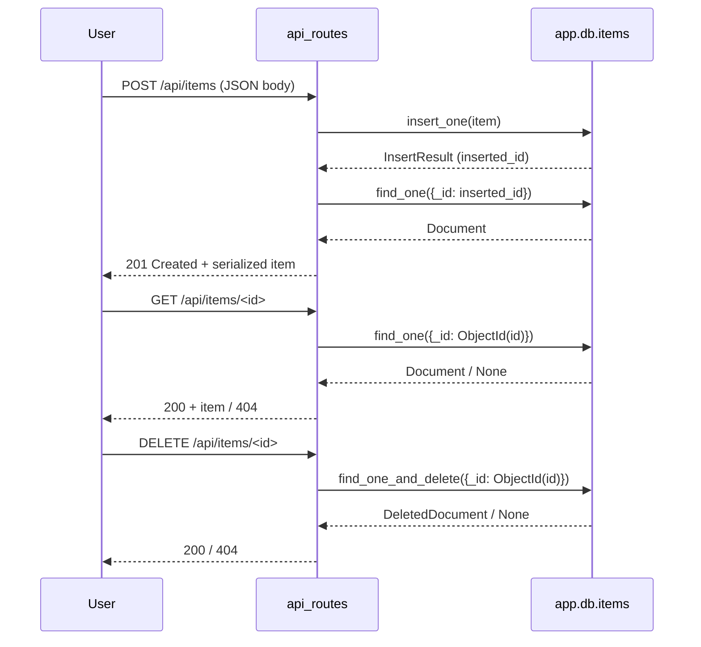

# Cart CRUD endpoints

## Domain & Purpose
- Domain: Shopping Cart / REST API
- Business purpose: Expose HTTP endpoints to list, retrieve, create, and remove shopping-cart items persisted in MongoDB so clients can manage cart contents.
- Scope in repo:
  - Controller: `flask-shopping-cart-rest-api/api/api_routes.py`
  - Documentation / developer guidance: `flask-shopping-cart-rest-api/docs/04-Shopping-Cart-API.md`, `flask-shopping-cart-rest-api/docs/4.1-Cart-and-item-CRUD-operations.md`
- Relational tags: crud, mongodb, validation, security, api, flask

## Key Abstractions
- **Flask Blueprint (API Controller)**
  - Location: `flask-shopping-cart-rest-api/api/api_routes.py`
  - Role: HTTP-facing routing layer that maps REST endpoints to persistence operations and request validation logic.
  - Pattern: Blueprint/route handlers implement request → validate → persist → serialize → response.

- **Persistence (PyMongo Collection)**
  - Access point: `app.db.items` (PyMongo Collection)
  - Role: Data store for cart item documents; handlers call `find()`, `find_one()`, `insert_one()`, `find_one_and_delete()` directly.
  - Concern: BSON types (e.g., ObjectId) require conversion to JSON primitives before serialization.

- **Serialization & Validation helpers (recommended)**
  - Purpose: Normalize DB documents for JSON responses and centralize input validation (ObjectId checks, JSON body parsing).
  - Example responsibilities:
    - `serialize_item(document)` — convert `_id` to string and sanitize types
    - `validate_object_id(id)` — `bson.ObjectId.is_valid(id)` -> raise/return 400 if invalid
    - `parse_json_body(request)` — `request.get_json(silent=True)` and schema validation

## Collaborative Use Case
Files and responsibilities:
- `api/api_routes.py` — implements routes and performs DB calls.
- `docs/04-Shopping-Cart-API.md` — prescribes RESTful endpoint shapes, status codes, and error shapes; shows migration plan.
- `docs/4.1-Cart-and-item-CRUD-operations.md` — documents current anti-patterns (e.g., `eval`, GET for mutating operations) and gives developer refactor steps.

Concrete integration example (recommended usage and snippets)

Registering the blueprint (application wiring):
```python
# app_factory.py (example)
from flask import Flask
from flask_shopping_cart_rest_api.api.api_routes import api_routes
from flask_pymongo import PyMongo

def create_app(config):
    app = Flask(__name__)
    app.config.update(config)
    mongo = PyMongo(app)
    app.db = mongo.db
    app.register_blueprint(api_routes, url_prefix='/api')
    return app
```

Serialization helper:
```python
# helpers/serialize.py
def serialize_item(doc):
    if not doc:
        return None
    out = dict(doc)
    out['_id'] = str(out['_id'])
    return out
```

Recommended endpoint surface (aligned with documentation):
- `GET /api/items` — list items (200)
- `GET /api/items/<id>` — get item (200 / 404 / 400)
- `POST /api/items` — create item (201 / 400 / 500)
- `DELETE /api/items/<id>` — delete item (200 / 404 / 400)

Example request/response snippets:

Create item (POST):
```http
POST /api/items
Content-Type: application/json

{ "name": "Widget", "price": 9.99, "quantity": 2 }
```
Response (201):
```json
{
  "message": "Item created",
  "item": {
    "_id": "60e4f0b8f1a2c3d4e5f6a7b8",
    "name": "Widget",
    "price": 9.99,
    "quantity": 2
  }
}
```

Get item (GET):
```http
GET /api/items/60e4f0b8f1a2c3d4e5f6a7b8
```
Response (200):
```json
{
  "message": "Successfully found an item with that id",
  "item": { "_id": "60e4f0b8f1a2c3d4e5f6a7b8", "name": "Widget", "price": 9.99, "quantity": 2 }
}
```

Delete item (DELETE):
```http
DELETE /api/items/60e4f0b8f1a2c3d4e5f6a7b8
```
Response (200):
```json
{ "message": "Item removed successfully" }
```

Security & validation highlights (applies across files)
- Never use `eval()` on query parameters. Parse JSON via `request.get_json()` or `json.loads()` and validate.
- Use `bson.ObjectId.is_valid(id)` before `ObjectId(id)` and return 400 for invalid ids.
- Convert BSON `_id` to string in responses; do not return `str(document)`.

## Application Flow Integration
Key flows enabled by this subtopic:

- Cart Item Retrieval Flow
  - Trigger: client → `GET /api/items`
  - Steps: route handler calls `db.items.find()` → map `serialize_item` over results → return `{ "count": n, "items": [...] }` (200)
  - Concerns: add pagination (limit/skip), filtering and DB error handling.

- Cart Item Lookup Flow
  - Trigger: client → `GET /api/items/<id>`
  - Steps: validate id → `db.items.find_one({ "_id": ObjectId(id) })` → if found return serialized item (200); if not found return 404; if id invalid return 400.
  - Concerns: consistent error payloads and status codes.

- Cart Item Add Flow
  - Trigger: client → `POST /api/items` (JSON)
  - Steps: parse JSON body → validate schema → `db.items.insert_one(item)` → fetch/serialize inserted doc → return 201 with item
  - Concerns: avoid `GET` for mutating ops, validate required fields, handle DB exceptions.

- Cart Item Remove Flow
  - Trigger: client → `DELETE /api/items/<id>`
  - Steps: validate id → `db.items.find_one_and_delete({ "_id": ObjectId(id) })` → return 200 if deleted, 404 if not found
  - Concerns: id validation, error mapping.

Developer / Testing flows
- Unit tests should mock `app.db.items` (or use `mongomock`) to exercise validation, success, not-found, and DB exception paths.
- Docs files (`docs/04-Shopping-Cart-API.md`, `docs/4.1-Cart-and-item-CRUD-operations.md`) provide migration steps and example responses used for test expectations.

## Visual Diagrams

### 1) File collaboration (how files reference each other and runtime artifacts)


### 2) Data / control flow (route → validation → DB → serialization → response)


### 3) Sequence diagram (example: create, retrieve, delete interactions)


## Operational notes (concise)
- Replace unsafe patterns:
  - Remove any `eval()` usage. Use `request.get_json()` or explicit JSON parsing.
  - Map mutating operations to POST/DELETE, not GET.
- Standardize responses:
  - Use structured JSON, convert `_id` to string, and include proper HTTP status codes (200, 201, 400, 404, 500).
- Validation & error-handling:
  - Use `bson.ObjectId.is_valid(id)` before conversion.
  - Wrap PyMongo calls in try/except and return sanitized 500 responses on DB failures.
- Testing:
  - Mock `app.db.items` or use `mongomock` for unit tests; ensure test coverage for invalid id, missing body, and DB exceptions.