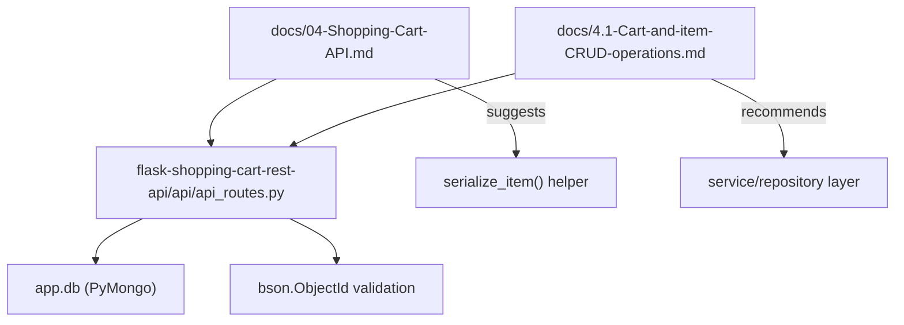
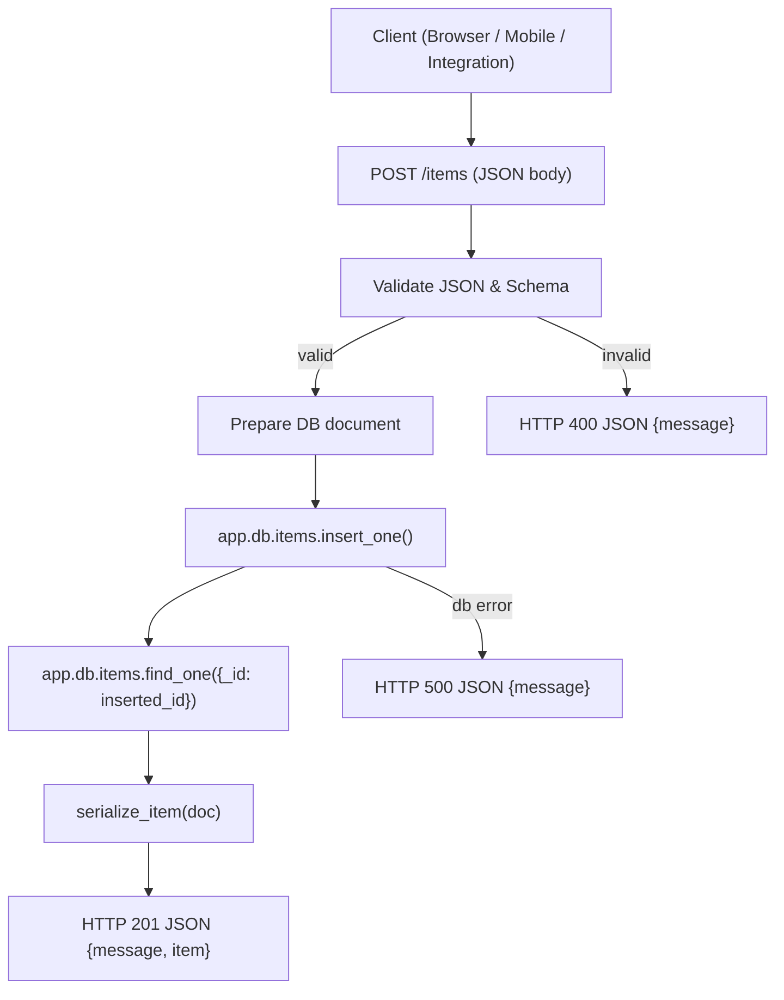

# Cart CRUD operations

## Summary
Domain: Backend API Documentation / Shopping Cart CRUD  
Business purpose: Provide the HTTP API surface for managing shopping cart items (list, read, create, delete) backed by MongoDB (PyMongo). This subtopic documents safe CRUD semantics, validation, serialization, and recommended architectural patterns for maintainable, testable endpoints.

## Key Abstractions
### 1. Controller (Flask Blueprint)
- Pattern: Flask `Blueprint` that maps HTTP routes to handler functions.
- Location: `flask-shopping-cart-rest-api/api/api_routes.py`
- Responsibility: parse requests, enforce HTTP semantics, call persistence/service functions, return JSON responses with appropriate status codes.

### 2. Persistence (PyMongo collection)
- Pattern: Direct use of a PyMongo collection exposed on the Flask app context as `app.db.items`.
- Contract: CRUD operations via `find`, `find_one`, `insert_one`, `find_one_and_delete`.
- Important: Wrap DB calls with try/except and avoid leaking internal errors.

### 3. Serialization & Validation Helpers
- Suggested helper: `serialize_item(doc)` — canonicalizes MongoDB documents for JSON by converting `_id` (ObjectId) to string and normalizing datatypes.
- ID validation: use `bson.ObjectId.is_valid(id)` before converting to `ObjectId(id)`.
- Request parsing: use `request.get_json(silent=True)` or `json.loads()` for bodies; never use `eval`.

### 4. Optional Service / Repository Layer (recommended)
- Pattern: thin service/repository with functions: `create_item(data)`, `list_items(limit, skip)`, `get_item_by_id(id)`, `delete_item_by_id(id)`.
- Benefits: decouples controllers from PyMongo for easier unit testing, centralizes error handling and validation.

## Collaborative Use Case
This section shows how the documented files and components collaborate to implement safe Cart CRUD behavior.

### Files & Roles
- `flask-shopping-cart-rest-api/api/api_routes.py` — request handlers (Blueprint).
- `flask-shopping-cart-rest-api/docs/04-Shopping-Cart-API.md` — API contract, examples, and operational guidance.
- `flask-shopping-cart-rest-api/docs/4.1-Cart-and-item-CRUD-operations.md` — security findings and recommended RESTful replacements.
- Tests (not present in these docs) should provide an `app.db` fixture (mongomock or test MongoDB) and exercise handlers.

### Example: Safe Create Handler (conceptual)
```python
from flask import Blueprint, request, jsonify, current_app
from bson import ObjectId

api = Blueprint('api', __name__)

def serialize_item(doc):
    doc = dict(doc)
    doc['_id'] = str(doc['_id'])
    return doc

@api.route('/items', methods=['POST'])
def create_item():
    data = request.get_json(silent=True)
    if not isinstance(data, dict):
        return jsonify({"message": "Invalid JSON body"}), 400
    # simple schema checks
    if 'name' not in data or 'price' not in data or 'quantity' not in data:
        return jsonify({"message": "Missing required fields"}), 400
    try:
        res = current_app.db.items.insert_one(data)
        created = current_app.db.items.find_one({'_id': res.inserted_id})
        return jsonify({"message": "Item created", "item": serialize_item(created)}), 201
    except Exception:
        return jsonify({"message": "Internal server error"}), 500
```

### Example: Safe Read/Delete Handlers (conceptual)
```python
@api.route('/items/<id>', methods=['GET'])
def get_item(id):
    if not ObjectId.is_valid(id):
        return jsonify({"message": "Invalid id"}), 400
    item = current_app.db.items.find_one({'_id': ObjectId(id)})
    if not item:
        return jsonify({"message": "No item present with that id"}), 404
    return jsonify({"message": "Successfully found an item with that id", "item": serialize_item(item)}), 200

@api.route('/items/<id>', methods=['DELETE'])
def delete_item(id):
    if not ObjectId.is_valid(id):
        return jsonify({"message": "Invalid id"}), 400
    deleted = current_app.db.items.find_one_and_delete({'_id': ObjectId(id)})
    if not deleted:
        return jsonify({"message": "No item present with that id"}), 404
    return jsonify({"message": "Item removed successfully"}), 200
```

### Testing / CI Collaboration
- Unit tests should mock `app.db.items` or use a repository layer to stub DB calls.
- Integration tests can use `mongomock` or a disposable test MongoDB instance; CI should run both unit and integration suites.
- Documentation files list required environment variables and wiring example (`app.db` must be set before registering blueprint).

## Application Flow Integration
This subtopic enables key flows in development and runtime:

### Flow: Development & Onboarding
- Steps:
  1. Inspect `api_routes.py` to understand current handlers.
  2. Start a local MongoDB or configure `mongomock` for tests; ensure `app.db` is set on app context.
  3. Replace unsafe GET-mutating endpoints with RESTful endpoints (`POST /items`, `DELETE /items/<id>`).
  4. Add `serialize_item` and central validation; add unit and integration tests.
- Outcome: New developers can safely modify handlers with clear guidance and contract examples.

### Flow: Integration Testing
- Steps:
  1. CI spins up test DB (or uses mongomock).
  2. Tests exercise endpoints for valid/invalid ObjectId, missing JSON, DB failures (simulated).
  3. Verify status codes (200/201/400/404/500) and response shape consistency.
- Outcome: Prevent regressions, ensure stability in DB interactions.

### Flow: API Development & Client Integration
- Steps:
  1. API team documents endpoint shapes and status codes in `04-Shopping-Cart-API.md`.
  2. Frontend/integrations consume endpoints: `GET /items?limit=10&skip=0`, `POST /items`, `GET /items/<id>`, `DELETE /items/<id>`.
  3. Backwards compatibility: deprecate old GET-mutating endpoints with a documented migration plan when needed.
- Outcome: Stable, RESTful contract for clients to manage cart items.

## Visual Diagrams

### File collaboration (which docs reference which code)


### Data & control flow for a Create request (POST /items)


## Error Handling & Security Patterns
### Validation
- Always call `bson.ObjectId.is_valid(id)` before converting to `ObjectId(id)`.
- Use `request.get_json(silent=True)` and explicit type/schema checks.
- Return `400 Bad Request` for invalid input.

### Serialization
- Implement a dedicated `serialize_item(doc)` to convert `_id` to string and normalize datatypes (datetimes, Decimal, etc.).

### Security
- Remove all uses of `eval` and never parse user input with `eval`.
- Use correct HTTP verbs: `POST` for create, `GET` for read, `DELETE` for delete.
- Avoid mutating state on `GET` endpoints.
- Log and sanitize server-side exceptions; return generic 500 messages to clients.

## Recommended Endpoints (Contract)
- GET /items?limit=<int>&skip=<int>  
  Response 200: `{ "count": <n>, "items": [ { "_id": "<id>", "name": ..., "price": ..., "quantity": ... }, ... ] }`

- GET /items/<id>  
  400: `{ "message": "Invalid id" }`  
  404: `{ "message": "No item present with that id" }`  
  200: `{ "message": "Successfully found an item with that id", "item": { ... } }`

- POST /items  
  400: invalid JSON or missing fields  
  201: `{ "message": "Item created", "item": { ... } }`

- DELETE /items/<id>  
  400: invalid id  
  404: no such item  
  200: `{ "message": "Item removed successfully" }`

## Maintenance Checklist
- Remove any `GET`-based mutating endpoints and `eval` usage.
- Add/standardize `serialize_item(doc)` and central validation helpers.
- Introduce a repository/service layer where beneficial for testability.
- Add unit and integration tests (mongomock or disposable MongoDB).
- Update documentation files (`docs/04-Shopping-Cart-API.md` and `docs/4.1-Cart-and-item-CRUD-operations.md`) when changing route shapes, status codes, or schema.

## References (file locations)
- Controller / Blueprint: `flask-shopping-cart-rest-api/api/api_routes.py`
- API contract & guidance: `flask-shopping-cart-rest-api/docs/04-Shopping-Cart-API.md`
- Security & CRUD recommendations: `flask-shopping-cart-rest-api/docs/4.1-Cart-and-item-CRUD-operations.md`