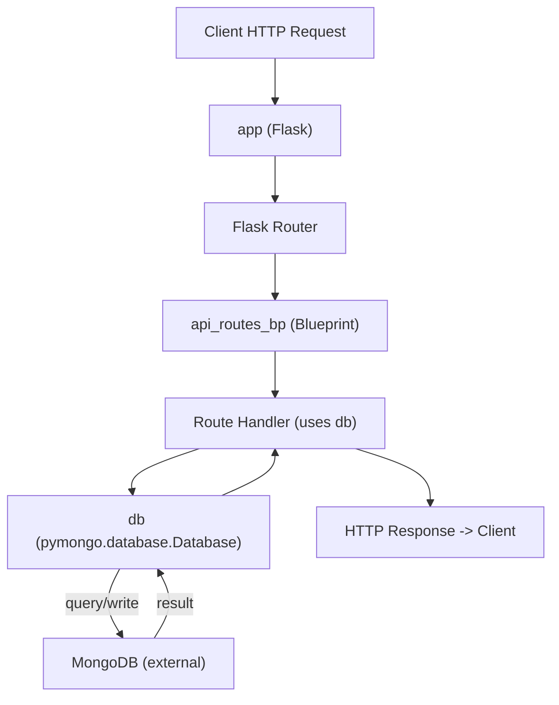

# Application initialization and wiring

## Domain & Context
- Domain: Application Infrastructure
- Architectural layer: Infrastructure / Infrastructure Layer
- Relational tags: infrastructure, database, routing, mongodb, bootstrapping
- Purpose: Provide the single-file bootstrapper that creates and configures the Flask application, initializes the Flask-PyMongo integration, exposes the `app`, `mongodb_client`, and `db` symbols for route handlers/tests/WSGI servers, and registers API blueprints under the `/api` prefix.

## Key Abstractions
### 1. Bootstrapper / Wiring Module
- Pattern: Single-module application bootstrap (flask-shopping-cart-rest-api/app.py).
- Responsibility: construct runtime objects (Flask app), apply configuration, initialize extensions, and register blueprints.
- Public surface: module-level exported symbols `app`, `mongodb_client`, `db`.

### 2. Extension Initialization (PyMongo)
- Pattern: framework extension initialization via direct constructor (PyMongo(app)).
- Responsibility: read `app.config['MONGO_URI']`, create pooled MongoDB client, expose `mongodb_client.db` as `db`.
- Operational note: config must be set before initializing the extension.

### 3. Blueprint-based Routing
- Pattern: modular routing via Flask `Blueprint` (api_routes_bp).
- Responsibility: keep route handlers modular and register them at startup with `app.register_blueprint(api_routes_bp, url_prefix='/api')`.
- Recommended evolution: migrate to an application factory (`create_app`) and lazy `init_app` style initialization for better testability and to avoid import cycles.

## Collaborative Use Case (Infrastructure integration between bootstrapper, routes, and DB)
This section shows how the files and symbols collaborate at import/runtime boundaries.

- Core file: flask-shopping-cart-rest-api/app.py
  - Exports: `app` (Flask), `mongodb_client` (flask_pymongo.PyMongo), `db` (pymongo.database.Database)
  - Registers blueprint exported by api routes under `/api`.

Example bootstrapper (representative content from flask-shopping-cart-rest-api/app.py):
```python
from flask import Flask
from flask_pymongo import PyMongo
from api.api_routes import api_routes_bp

app = Flask(__name__)
app.config['MONGO_URI'] = 'mongodb://localhost:27017/shoppingcart'
app.config['DEBUG'] = True

mongodb_client = PyMongo(app)
db = mongodb_client.db

app.register_blueprint(api_routes_bp, url_prefix='/api')

if __name__ == '__main__':
    app.run(debug=True)
```

Example route module (typical file: flask-shopping-cart-rest-api/api/api_routes.py):
```python
from flask import Blueprint, request, jsonify
from app import db

api_routes_bp = Blueprint('api', __name__)

@api_routes_bp.route('/items', methods=['GET'])
def list_items():
    items = list(db.items.find({}))
    return jsonify(items)
```

Example usage in tests or WSGI runner:
```python
# tests/conftest.py
from app import app, db

client = app.test_client()
# Seed db collections, run requests against client
```

Collaboration summary:
- app.py constructs `app` and `mongodb_client`, sets `db = mongodb_client.db`.
- api/api_routes.py defines `api_routes_bp` and imports `db` for handler implementations.
- app.py registers `api_routes_bp` at startup so routes are reachable at `/api/...`.
- Tests or WSGI servers import `app` to run or exercise the application.

## Application Flow Integration
This wiring participates in these key flows:

### Application Startup Flow
1. Start script / WSGI server imports `app` from flask-shopping-cart-rest-api/app.py.
2. `app` is constructed and configured (DEBUG, MONGO_URI).
3. PyMongo is initialized: `mongodb_client = PyMongo(app)` → connection pooling established.
4. `db = mongodb_client.db` is assigned.
5. Blueprint(s) (e.g., `api_routes_bp`) are registered: `app.register_blueprint(api_routes_bp, url_prefix='/api')`.
6. Server starts (dev server or WSGI process).

### API Request Handling Workflow
1. Client HTTP request → Flask `app` HTTP entrypoint.
2. Flask router matches URL and dispatches to blueprint handler.
3. Route handler uses `db` (imported from `app`) to read/write collections.
4. Handler returns a response to Flask for delivery to client.

### Database Initialization Process
1. `app.config['MONGO_URI']` read at startup.
2. `PyMongo(app)` constructs a `mongodb_client` and opens connections (pool).
3. `db = mongodb_client.db` provides a `pymongo.database.Database` handle for queries and commands.

Operational considerations:
- Move sensitive config (MONGO_URI) out of source code into environment variables or secret manager.
- Avoid DEBUG=True in production; use environment-driven settings.
- For production, run under a WSGI server: e.g., `gunicorn -w 4 'app:app'`.
- When refactoring to app factory, maintain compatibility for tests/WSGI or update deployment references.

## Visual Diagrams

### File collaboration diagram (files & imports)
```mermaid
graph TD
    A["flask-shopping-cart-rest-api/app.py"] -->|imports/registers| B["flask-shopping-cart-rest-api/api/api_routes.py"]
    A -->|initializes| C["flask_pymongo.PyMongo"]
    C -->|provides| D["db (pymongo.database.Database)"]
    E["Tests / WSGI (gunicorn)"] -->|import app| A
    F["External MongoDB"] <--|network| C
```

### Data / Control flow for an API request (symbols: app, mongodb_client, db)


## Common Pitfalls & Recommendations (Infrastructure / database / routing)
- Avoid hard-coded `MONGO_URI` and credentials in source; use environment variables (example: `os.environ.get('MONGO_URI')`).
- Ensure `app.config` values are set before calling `PyMongo(app)`.
- Prevent circular imports by organizing modules or adopting an application factory and `init_app` pattern.
- Use separate databases or mocked instances for tests to prevent data contamination.
- Prefer running under a WSGI server in production; use health/readiness endpoints to check DB connectivity.

## Reference snippets
- Environment-driven config example:
```python
import os
app.config['MONGO_URI'] = os.environ.get('MONGO_URI')
app.config['DEBUG'] = os.environ.get('FLASK_DEBUG', 'false').lower() == 'true'
```

- Minimal migration pattern (app factory outline):
```python
from flask import Flask
from flask_pymongo import PyMongo

mongo = PyMongo()

def create_app(config=None):
    app = Flask(__name__)
    if config:
        app.config.update(config)
    mongo.init_app(app)
    from api.api_routes import api_routes_bp
    app.register_blueprint(api_routes_bp, url_prefix='/api')
    return app
```

