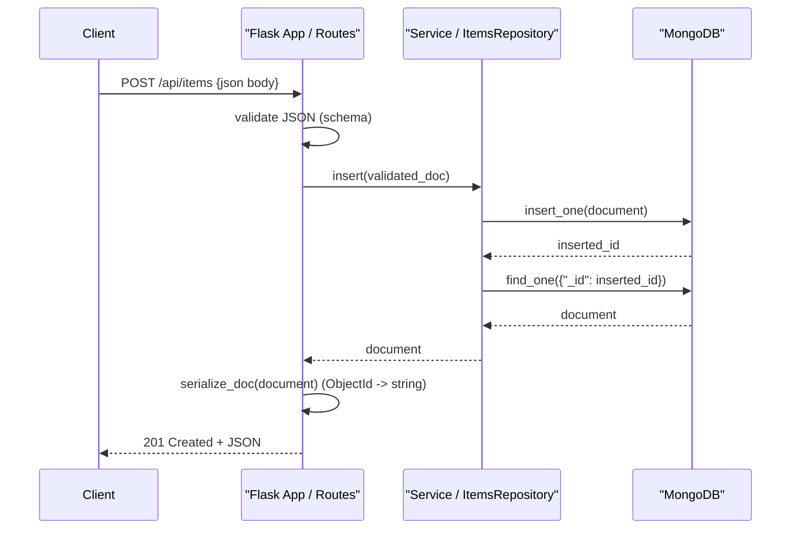

# Infrastructure wiring

## Overview — System Architecture & Developer Tooling (documentation, ci-cd, persistence)

This document describes the concrete wiring between runtime code, developer tooling, CI, and infrastructure for the flask-shopping-cart-rest-api project. It maps files, exports/imports, environment-driven configuration, and recommended patterns that reduce test friction and hardening risks. Primary concerns: documentation, ci-cd, persistence.

## Key Abstractions

- Application Factory / Env-driven Config
  - Use a `create_app(config)` factory to avoid global singletons and to make configuration explicit via environment variables: `MONGODB_URI` / `MONGO_URI`, `FLASK_ENV`, `PORT`.
  - Benefits: test isolation, dependency injection, easier WSGI/e2e orchestration.

- Controller → Service → Persistence (Repository) Pattern
  - Controllers (Flask routes) remain thin. A small service/repository layer centralizes validation, serialization, and MongoDB operations (e.g., `items_repository.insert(item)`, `items_repository.find_by_id(id)`).
  - Benefits: single place to validate `ObjectId` via `bson.ObjectId.is_valid`, consistent HTTP error mapping, and easier unit testing.

- Tooling Parity & Pipeline-as-Code
  - Pre-commit + trufflehog wrapper used locally and in CI must be identical. The pre-commit entry points and CI steps should call the same `trufflehog/trufflehog-hook.sh` script.
  - Benefits: prevents bypasses where local hooks differ from CI enforcement.

## Collaborative Use Case — How the files work together

Files referenced in wiring:
- `flask-shopping-cart-rest-api/app.py` — app bootstrap (exports `app`, `mongo`, `db` in current layout; recommended to implement `create_app`)
- `flask-shopping-cart-rest-api/api/api_routes.py` — controllers that currently import the db handle
- `flask-shopping-cart-rest-api/.pre-commit-config.yaml` — pre-commit hooks
- `flask-shopping-cart-rest-api/trufflehog/trufflehog-hook.sh` — secret-scan wrapper called by pre-commit and CI
- `flask-shopping-cart-rest-api/Dockerfile` — container build; references dependency manifest
- `flask-shopping-cart-rest-api/requirements.txt` (standardized name; repository currently contains a mismatch)
- `flask-shopping-cart-rest-api/docs/01-flask-shopping-cart-rest-api-Overview.md` — high-level documentation and onboarding

Concrete example interactions (imports, calls, and wiring):

- Current (simple/global) pattern in `api/api_routes.py`:
```python
# flask-shopping-cart-rest-api/api/api_routes.py
from flask import Blueprint, request, jsonify
from app import db  # global db handle exported by app.py

routes = Blueprint('api', __name__)

@routes.route('/api/items', methods=['GET'])
def list_items():
    docs = list(db.items.find())
    return jsonify([serialize_doc(d) for d in docs])
```

- Recommended (factory + repository) pattern:
```python
# flask-shopping-cart-rest-api/app.py
from flask import Flask
from flask_pymongo import PyMongo

def create_app(config=None):
    app = Flask(__name__)
    if config:
        app.config.update(config)
    mongo = PyMongo(app)
    from api.api_routes import register_routes
    register_routes(app, mongo)
    return app
```

```python
# flask-shopping-cart-rest-api/api/api_routes.py
from flask import request, jsonify, current_app

def register_routes(app, mongo):
    @app.route('/api/items', methods=['POST'])
    def create_item():
        payload = request.get_json()
        validated = validate_item(payload)
        inserted = app.config['ITEMS_REPO'].insert(validated)
        return jsonify(serialize_doc(inserted)), 201
```

```python
# flask-shopping-cart-rest-api/repos/items_repository.py
from bson import ObjectId

class ItemsRepository:
    def __init__(self, mongo):
        self._coll = mongo.db.items

    def insert(self, doc):
        res = self._coll.insert_one(doc)
        return self._coll.find_one({"_id": res.inserted_id})

    def find_by_id(self, id_str):
        if not ObjectId.is_valid(id_str):
            raise ValueError("invalid id")
        return self._coll.find_one({"_id": ObjectId(id_str)})
```

Serialization helper (BSON -> JSON):
```python
# flask-shopping-cart-rest-api/utils/serialize.py
from bson import ObjectId

def serialize_doc(doc):
    if not doc:
        return None
    doc = dict(doc)
    doc['_id'] = str(doc['_id'])
    return doc
```

Tooling wiring examples:
- `.pre-commit-config.yaml` entry:
```yaml
- repo: local
  hooks:
    - id: trufflehog-scan
      name: trufflehog-scan
      entry: trufflehog/trufflehog-hook.sh
      language: script
```

- Dockerfile must reference the canonical `requirements.txt`:
```dockerfile
COPY requirements.txt /app/requirements.txt
RUN pip install --no-cache-dir -r /app/requirements.txt
```

## Application Flow Integration — Key flows enabled

1. Developer Onboarding
   - Local environment variables: `MONGODB_URI` (e.g. `mongodb://localhost:27017/shoppingcart`), `FLASK_ENV`, `PORT`.
   - Steps: clone → `pip install -r requirements.txt` → `export MONGODB_URI=...` → `flask run` or `python -m app` (if create_app exists use a runner).
   - Hooks: `pre-commit` configured via `.pre-commit-config.yaml` runs `trufflehog/trufflehog-hook.sh`. Ensure `chmod +x trufflehog/trufflehog-hook.sh`.

2. Build Process
   - Docker build uses `Dockerfile` and must have correct dependency manifest name `requirements.txt`. The Docker build step should run unit tests or at least `pre-commit run --all-files` in CI equivalently.
   - Artifact: container image built using `gunicorn -w 4 'app:app'` or equivalent entrypoint using `create_app` pattern.

3. Deployment Pipeline (CI)
   - CI must run the same scans and hooks as local: `pre-commit run --all-files` and invoke `trufflehog/trufflehog-hook.sh` to detect secrets before building images.
   - CI steps: checkout → set env vars (or use secrets) → run linters/tests → run `pre-commit` checks → `docker build` → (optional) push to registry → deploy.
   - Runtime: Use WSGI `gunicorn` and ensure `MONGODB_URI` is set in runtime environment or injected via platform secrets.

## Visual Diagrams

### 1) File collaboration (imports/exports, toolchain calls)
```mermaid
graph TD
    appFile[ "flask-shopping-cart-rest-api/app.py\n(exports app:app, or create_app)"] 
    apiRoutes[ "flask-shopping-cart-rest-api/api/api_routes.py\n(register_routes or Blueprint)"]
    itemsRepo[ "flask-shopping-cart-rest-api/repos/items_repository.py\n(ItemsRepository)"]
    serializeUtil[ "flask-shopping-cart-rest-api/utils/serialize.py\n(serialize_doc)"]
    docsFile[ "flask-shopping-cart-rest-api/docs/01-flask-shopping-cart-rest-api-Overview.md"]
    precommitConf[ ".pre-commit-config.yaml" ]
    trufflehogScript[ "trufflehog/trufflehog-hook.sh" ]
    dockerfile[ "flask-shopping-cart-rest-api/Dockerfile" ]
    requirements[ "flask-shopping-cart-rest-api/requirements.txt" ]
    mongoDB[ "MongoDB (mongodb://...)" ]

    appFile -->|imports/registers| apiRoutes
    apiRoutes -->|depends on| itemsRepo
    apiRoutes -->|uses| serializeUtil
    appFile -->|instantiates| mongoDB
    itemsRepo -->|calls| mongoDB

    precommitConf -->|entry ->| trufflehogScript
    docsFile -->|references| appFile
    docsFile -->|references| dockerfile
    dockerfile -->|reads| requirements
```

### 2) Request handling and control/data flow (client → API → DB)


## Operational Pitfalls & Remediations (CI, persistence, security)

- Dependency manifest mismatch
  - Pitfall: Dockerfile or README referencing `requirements.` (trailing dot) breaks builds.
  - Remediation: Standardize to `requirements.txt` and update Dockerfile/CI.

- Unsafe endpoints / eval usage
  - Pitfall: GET endpoints that use `eval` create RCE risks.
  - Remediation: Replace with `POST /api/items` and `DELETE /api/items/<id>`, validate JSON payloads, remove `eval`.

- Global db handle
  - Pitfall: `from app import db` couples routes to global state, complicating tests.
  - Remediation: Implement `create_app` and inject `mongo` or repository instances into routes.

- BSON -> JSON inconsistencies
  - Pitfall: returning raw Mongo documents leaks `ObjectId` objects or causes serialization errors.
  - Remediation: central `serialize_doc` helper that converts `_id` to `str`.

- Hook/script execution parity
  - Pitfall: trufflehog wrapper not executable or CI not invoking it results in silent bypass.
  - Remediation: make `trufflehog/trufflehog-hook.sh` executable in repo (`chmod +x`) and call it from CI steps.

## Wiring Checklist — concrete items to apply to repository

- [ ] Standardize dependency manifest to `requirements.txt`. Update `Dockerfile`, `README`, and CI manifests.
- [ ] Replace any `eval`-based GET endpoints with safe `POST`/`DELETE` routes. Add input schema validation.
- [ ] Introduce `create_app(config)` in `flask-shopping-cart-rest-api/app.py`; remove exported global `db`.
- [ ] Add `flask-shopping-cart-rest-api/repos/items_repository.py` and update `api/api_routes.py` to use repository.
- [ ] Add `flask-shopping-cart-rest-api/utils/serialize.py` with `serialize_doc()` and use it consistently.
- [ ] Ensure `trufflehog/trufflehog-hook.sh` is executable and invoked by `.pre-commit-config.yaml` and CI pipeline.
- [ ] CI: run `pre-commit run --all-files`, `pytest`, then `docker build` using the standardized `requirements.txt`.
- [ ] Document environment variables in `docs/01-flask-shopping-cart-rest-api-Overview.md` (`MONGODB_URI`, `FLASK_ENV`, `PORT`) and map them to CI/deployment secret names.

